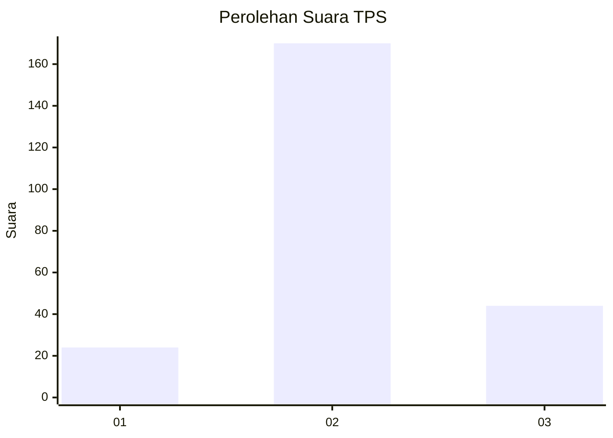
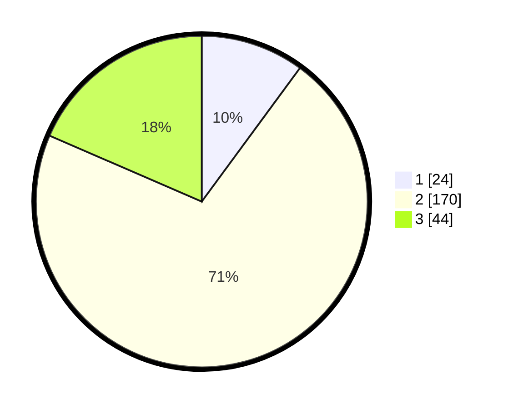

# Hasil

## Grafik

## Tabel

| No. | Nama Paslon    | Suara | Suara (raw) | Persentase |
|:--- |:-------------- | -----:| -----------:| ----------:|
| 1   | ANIES MUHAIMIN | 24    | [24][p-1]   | 10,08      |
| 2   | PRABOWO GIBRAN | 170   | [170][p-2]  | 71,43      |
| 3   | GANJAR MAHFUD  | 44    | [44][p-3]   | 18,49      |

[p-1]: https://github.com/gigit-pemilu/pemilu-2024/blob/main/pilpres/hitung-suara/sub/35-jawa-timur/sub/22-bojonegoro/sub/06-dander/sub/2008-mojoranu/sub/007-tps/sub/paslon-1.txt
[p-2]: https://github.com/gigit-pemilu/pemilu-2024/blob/main/pilpres/hitung-suara/sub/35-jawa-timur/sub/22-bojonegoro/sub/06-dander/sub/2008-mojoranu/sub/007-tps/sub/paslon-2.txt
[p-3]: https://github.com/gigit-pemilu/pemilu-2024/blob/main/pilpres/hitung-suara/sub/35-jawa-timur/sub/22-bojonegoro/sub/06-dander/sub/2008-mojoranu/sub/007-tps/sub/paslon-3.txt

## Foto C Plano

https://sirekap-obj-formc.kpu.go.id/fc78/pemilu/ppwp/35/22/06/20/08/3522062008007-20240215-002110--7766f1fd-7521-4afa-8634-ac71b48625a8.jpg

https://sirekap-obj-formc.kpu.go.id/fc78/pemilu/ppwp/35/22/06/20/08/3522062008007-20240215-002314--da84a4a0-4536-453c-9ee0-d5cb3b076e6d.jpg

https://sirekap-obj-formc.kpu.go.id/fc78/pemilu/ppwp/35/22/06/20/08/3522062008007-20240215-002143--2ac124da-e725-4fde-a9f1-1f834223ffd3.jpg

## Metadata

| Key        | Value               |
| ---------- | ------------------- |
| Time Stamp | 2024-02-25 16:00:00 |

