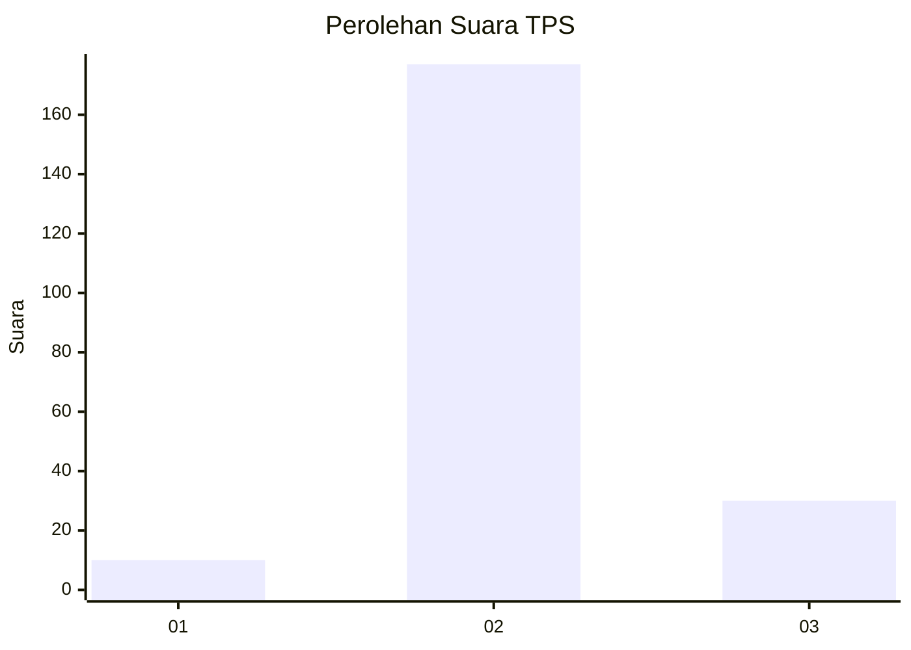
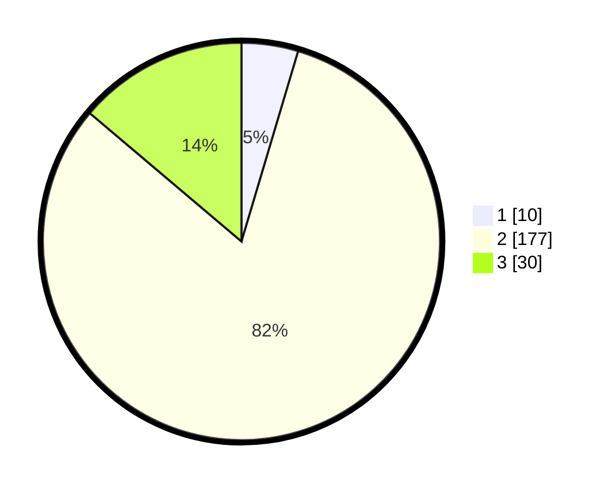

# Hasil

## Grafik

## Tabel

| No. | Nama Paslon    | Suara | Suara (raw) | Persentase |
|:--- |:-------------- | -----:| -----------:| ----------:|
| 1   | ANIES MUHAIMIN | 10    | [10][p-1]   | 4,61       |
| 2   | PRABOWO GIBRAN | 177   | [177][p-2]  | 81,57      |
| 3   | GANJAR MAHFUD  | 30    | [30][p-3]   | 13,82      |

[p-1]: https://github.com/gigit-pemilu/pemilu-2024/blob/main/pilpres/hitung-suara/sub/35-jawa-timur/sub/22-bojonegoro/sub/06-dander/sub/2012-sumodikaran/sub/002-tps/sub/paslon-1.txt
[p-2]: https://github.com/gigit-pemilu/pemilu-2024/blob/main/pilpres/hitung-suara/sub/35-jawa-timur/sub/22-bojonegoro/sub/06-dander/sub/2012-sumodikaran/sub/002-tps/sub/paslon-2.txt
[p-3]: https://github.com/gigit-pemilu/pemilu-2024/blob/main/pilpres/hitung-suara/sub/35-jawa-timur/sub/22-bojonegoro/sub/06-dander/sub/2012-sumodikaran/sub/002-tps/sub/paslon-3.txt

## Foto C Plano

https://sirekap-obj-formc.kpu.go.id/d169/pemilu/ppwp/35/22/06/20/12/3522062012002-20240217-112050--542a81c3-611c-42e8-a0e7-f404428c1eac.jpg

https://sirekap-obj-formc.kpu.go.id/d169/pemilu/ppwp/35/22/06/20/12/3522062012002-20240214-233954--9c811622-0371-4407-9a73-63814899676c.jpg

https://sirekap-obj-formc.kpu.go.id/d169/pemilu/ppwp/35/22/06/20/12/3522062012002-20240214-234126--4d3182f6-05bf-4498-bd8c-0b76329b0abd.jpg

## Metadata

| Key        | Value               |
| ---------- | ------------------- |
| Time Stamp | 2024-02-17 11:30:03 |

