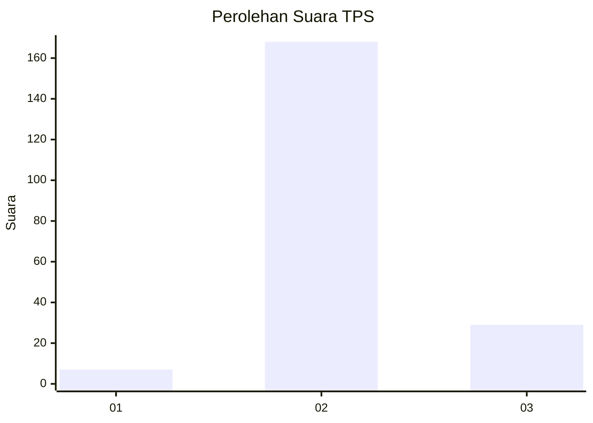
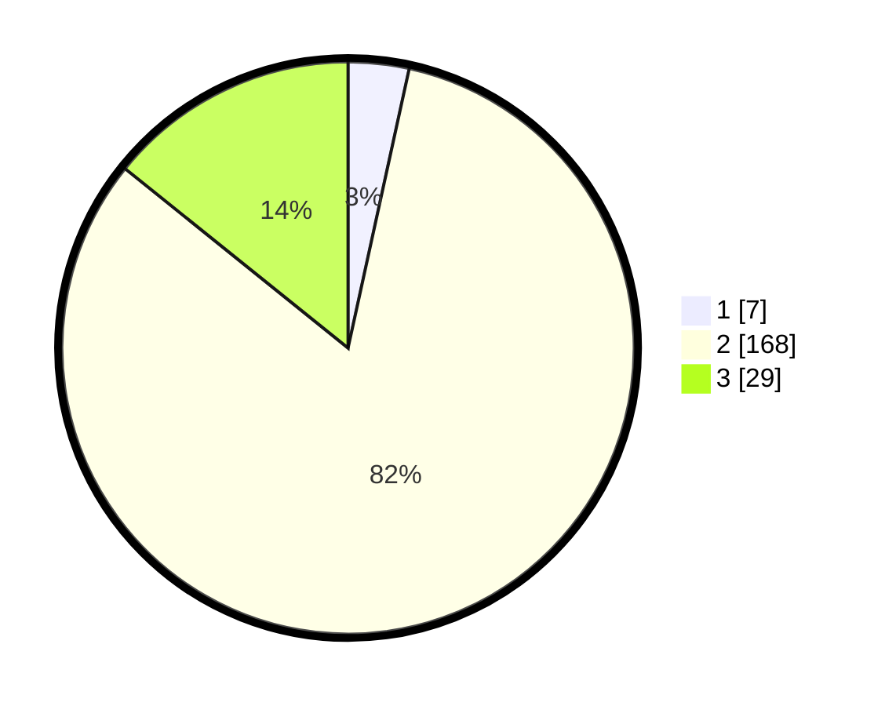

# Hasil

## Grafik

## Tabel

| No. | Nama Paslon    | Suara | Suara (raw) | Persentase |
|:--- |:-------------- | -----:| -----------:| ----------:|
| 1   | ANIES MUHAIMIN | 7     | [7][p-1]    | 3,43       |
| 2   | PRABOWO GIBRAN | 168   | [168][p-2]  | 82,35      |
| 3   | GANJAR MAHFUD  | 29    | [29][p-3]   | 14,22      |

[p-1]: https://github.com/gigit-pemilu/pemilu-2024-35-jawa-timur/blob/main/pilpres/hitung-suara/sub/35-jawa-timur/sub/22-bojonegoro/sub/06-dander/sub/2012-sumodikaran/sub/004-tps/sub/paslon-1.txt
[p-2]: https://github.com/gigit-pemilu/pemilu-2024-35-jawa-timur/blob/main/pilpres/hitung-suara/sub/35-jawa-timur/sub/22-bojonegoro/sub/06-dander/sub/2012-sumodikaran/sub/004-tps/sub/paslon-2.txt
[p-3]: https://github.com/gigit-pemilu/pemilu-2024-35-jawa-timur/blob/main/pilpres/hitung-suara/sub/35-jawa-timur/sub/22-bojonegoro/sub/06-dander/sub/2012-sumodikaran/sub/004-tps/sub/paslon-3.txt

## Foto C Plano

https://sirekap-obj-formc.kpu.go.id/a21a/pemilu/ppwp/35/22/06/20/12/3522062012004-20240214-225355--b91d1847-2723-49ad-8fa1-14b2694e851a.jpg

https://sirekap-obj-formc.kpu.go.id/a21a/pemilu/ppwp/35/22/06/20/12/3522062012004-20240214-225550--391a8135-748f-4d5c-858f-75bddd674a1b.jpg

https://sirekap-obj-formc.kpu.go.id/a21a/pemilu/ppwp/35/22/06/20/12/3522062012004-20240214-225702--01b573dc-c841-4b72-ac33-1c2fbc2a8689.jpg

## Metadata

| Key        | Value               |
| ---------- | ------------------- |
| Time Stamp | 2024-02-17 08:00:02 |

