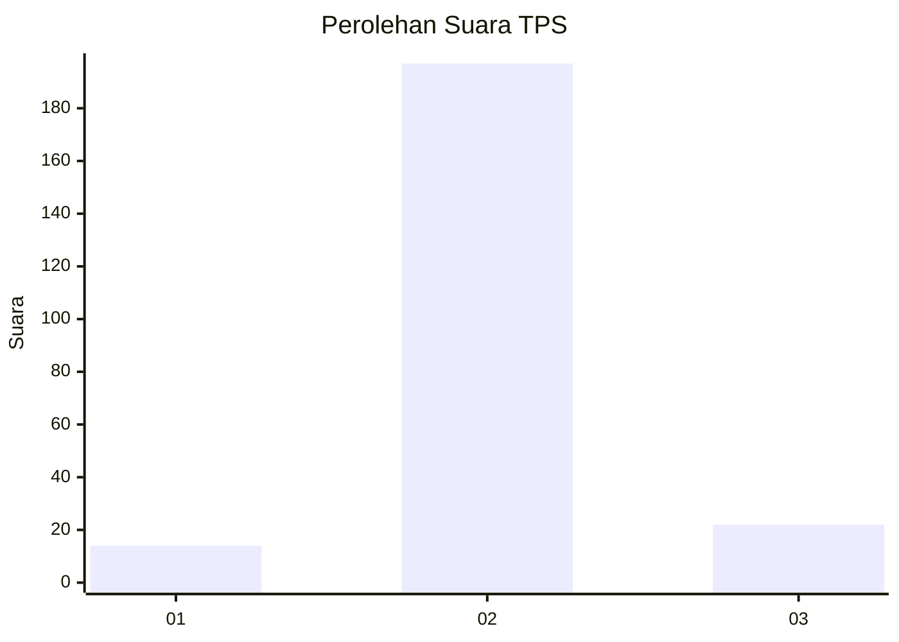
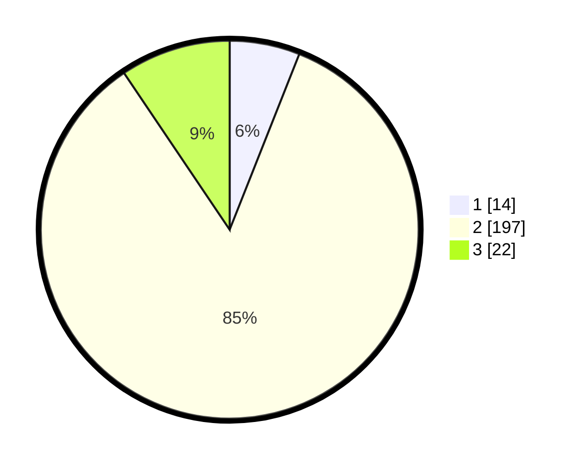

# Hasil

## Grafik

## Tabel

| No. | Nama Paslon    | Suara | Suara (raw) | Persentase |
|:--- |:-------------- | -----:| -----------:| ----------:|
| 1   | ANIES MUHAIMIN | 14    | [14][p-1]   | 6,01       |
| 2   | PRABOWO GIBRAN | 197   | [197][p-2]  | 84,55      |
| 3   | GANJAR MAHFUD  | 22    | [22][p-3]   | 9,44       |

[p-1]: https://github.com/gigit-pemilu/pemilu-2024/blob/main/pilpres/hitung-suara/sub/35-jawa-timur/sub/22-bojonegoro/sub/06-dander/sub/2014-sumbertlaseh/sub/003-tps/sub/paslon-1.txt
[p-2]: https://github.com/gigit-pemilu/pemilu-2024/blob/main/pilpres/hitung-suara/sub/35-jawa-timur/sub/22-bojonegoro/sub/06-dander/sub/2014-sumbertlaseh/sub/003-tps/sub/paslon-2.txt
[p-3]: https://github.com/gigit-pemilu/pemilu-2024/blob/main/pilpres/hitung-suara/sub/35-jawa-timur/sub/22-bojonegoro/sub/06-dander/sub/2014-sumbertlaseh/sub/003-tps/sub/paslon-3.txt

## Foto C Plano

https://sirekap-obj-formc.kpu.go.id/6249/pemilu/ppwp/35/22/06/20/14/3522062014003-20240214-230928--d5ea7ecc-49eb-473c-9425-7a24090bdf94.jpg

https://sirekap-obj-formc.kpu.go.id/6249/pemilu/ppwp/35/22/06/20/14/3522062014003-20240214-233737--7e78c10a-e129-4791-a6b1-5b53cb4e7158.jpg

https://sirekap-obj-formc.kpu.go.id/6249/pemilu/ppwp/35/22/06/20/14/3522062014003-20240215-001737--4d67653c-db31-45f2-97f8-42125514575a.jpg

## Metadata

| Key        | Value               |
| ---------- | ------------------- |
| Time Stamp | 2024-03-01 22:00:00 |

