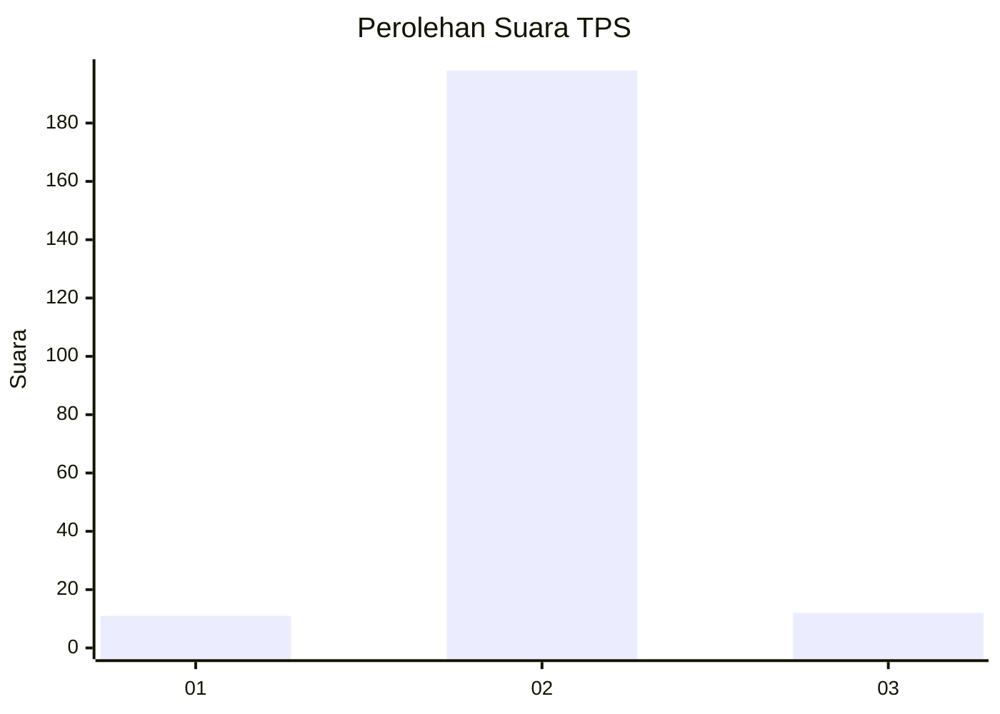
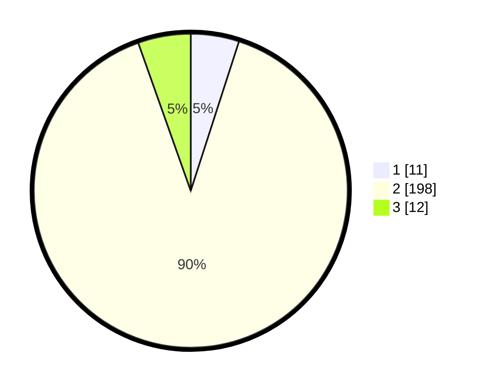

# Hasil

## Grafik

## Tabel

| No. | Nama Paslon    | Suara | Suara (raw) | Persentase |
|:--- |:-------------- | -----:| -----------:| ----------:|
| 1   | ANIES MUHAIMIN | 11    | [11][p-1]   | 4,98       |
| 2   | PRABOWO GIBRAN | 198   | [198][p-2]  | 89,59      |
| 3   | GANJAR MAHFUD  | 12    | [12][p-3]   | 5,43       |

[p-1]: https://github.com/gigit-pemilu/pemilu-2024/blob/main/pilpres/hitung-suara/sub/35-jawa-timur/sub/22-bojonegoro/sub/06-dander/sub/2014-sumbertlaseh/sub/009-tps/sub/paslon-1.txt
[p-2]: https://github.com/gigit-pemilu/pemilu-2024/blob/main/pilpres/hitung-suara/sub/35-jawa-timur/sub/22-bojonegoro/sub/06-dander/sub/2014-sumbertlaseh/sub/009-tps/sub/paslon-2.txt
[p-3]: https://github.com/gigit-pemilu/pemilu-2024/blob/main/pilpres/hitung-suara/sub/35-jawa-timur/sub/22-bojonegoro/sub/06-dander/sub/2014-sumbertlaseh/sub/009-tps/sub/paslon-3.txt

## Foto C Plano

https://sirekap-obj-formc.kpu.go.id/50a6/pemilu/ppwp/35/22/06/20/14/3522062014009-20240214-213430--22c838b6-7222-4b8b-9a15-a072c256d4fd.jpg

https://sirekap-obj-formc.kpu.go.id/50a6/pemilu/ppwp/35/22/06/20/14/3522062014009-20240214-195629--cbacdd91-d9f6-4972-aa14-4f4359fa5631.jpg

https://sirekap-obj-formc.kpu.go.id/50a6/pemilu/ppwp/35/22/06/20/14/3522062014009-20240214-195803--5cde6ecf-4822-42be-a389-a3f2410da7e9.jpg

## Metadata

| Key        | Value               |
| ---------- | ------------------- |
| Time Stamp | 2024-02-14 21:46:01 |

