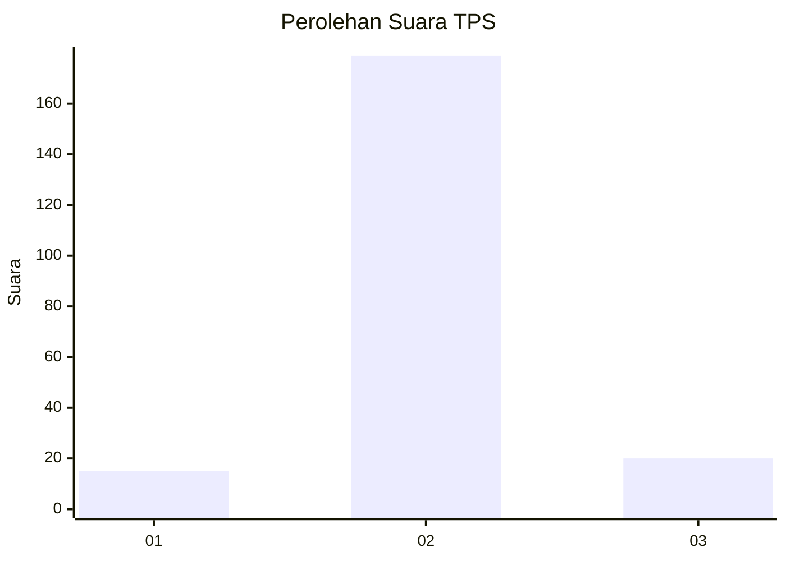
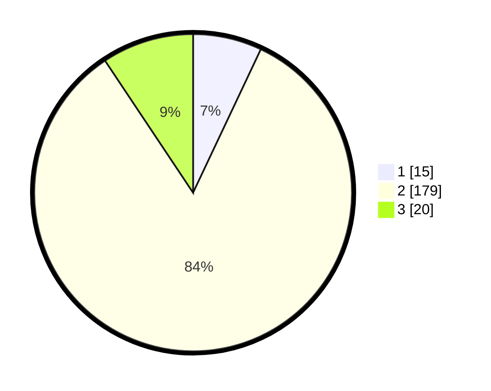

# Hasil

## Grafik

## Tabel

| No. | Nama Paslon    | Suara | Suara (raw) | Persentase |
|:--- |:-------------- | -----:| -----------:| ----------:|
| 1   | ANIES MUHAIMIN | 15    | [15][p-1]   | 7,01       |
| 2   | PRABOWO GIBRAN | 179   | [179][p-2]  | 83,64      |
| 3   | GANJAR MAHFUD  | 20    | [20][p-3]   | 9,35       |

[p-1]: https://github.com/gigit-pemilu/pemilu-2024-35-jawa-timur/blob/main/pilpres/hitung-suara/sub/35-jawa-timur/sub/22-bojonegoro/sub/06-dander/sub/2014-sumbertlaseh/sub/010-tps/sub/paslon-1.txt
[p-2]: https://github.com/gigit-pemilu/pemilu-2024-35-jawa-timur/blob/main/pilpres/hitung-suara/sub/35-jawa-timur/sub/22-bojonegoro/sub/06-dander/sub/2014-sumbertlaseh/sub/010-tps/sub/paslon-2.txt
[p-3]: https://github.com/gigit-pemilu/pemilu-2024-35-jawa-timur/blob/main/pilpres/hitung-suara/sub/35-jawa-timur/sub/22-bojonegoro/sub/06-dander/sub/2014-sumbertlaseh/sub/010-tps/sub/paslon-3.txt

## Foto C Plano

https://sirekap-obj-formc.kpu.go.id/87cc/pemilu/ppwp/35/22/06/20/14/3522062014010-20240214-215459--f689e5d2-8f0a-4b6a-8666-f5aadaf0197f.jpg

https://sirekap-obj-formc.kpu.go.id/87cc/pemilu/ppwp/35/22/06/20/14/3522062014010-20240214-215513--fa7cf5c0-89f5-405f-974c-e305b8f5b2e5.jpg

https://sirekap-obj-formc.kpu.go.id/87cc/pemilu/ppwp/35/22/06/20/14/3522062014010-20240214-215514--06463d48-fc95-4292-b63d-e304a82b136f.jpg

## Metadata

| Key        | Value               |
| ---------- | ------------------- |
| Time Stamp | 2024-02-25 14:00:00 |

