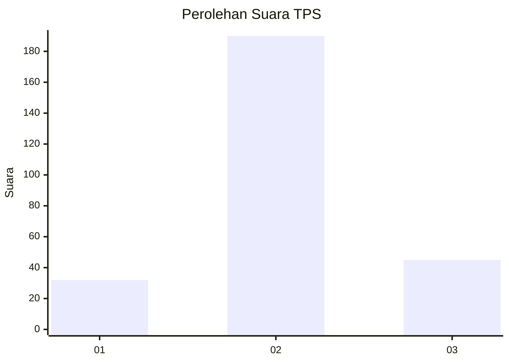
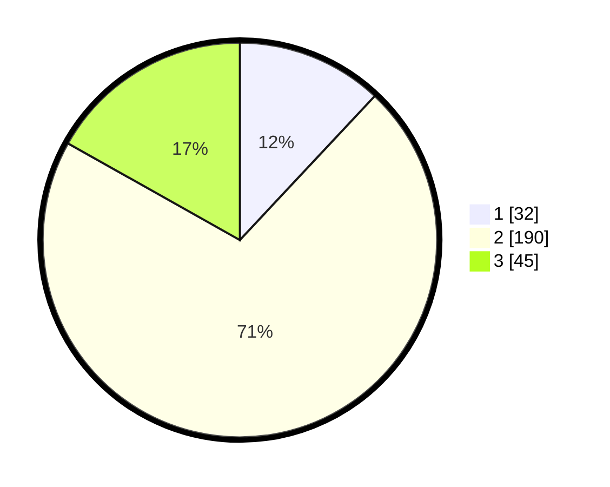

# Hasil

## Grafik

## Tabel

| No. | Nama Paslon    | Suara | Suara (raw) | Persentase |
|:--- |:-------------- | -----:| -----------:| ----------:|
| 1   | ANIES MUHAIMIN | 32    | [32][p-1]   | 11,99      |
| 2   | PRABOWO GIBRAN | 190   | [190][p-2]  | 71,16      |
| 3   | GANJAR MAHFUD  | 45    | [45][p-3]   | 16,85      |

[p-1]: https://github.com/gigit-pemilu/pemilu-2024/blob/main/pilpres/hitung-suara/sub/35-jawa-timur/sub/22-bojonegoro/sub/06-dander/sub/2015-ngulanan/sub/001-tps/sub/paslon-1.txt
[p-2]: https://github.com/gigit-pemilu/pemilu-2024/blob/main/pilpres/hitung-suara/sub/35-jawa-timur/sub/22-bojonegoro/sub/06-dander/sub/2015-ngulanan/sub/001-tps/sub/paslon-2.txt
[p-3]: https://github.com/gigit-pemilu/pemilu-2024/blob/main/pilpres/hitung-suara/sub/35-jawa-timur/sub/22-bojonegoro/sub/06-dander/sub/2015-ngulanan/sub/001-tps/sub/paslon-3.txt

## Foto C Plano

https://sirekap-obj-formc.kpu.go.id/f50b/pemilu/ppwp/35/22/06/20/15/3522062015001-20240214-230129--134ee64d-d925-4bb3-ad37-e8a6418df06f.jpg

https://sirekap-obj-formc.kpu.go.id/f50b/pemilu/ppwp/35/22/06/20/15/3522062015001-20240214-212806--414890e4-7b75-4c58-9929-dda63bcb85a1.jpg

https://sirekap-obj-formc.kpu.go.id/f50b/pemilu/ppwp/35/22/06/20/15/3522062015001-20240214-213011--2ac55d90-f84c-4a10-a6dc-029a89c7384f.jpg

## Metadata

| Key        | Value               |
| ---------- | ------------------- |
| Time Stamp | 2024-02-25 00:00:00 |

