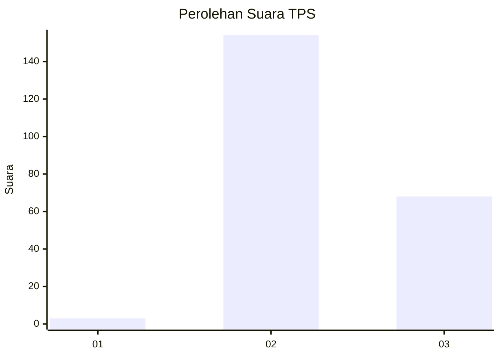

# Hasil

## Grafik

## Tabel

| No. | Nama Paslon    | Suara | Suara (raw) | Persentase |
|:--- |:-------------- | -----:| -----------:| ----------:|
| 1   | ANIES MUHAIMIN | 3     | [3][p-1]    | 1,33       |
| 2   | PRABOWO GIBRAN | 154   | [154][p-2]  | 68,44      |
| 3   | GANJAR MAHFUD  | 68    | [68][p-3]   | 30,22      |

[p-1]: https://github.com/gigit-pemilu/pemilu-2024-35-jawa-timur/blob/main/pilpres/hitung-suara/sub/35-jawa-timur/sub/22-bojonegoro/sub/08-kedungadem/sub/2001-babad/sub/001-tps/sub/paslon-1.txt
[p-2]: https://github.com/gigit-pemilu/pemilu-2024-35-jawa-timur/blob/main/pilpres/hitung-suara/sub/35-jawa-timur/sub/22-bojonegoro/sub/08-kedungadem/sub/2001-babad/sub/001-tps/sub/paslon-2.txt
[p-3]: https://github.com/gigit-pemilu/pemilu-2024-35-jawa-timur/blob/main/pilpres/hitung-suara/sub/35-jawa-timur/sub/22-bojonegoro/sub/08-kedungadem/sub/2001-babad/sub/001-tps/sub/paslon-3.txt

## Foto C Plano

https://sirekap-obj-formc.kpu.go.id/f124/pemilu/ppwp/35/22/08/20/01/3522082001001-20240214-230751--c897861f-d72f-4fc0-bb84-3e8d83ec4c2d.jpg

https://sirekap-obj-formc.kpu.go.id/f124/pemilu/ppwp/35/22/08/20/01/3522082001001-20240214-230822--919700ae-244f-43ec-8755-8f8c875f1187.jpg

https://sirekap-obj-formc.kpu.go.id/f124/pemilu/ppwp/35/22/08/20/01/3522082001001-20240214-230852--0c9104c3-e68f-4a3b-9993-7f90227f30aa.jpg

## Metadata

| Key        | Value               |
| ---------- | ------------------- |
| Time Stamp | 2024-02-24 22:31:28 |

