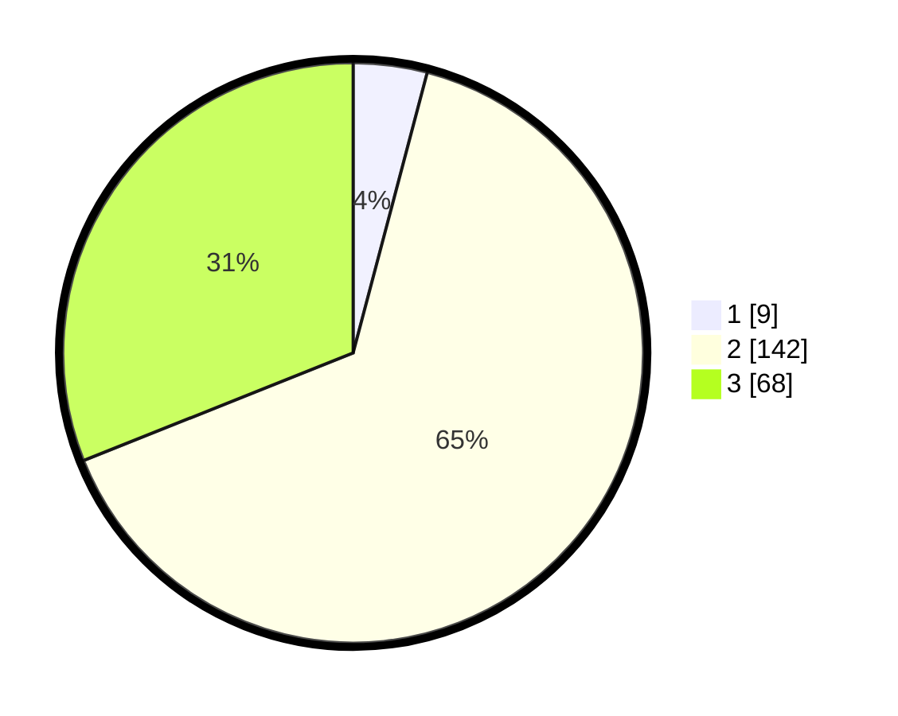

# Hasil

## Grafik

## Tabel

| No. | Nama Paslon    | Suara | Suara (raw) | Persentase |
|:--- |:-------------- | -----:| -----------:| ----------:|
| 1   | ANIES MUHAIMIN | 9     | [9][p-1]    | 4,11       |
| 2   | PRABOWO GIBRAN | 142   | [142][p-2]  | 64,84      |
| 3   | GANJAR MAHFUD  | 68    | [68][p-3]   | 31,05      |

[p-1]: https://github.com/gigit-pemilu/pemilu-2024/blob/main/pilpres/hitung-suara/sub/35-jawa-timur/sub/22-bojonegoro/sub/08-kedungadem/sub/2001-babad/sub/004-tps/sub/paslon-1.txt
[p-2]: https://github.com/gigit-pemilu/pemilu-2024/blob/main/pilpres/hitung-suara/sub/35-jawa-timur/sub/22-bojonegoro/sub/08-kedungadem/sub/2001-babad/sub/004-tps/sub/paslon-2.txt
[p-3]: https://github.com/gigit-pemilu/pemilu-2024/blob/main/pilpres/hitung-suara/sub/35-jawa-timur/sub/22-bojonegoro/sub/08-kedungadem/sub/2001-babad/sub/004-tps/sub/paslon-3.txt

## Foto C Plano

https://sirekap-obj-formc.kpu.go.id/7bc6/pemilu/ppwp/35/22/08/20/01/3522082001004-20240214-141022--f5fdebb8-927b-4396-9a88-80b76b099d8b.jpg

https://sirekap-obj-formc.kpu.go.id/7bc6/pemilu/ppwp/35/22/08/20/01/3522082001004-20240214-235354--898b7607-de79-439d-a3fe-4b7774185ab6.jpg

https://sirekap-obj-formc.kpu.go.id/7bc6/pemilu/ppwp/35/22/08/20/01/3522082001004-20240214-235500--02dcc5b8-d9b6-4287-917f-a13fe8b3a973.jpg

## Metadata

| Key        | Value               |
| ---------- | ------------------- |
| Time Stamp | 2024-02-15 15:00:29 |

