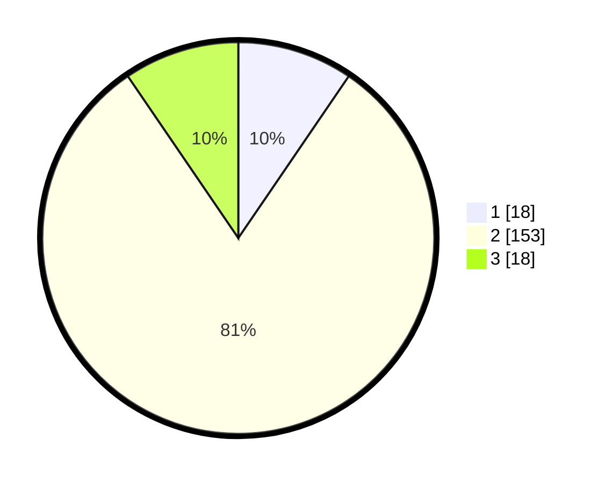

# Hasil

## Grafik

## Tabel

| No. | Nama Paslon    | Suara | Suara (raw) | Persentase |
|:--- |:-------------- | -----:| -----------:| ----------:|
| 1   | ANIES MUHAIMIN | 18    | [18][p-1]   | 9,52       |
| 2   | PRABOWO GIBRAN | 153   | [153][p-2]  | 80,95      |
| 3   | GANJAR MAHFUD  | 18    | [18][p-3]   | 9,52       |

[p-1]: https://github.com/gigit-pemilu/pemilu-2024-35-jawa-timur/blob/main/pilpres/hitung-suara/sub/35-jawa-timur/sub/22-bojonegoro/sub/08-kedungadem/sub/2002-pejok/sub/001-tps/sub/paslon-1.txt
[p-2]: https://github.com/gigit-pemilu/pemilu-2024-35-jawa-timur/blob/main/pilpres/hitung-suara/sub/35-jawa-timur/sub/22-bojonegoro/sub/08-kedungadem/sub/2002-pejok/sub/001-tps/sub/paslon-2.txt
[p-3]: https://github.com/gigit-pemilu/pemilu-2024-35-jawa-timur/blob/main/pilpres/hitung-suara/sub/35-jawa-timur/sub/22-bojonegoro/sub/08-kedungadem/sub/2002-pejok/sub/001-tps/sub/paslon-3.txt

## Foto C Plano

https://sirekap-obj-formc.kpu.go.id/29e7/pemilu/ppwp/35/22/08/20/02/3522082002001-20240214-155508--7865076f-836f-4d50-a08b-6db5d82e1c8b.jpg

https://sirekap-obj-formc.kpu.go.id/29e7/pemilu/ppwp/35/22/08/20/02/3522082002001-20240214-202145--54976570-9caa-4031-8273-5f190a2ebc7b.jpg

https://sirekap-obj-formc.kpu.go.id/29e7/pemilu/ppwp/35/22/08/20/02/3522082002001-20240214-160137--b08d9d78-d525-4ac8-abd8-2e9f32aa6e5f.jpg

## Metadata

| Key        | Value               |
| ---------- | ------------------- |
| Time Stamp | 2024-02-25 15:00:00 |

