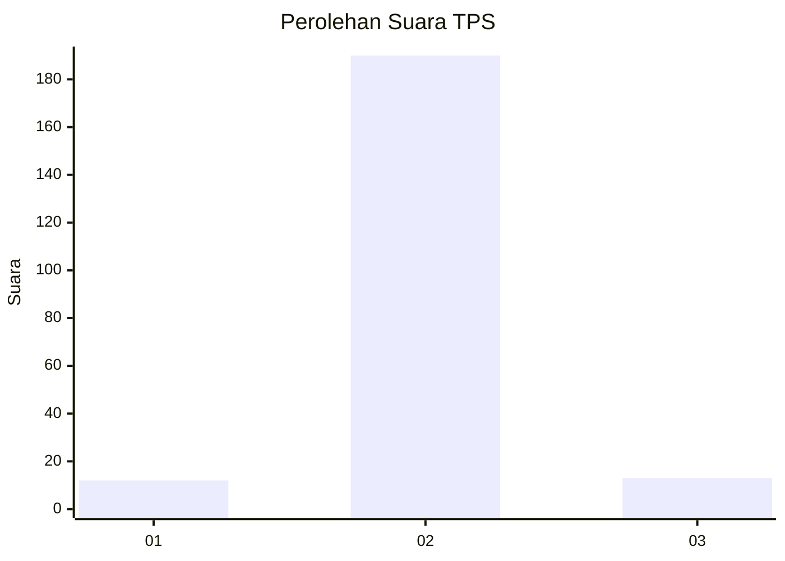
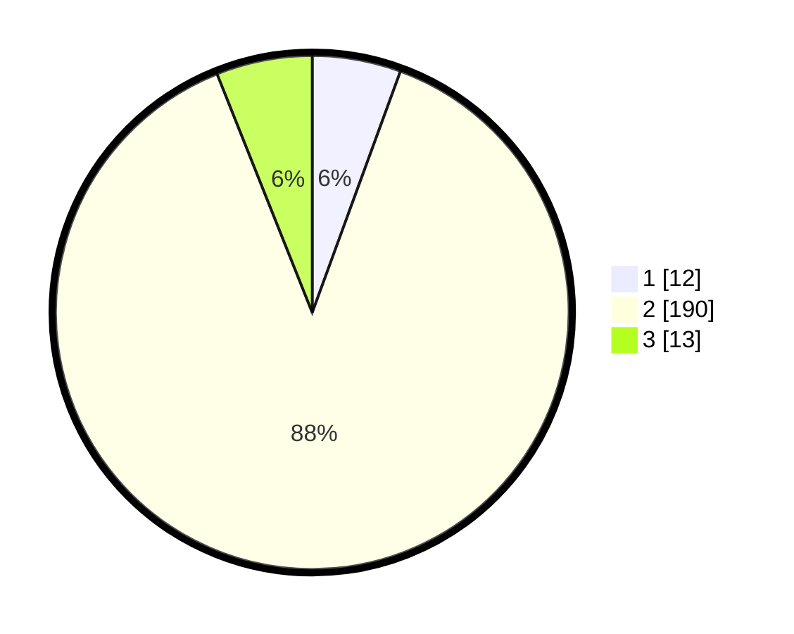

# Hasil

## Grafik

## Tabel

| No. | Nama Paslon    | Suara | Suara (raw) | Persentase |
|:--- |:-------------- | -----:| -----------:| ----------:|
| 1   | ANIES MUHAIMIN | 12    | [12][p-1]   | 5,58       |
| 2   | PRABOWO GIBRAN | 190   | [190][p-2]  | 88,37      |
| 3   | GANJAR MAHFUD  | 13    | [13][p-3]   | 6,05       |

[p-1]: https://github.com/gigit-pemilu/pemilu-2024-35-jawa-timur/blob/main/pilpres/hitung-suara/sub/35-jawa-timur/sub/22-bojonegoro/sub/08-kedungadem/sub/2002-pejok/sub/006-tps/sub/paslon-1.txt
[p-2]: https://github.com/gigit-pemilu/pemilu-2024-35-jawa-timur/blob/main/pilpres/hitung-suara/sub/35-jawa-timur/sub/22-bojonegoro/sub/08-kedungadem/sub/2002-pejok/sub/006-tps/sub/paslon-2.txt
[p-3]: https://github.com/gigit-pemilu/pemilu-2024-35-jawa-timur/blob/main/pilpres/hitung-suara/sub/35-jawa-timur/sub/22-bojonegoro/sub/08-kedungadem/sub/2002-pejok/sub/006-tps/sub/paslon-3.txt

## Foto C Plano

https://sirekap-obj-formc.kpu.go.id/3492/pemilu/ppwp/35/22/08/20/02/3522082002006-20240214-213303--a6d46cb4-ac56-4382-9466-52b6e634f83f.jpg

https://sirekap-obj-formc.kpu.go.id/3492/pemilu/ppwp/35/22/08/20/02/3522082002006-20240214-213320--2f563a49-abdb-4bf6-8e03-9a36130bb98b.jpg

https://sirekap-obj-formc.kpu.go.id/3492/pemilu/ppwp/35/22/08/20/02/3522082002006-20240214-213338--ed85a73e-c0d8-448c-96bd-474d484a03bd.jpg

## Metadata

| Key        | Value               |
| ---------- | ------------------- |
| Time Stamp | 2024-02-24 22:31:28 |

