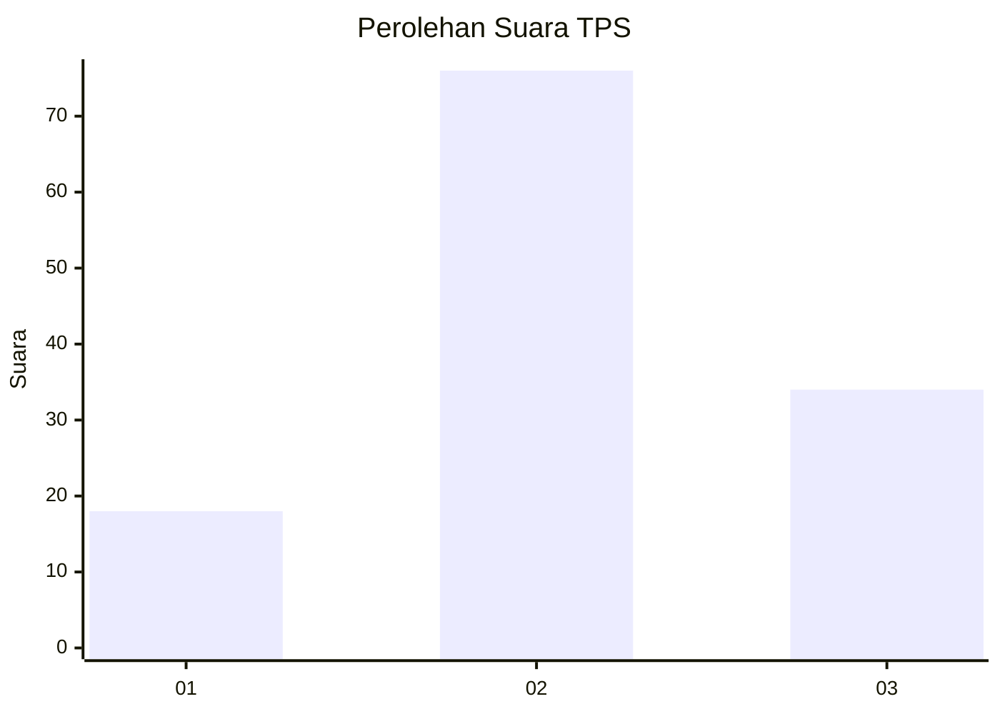
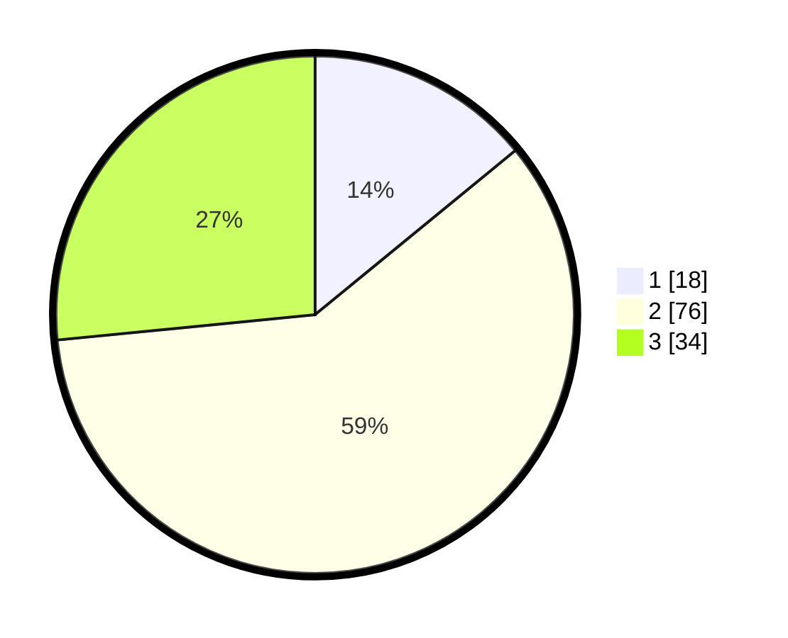

# Hasil

## Grafik

## Tabel

| No. | Nama Paslon    | Suara | Suara (raw) | Persentase |
|:--- |:-------------- | -----:| -----------:| ----------:|
| 1   | ANIES MUHAIMIN | 18    | [18][p-1]   | 14,06      |
| 2   | PRABOWO GIBRAN | 76    | [76][p-2]   | 59,38      |
| 3   | GANJAR MAHFUD  | 34    | [34][p-3]   | 26,56      |

[p-1]: https://github.com/gigit-pemilu/pemilu-2024/blob/main/pilpres/hitung-suara/sub/35-jawa-timur/sub/22-bojonegoro/sub/08-kedungadem/sub/2002-pejok/sub/009-tps/sub/paslon-1.txt
[p-2]: https://github.com/gigit-pemilu/pemilu-2024/blob/main/pilpres/hitung-suara/sub/35-jawa-timur/sub/22-bojonegoro/sub/08-kedungadem/sub/2002-pejok/sub/009-tps/sub/paslon-2.txt
[p-3]: https://github.com/gigit-pemilu/pemilu-2024/blob/main/pilpres/hitung-suara/sub/35-jawa-timur/sub/22-bojonegoro/sub/08-kedungadem/sub/2002-pejok/sub/009-tps/sub/paslon-3.txt

## Foto C Plano

https://sirekap-obj-formc.kpu.go.id/43ee/pemilu/ppwp/35/22/08/20/02/3522082002009-20240214-141817--146f6138-b1d2-40ee-87e5-d4577ebd1324.jpg

https://sirekap-obj-formc.kpu.go.id/43ee/pemilu/ppwp/35/22/08/20/02/3522082002009-20240214-141852--ca67542e-dae8-4eeb-ac38-48762460510b.jpg

https://sirekap-obj-formc.kpu.go.id/43ee/pemilu/ppwp/35/22/08/20/02/3522082002009-20240214-141924--be17c53b-5cc6-4bc4-9872-0bc5a7ecd9da.jpg

## Metadata

| Key        | Value               |
| ---------- | ------------------- |
| Time Stamp | 2024-02-14 21:46:01 |

