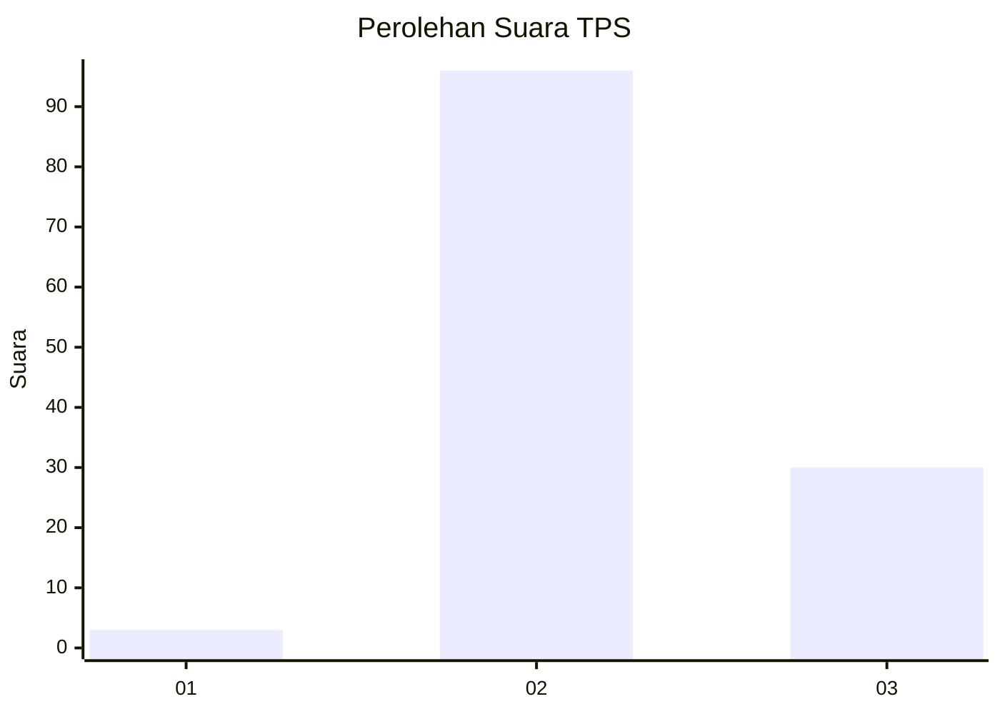
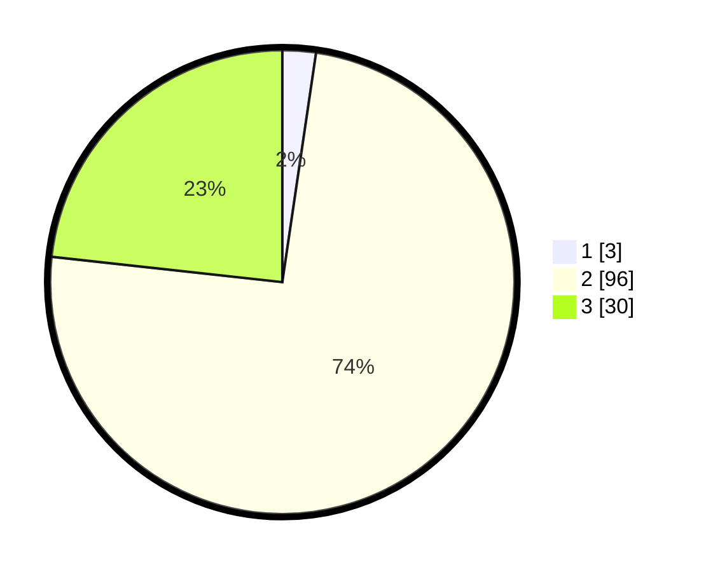

# Hasil

## Grafik

## Tabel

| No. | Nama Paslon    | Suara | Suara (raw) | Persentase |
|:--- |:-------------- | -----:| -----------:| ----------:|
| 1   | ANIES MUHAIMIN | 3     | [3][p-1]    | 2,33       |
| 2   | PRABOWO GIBRAN | 96    | [96][p-2]   | 74,42      |
| 3   | GANJAR MAHFUD  | 30    | [30][p-3]   | 23,26      |

[p-1]: https://github.com/gigit-pemilu/pemilu-2024/blob/main/pilpres/hitung-suara/sub/35-jawa-timur/sub/22-bojonegoro/sub/08-kedungadem/sub/2002-pejok/sub/011-tps/sub/paslon-1.txt
[p-2]: https://github.com/gigit-pemilu/pemilu-2024/blob/main/pilpres/hitung-suara/sub/35-jawa-timur/sub/22-bojonegoro/sub/08-kedungadem/sub/2002-pejok/sub/011-tps/sub/paslon-2.txt
[p-3]: https://github.com/gigit-pemilu/pemilu-2024/blob/main/pilpres/hitung-suara/sub/35-jawa-timur/sub/22-bojonegoro/sub/08-kedungadem/sub/2002-pejok/sub/011-tps/sub/paslon-3.txt

## Foto C Plano

https://sirekap-obj-formc.kpu.go.id/3681/pemilu/ppwp/35/22/08/20/02/3522082002011-20240214-201824--543e5ffa-7e3c-4989-8d0b-498e5f32d8f4.jpg

https://sirekap-obj-formc.kpu.go.id/3681/pemilu/ppwp/35/22/08/20/02/3522082002011-20240214-141025--19d68001-ffed-48df-8a96-0a942236054c.jpg

https://sirekap-obj-formc.kpu.go.id/3681/pemilu/ppwp/35/22/08/20/02/3522082002011-20240214-141127--128df5c1-2ba9-4ebd-8ac6-314799890999.jpg

## Metadata

| Key        | Value               |
| ---------- | ------------------- |
| Time Stamp | 2024-02-24 22:31:28 |

