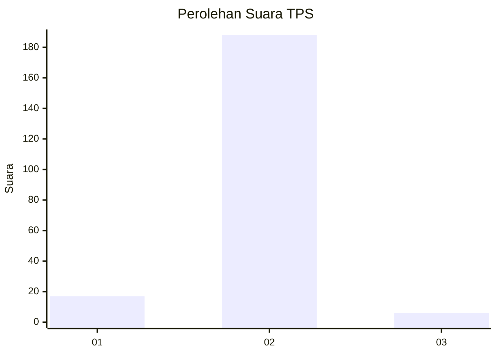
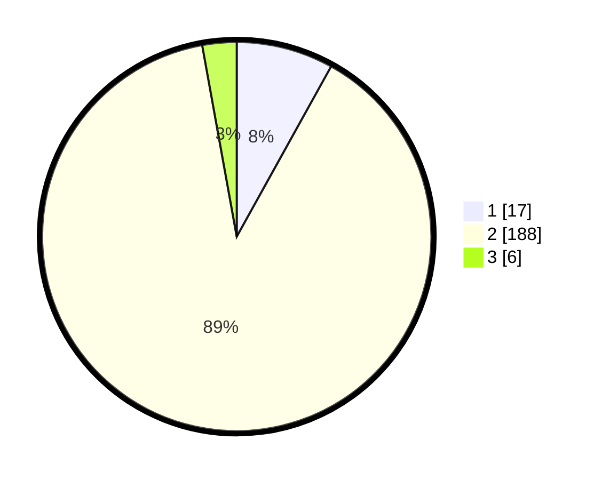

# Hasil

## Grafik

## Tabel

| No. | Nama Paslon    | Suara | Suara (raw) | Persentase |
|:--- |:-------------- | -----:| -----------:| ----------:|
| 1   | ANIES MUHAIMIN | 17    | [17][p-1]   | 8,06       |
| 2   | PRABOWO GIBRAN | 188   | [188][p-2]  | 89,10      |
| 3   | GANJAR MAHFUD  | 6     | [6][p-3]    | 2,84       |

[p-1]: https://github.com/gigit-pemilu/pemilu-2024/blob/main/pilpres/hitung-suara/sub/35-jawa-timur/sub/22-bojonegoro/sub/08-kedungadem/sub/2003-dayukidul/sub/004-tps/sub/paslon-1.txt
[p-2]: https://github.com/gigit-pemilu/pemilu-2024/blob/main/pilpres/hitung-suara/sub/35-jawa-timur/sub/22-bojonegoro/sub/08-kedungadem/sub/2003-dayukidul/sub/004-tps/sub/paslon-2.txt
[p-3]: https://github.com/gigit-pemilu/pemilu-2024/blob/main/pilpres/hitung-suara/sub/35-jawa-timur/sub/22-bojonegoro/sub/08-kedungadem/sub/2003-dayukidul/sub/004-tps/sub/paslon-3.txt

## Foto C Plano

https://sirekap-obj-formc.kpu.go.id/c4cf/pemilu/ppwp/35/22/08/20/03/3522082003004-20240214-141709--5a3c8b70-3460-47ee-a33a-75390753f81f.jpg

https://sirekap-obj-formc.kpu.go.id/c4cf/pemilu/ppwp/35/22/08/20/03/3522082003004-20240214-141857--454ac5f6-6fde-472a-9fe8-d5a49816b5d5.jpg

https://sirekap-obj-formc.kpu.go.id/c4cf/pemilu/ppwp/35/22/08/20/03/3522082003004-20240215-002540--6029d0b3-34c5-40b3-8438-c23048eee7fe.jpg

## Metadata

| Key        | Value               |
| ---------- | ------------------- |
| Time Stamp | 2024-02-15 00:46:45 |

