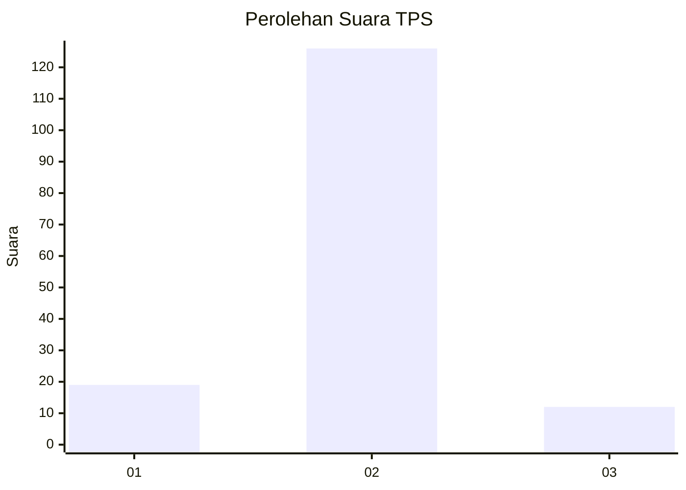
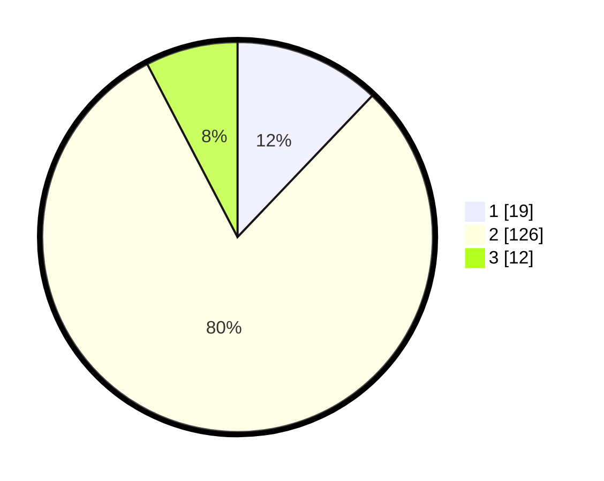

# Hasil

## Grafik

## Tabel

| No. | Nama Paslon    | Suara | Suara (raw) | Persentase |
|:--- |:-------------- | -----:| -----------:| ----------:|
| 1   | ANIES MUHAIMIN | 19    | [19][p-1]   | 12,10      |
| 2   | PRABOWO GIBRAN | 126   | [126][p-2]  | 80,25      |
| 3   | GANJAR MAHFUD  | 12    | [12][p-3]   | 7,64       |

[p-1]: https://github.com/gigit-pemilu/pemilu-2024/blob/main/pilpres/hitung-suara/sub/35-jawa-timur/sub/22-bojonegoro/sub/08-kedungadem/sub/2003-dayukidul/sub/008-tps/sub/paslon-1.txt
[p-2]: https://github.com/gigit-pemilu/pemilu-2024/blob/main/pilpres/hitung-suara/sub/35-jawa-timur/sub/22-bojonegoro/sub/08-kedungadem/sub/2003-dayukidul/sub/008-tps/sub/paslon-2.txt
[p-3]: https://github.com/gigit-pemilu/pemilu-2024/blob/main/pilpres/hitung-suara/sub/35-jawa-timur/sub/22-bojonegoro/sub/08-kedungadem/sub/2003-dayukidul/sub/008-tps/sub/paslon-3.txt

## Foto C Plano

https://sirekap-obj-formc.kpu.go.id/f481/pemilu/ppwp/35/22/08/20/03/3522082003008-20240214-141719--23e0938c-4adb-47f5-a4e1-13f6fd698a33.jpg

https://sirekap-obj-formc.kpu.go.id/f481/pemilu/ppwp/35/22/08/20/03/3522082003008-20240214-141800--1b025d84-f17a-4de7-bcf1-c35e9b4fe4a3.jpg

https://sirekap-obj-formc.kpu.go.id/f481/pemilu/ppwp/35/22/08/20/03/3522082003008-20240214-141844--0303b96d-79c7-456f-8472-7113348ed6d5.jpg

## Metadata

| Key        | Value               |
| ---------- | ------------------- |
| Time Stamp | 2024-02-14 21:46:01 |

