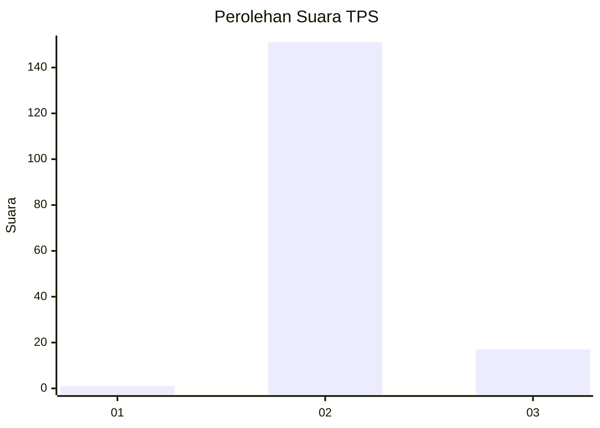
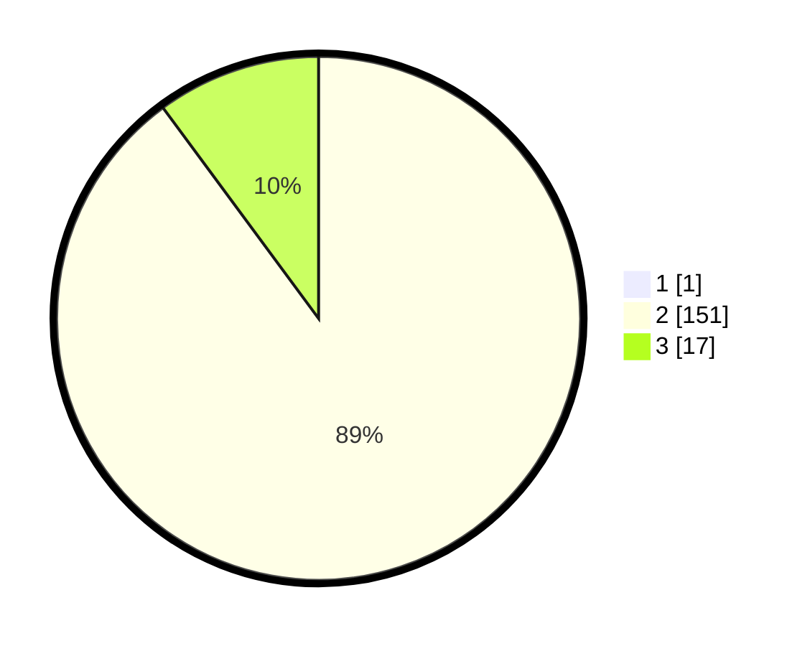

# Hasil

## Grafik

## Tabel

| No. | Nama Paslon    | Suara | Suara (raw) | Persentase |
|:--- |:-------------- | -----:| -----------:| ----------:|
| 1   | ANIES MUHAIMIN | 1     | [1][p-1]    | 0,59       |
| 2   | PRABOWO GIBRAN | 151   | [151][p-2]  | 89,35      |
| 3   | GANJAR MAHFUD  | 17    | [17][p-3]   | 10,06      |

[p-1]: https://github.com/gigit-pemilu/pemilu-2024/blob/main/pilpres/hitung-suara/sub/35-jawa-timur/sub/22-bojonegoro/sub/08-kedungadem/sub/2005-tondomulo/sub/003-tps/sub/paslon-1.txt
[p-2]: https://github.com/gigit-pemilu/pemilu-2024/blob/main/pilpres/hitung-suara/sub/35-jawa-timur/sub/22-bojonegoro/sub/08-kedungadem/sub/2005-tondomulo/sub/003-tps/sub/paslon-2.txt
[p-3]: https://github.com/gigit-pemilu/pemilu-2024/blob/main/pilpres/hitung-suara/sub/35-jawa-timur/sub/22-bojonegoro/sub/08-kedungadem/sub/2005-tondomulo/sub/003-tps/sub/paslon-3.txt

## Foto C Plano

https://sirekap-obj-formc.kpu.go.id/8ed0/pemilu/ppwp/35/22/08/20/05/3522082005003-20240215-020549--06d6ff12-41b3-44ee-86e1-3b1ddfc8e51e.jpg

https://sirekap-obj-formc.kpu.go.id/8ed0/pemilu/ppwp/35/22/08/20/05/3522082005003-20240215-024118--661a7fd2-a1f8-4fcd-a7da-fe672ef08423.jpg

https://sirekap-obj-formc.kpu.go.id/8ed0/pemilu/ppwp/35/22/08/20/05/3522082005003-20240215-024236--59da3546-3cec-44a1-980a-006309eeaba1.jpg

## Metadata

| Key        | Value               |
| ---------- | ------------------- |
| Time Stamp | 2024-02-15 15:00:29 |

