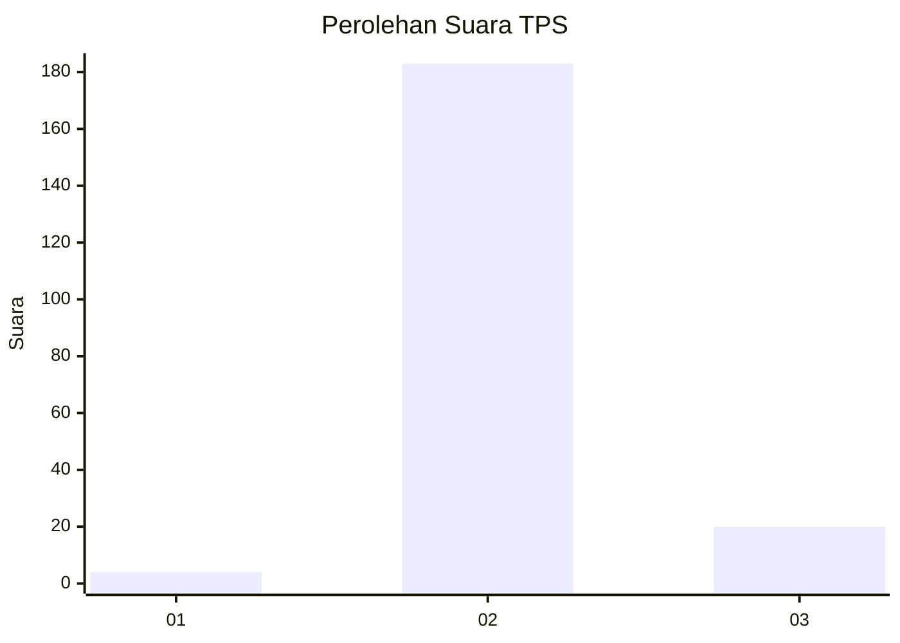
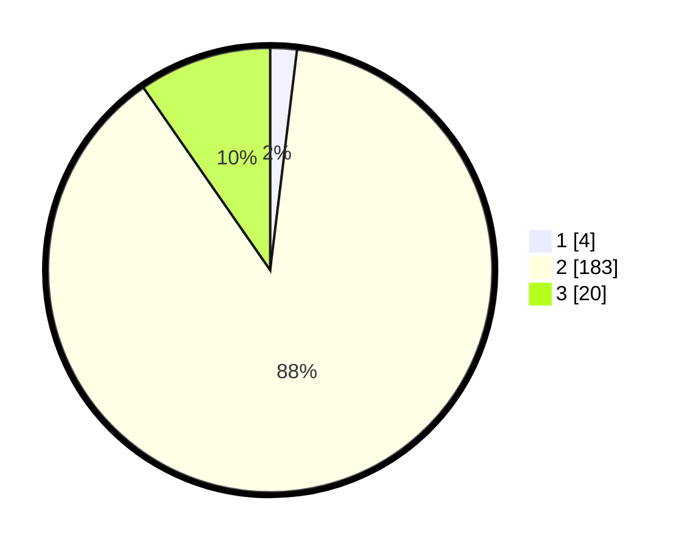

# Hasil

## Grafik

## Tabel

| No. | Nama Paslon    | Suara | Suara (raw) | Persentase |
|:--- |:-------------- | -----:| -----------:| ----------:|
| 1   | ANIES MUHAIMIN | 4     | [4][p-1]    | 1,93       |
| 2   | PRABOWO GIBRAN | 183   | [183][p-2]  | 88,41      |
| 3   | GANJAR MAHFUD  | 20    | [20][p-3]   | 9,66       |

[p-1]: https://github.com/gigit-pemilu/pemilu-2024/blob/main/pilpres/hitung-suara/sub/35-jawa-timur/sub/22-bojonegoro/sub/08-kedungadem/sub/2005-tondomulo/sub/004-tps/sub/paslon-1.txt
[p-2]: https://github.com/gigit-pemilu/pemilu-2024/blob/main/pilpres/hitung-suara/sub/35-jawa-timur/sub/22-bojonegoro/sub/08-kedungadem/sub/2005-tondomulo/sub/004-tps/sub/paslon-2.txt
[p-3]: https://github.com/gigit-pemilu/pemilu-2024/blob/main/pilpres/hitung-suara/sub/35-jawa-timur/sub/22-bojonegoro/sub/08-kedungadem/sub/2005-tondomulo/sub/004-tps/sub/paslon-3.txt

## Foto C Plano

https://sirekap-obj-formc.kpu.go.id/7d27/pemilu/ppwp/35/22/08/20/05/3522082005004-20240215-014234--750be93b-ef39-4649-91af-0a6a21571931.jpg

https://sirekap-obj-formc.kpu.go.id/7d27/pemilu/ppwp/35/22/08/20/05/3522082005004-20240215-014312--c14daae1-26c5-423b-90d4-c2e84f0b8612.jpg

https://sirekap-obj-formc.kpu.go.id/7d27/pemilu/ppwp/35/22/08/20/05/3522082005004-20240215-014354--5b3a7fe2-cad1-4099-8d4d-e4d193852fab.jpg

## Metadata

| Key        | Value               |
| ---------- | ------------------- |
| Time Stamp | 2024-02-19 09:00:00 |

