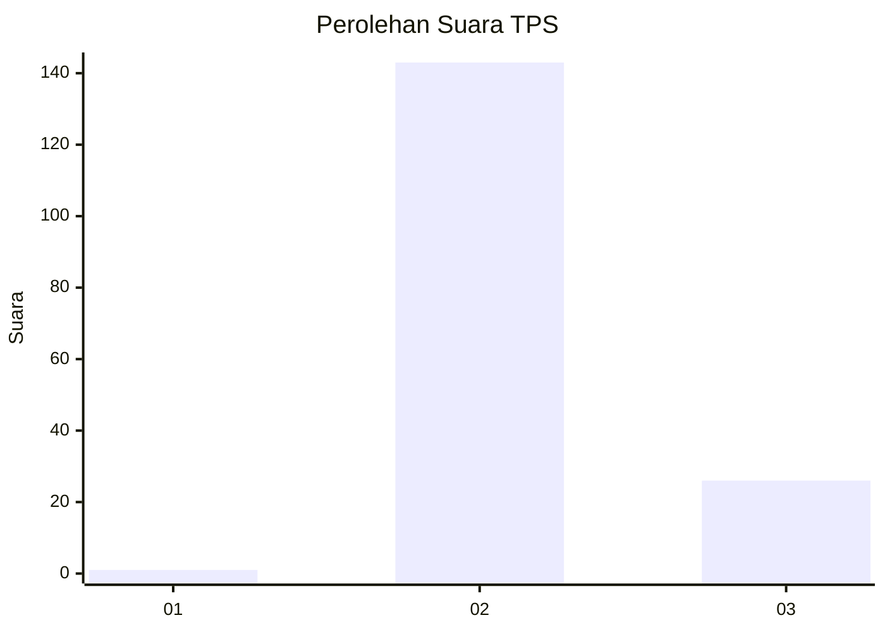
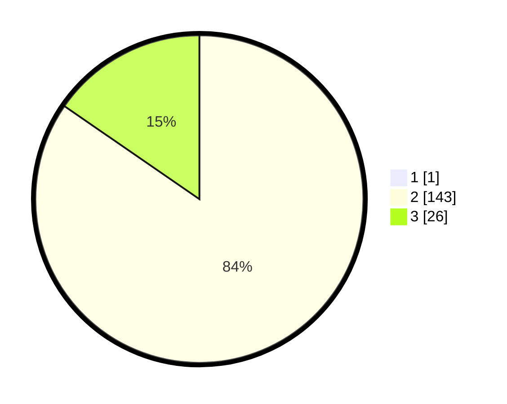

# Hasil

## Grafik

## Tabel

| No. | Nama Paslon    | Suara | Suara (raw) | Persentase |
|:--- |:-------------- | -----:| -----------:| ----------:|
| 1   | ANIES MUHAIMIN | 1     | [1][p-1]    | 0,59       |
| 2   | PRABOWO GIBRAN | 143   | [143][p-2]  | 84,12      |
| 3   | GANJAR MAHFUD  | 26    | [26][p-3]   | 15,29      |

[p-1]: https://github.com/gigit-pemilu/pemilu-2024-35-jawa-timur/blob/main/pilpres/hitung-suara/sub/35-jawa-timur/sub/22-bojonegoro/sub/08-kedungadem/sub/2005-tondomulo/sub/005-tps/sub/paslon-1.txt
[p-2]: https://github.com/gigit-pemilu/pemilu-2024-35-jawa-timur/blob/main/pilpres/hitung-suara/sub/35-jawa-timur/sub/22-bojonegoro/sub/08-kedungadem/sub/2005-tondomulo/sub/005-tps/sub/paslon-2.txt
[p-3]: https://github.com/gigit-pemilu/pemilu-2024-35-jawa-timur/blob/main/pilpres/hitung-suara/sub/35-jawa-timur/sub/22-bojonegoro/sub/08-kedungadem/sub/2005-tondomulo/sub/005-tps/sub/paslon-3.txt

## Foto C Plano

https://sirekap-obj-formc.kpu.go.id/6681/pemilu/ppwp/35/22/08/20/05/3522082005005-20240214-214914--d437c5b3-c8ee-405f-9b12-66952ab0399d.jpg

https://sirekap-obj-formc.kpu.go.id/6681/pemilu/ppwp/35/22/08/20/05/3522082005005-20240214-202920--5ccd47fb-69f1-4272-96eb-0d11a31e0c01.jpg

https://sirekap-obj-formc.kpu.go.id/6681/pemilu/ppwp/35/22/08/20/05/3522082005005-20240214-203126--d91430fa-3edf-4f5f-a31f-676f9204f7e2.jpg

## Metadata

| Key        | Value               |
| ---------- | ------------------- |
| Time Stamp | 2024-02-21 22:00:00 |

