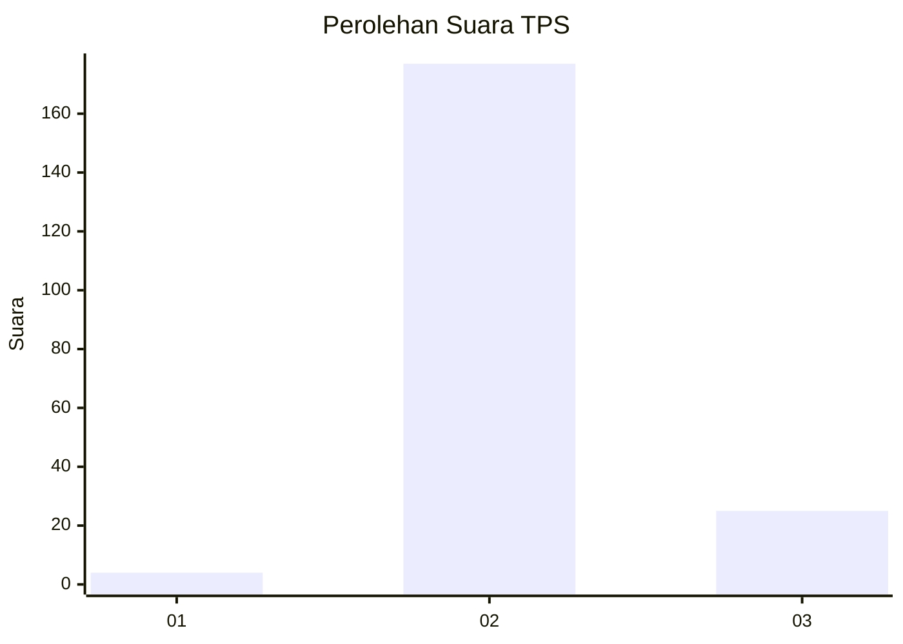
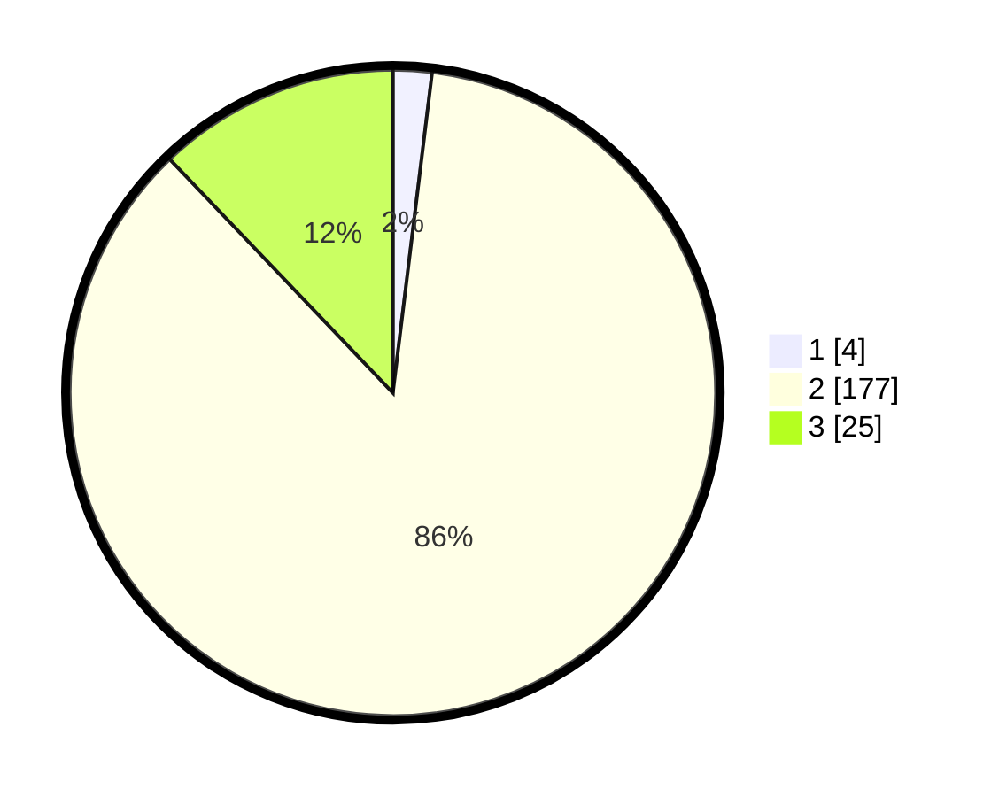

# Hasil

## Grafik

## Tabel

| No. | Nama Paslon    | Suara | Suara (raw) | Persentase |
|:--- |:-------------- | -----:| -----------:| ----------:|
| 1   | ANIES MUHAIMIN | 4     | [4][p-1]    | 1,94       |
| 2   | PRABOWO GIBRAN | 177   | [177][p-2]  | 85,92      |
| 3   | GANJAR MAHFUD  | 25    | [25][p-3]   | 12,14      |

[p-1]: https://github.com/gigit-pemilu/pemilu-2024-35-jawa-timur/blob/main/pilpres/hitung-suara/sub/35-jawa-timur/sub/22-bojonegoro/sub/08-kedungadem/sub/2006-kesongo/sub/003-tps/sub/paslon-1.txt
[p-2]: https://github.com/gigit-pemilu/pemilu-2024-35-jawa-timur/blob/main/pilpres/hitung-suara/sub/35-jawa-timur/sub/22-bojonegoro/sub/08-kedungadem/sub/2006-kesongo/sub/003-tps/sub/paslon-2.txt
[p-3]: https://github.com/gigit-pemilu/pemilu-2024-35-jawa-timur/blob/main/pilpres/hitung-suara/sub/35-jawa-timur/sub/22-bojonegoro/sub/08-kedungadem/sub/2006-kesongo/sub/003-tps/sub/paslon-3.txt

## Foto C Plano

https://sirekap-obj-formc.kpu.go.id/fa2f/pemilu/ppwp/35/22/08/20/06/3522082006003-20240215-013634--afe4d7e0-3595-48a7-adcc-3f1f2886dc5d.jpg

https://sirekap-obj-formc.kpu.go.id/fa2f/pemilu/ppwp/35/22/08/20/06/3522082006003-20240215-013843--77a39591-d8c1-4216-91c0-ed9a5cf63264.jpg

https://sirekap-obj-formc.kpu.go.id/fa2f/pemilu/ppwp/35/22/08/20/06/3522082006003-20240215-013939--dc1c8f2e-7e17-4e46-9f73-a0ccdd51ceff.jpg

## Metadata

| Key        | Value               |
| ---------- | ------------------- |
| Time Stamp | 2024-02-24 22:31:28 |

