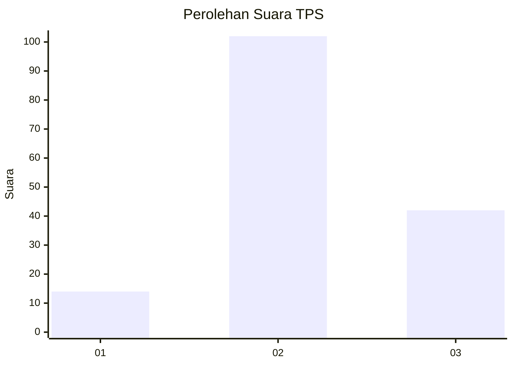
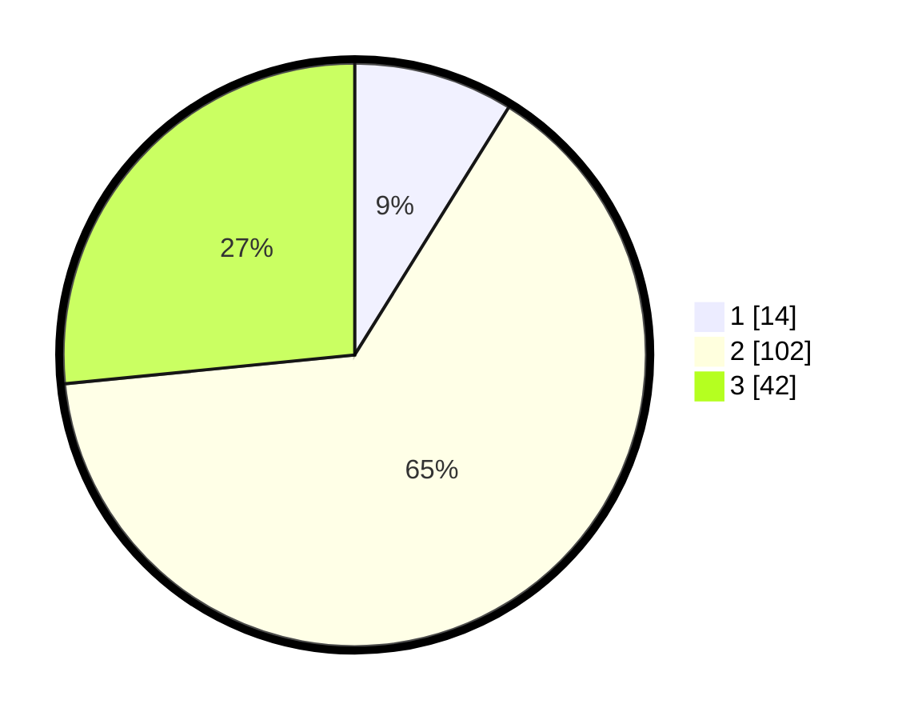

# Hasil

## Grafik

## Tabel

| No. | Nama Paslon    | Suara | Suara (raw) | Persentase |
|:--- |:-------------- | -----:| -----------:| ----------:|
| 1   | ANIES MUHAIMIN | 14    | [14][p-1]   | 8,86       |
| 2   | PRABOWO GIBRAN | 102   | [102][p-2]  | 64,56      |
| 3   | GANJAR MAHFUD  | 42    | [42][p-3]   | 26,58      |

[p-1]: https://github.com/gigit-pemilu/pemilu-2024/blob/main/pilpres/hitung-suara/sub/35-jawa-timur/sub/22-bojonegoro/sub/08-kedungadem/sub/2006-kesongo/sub/006-tps/sub/paslon-1.txt
[p-2]: https://github.com/gigit-pemilu/pemilu-2024/blob/main/pilpres/hitung-suara/sub/35-jawa-timur/sub/22-bojonegoro/sub/08-kedungadem/sub/2006-kesongo/sub/006-tps/sub/paslon-2.txt
[p-3]: https://github.com/gigit-pemilu/pemilu-2024/blob/main/pilpres/hitung-suara/sub/35-jawa-timur/sub/22-bojonegoro/sub/08-kedungadem/sub/2006-kesongo/sub/006-tps/sub/paslon-3.txt

## Foto C Plano

https://sirekap-obj-formc.kpu.go.id/fa01/pemilu/ppwp/35/22/08/20/06/3522082006006-20240219-171256--26b49f36-aa13-4003-8d9d-cd944df7cb74.jpg

https://sirekap-obj-formc.kpu.go.id/fa01/pemilu/ppwp/35/22/08/20/06/3522082006006-20240219-170133--8931879c-aa4e-4264-a0fd-635d5b959f02.jpg

https://sirekap-obj-formc.kpu.go.id/fa01/pemilu/ppwp/35/22/08/20/06/3522082006006-20240219-171338--eca05fd1-121e-4bb0-a92f-255ff2632c09.jpg

## Metadata

| Key        | Value               |
| ---------- | ------------------- |
| Time Stamp | 2024-02-24 22:31:28 |

