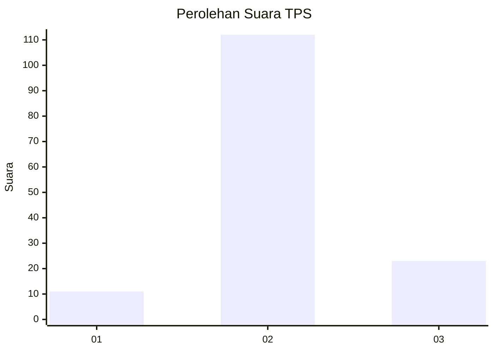

# Hasil

## Grafik

## Tabel

| No. | Nama Paslon    | Suara | Suara (raw) | Persentase |
|:--- |:-------------- | -----:| -----------:| ----------:|
| 1   | ANIES MUHAIMIN | 11    | [11][p-1]   | 7,53       |
| 2   | PRABOWO GIBRAN | 112   | [112][p-2]  | 76,71      |
| 3   | GANJAR MAHFUD  | 23    | [23][p-3]   | 15,75      |

[p-1]: https://github.com/gigit-pemilu/pemilu-2024-35-jawa-timur/blob/main/pilpres/hitung-suara/sub/35-jawa-timur/sub/22-bojonegoro/sub/08-kedungadem/sub/2007-kendung/sub/009-tps/sub/paslon-1.txt
[p-2]: https://github.com/gigit-pemilu/pemilu-2024-35-jawa-timur/blob/main/pilpres/hitung-suara/sub/35-jawa-timur/sub/22-bojonegoro/sub/08-kedungadem/sub/2007-kendung/sub/009-tps/sub/paslon-2.txt
[p-3]: https://github.com/gigit-pemilu/pemilu-2024-35-jawa-timur/blob/main/pilpres/hitung-suara/sub/35-jawa-timur/sub/22-bojonegoro/sub/08-kedungadem/sub/2007-kendung/sub/009-tps/sub/paslon-3.txt

## Foto C Plano

https://sirekap-obj-formc.kpu.go.id/cf67/pemilu/ppwp/35/22/08/20/07/3522082007009-20240219-190758--aac85dac-11dc-41ee-9e87-62c8607ca77d.jpg

https://sirekap-obj-formc.kpu.go.id/cf67/pemilu/ppwp/35/22/08/20/07/3522082007009-20240219-190955--b7fea33b-2032-4826-9abf-a2c6f2eddc23.jpg

https://sirekap-obj-formc.kpu.go.id/cf67/pemilu/ppwp/35/22/08/20/07/3522082007009-20240214-220746--f13b8094-7c6c-4c3d-8e0c-c4b976ad03c0.jpg

## Metadata

| Key        | Value               |
| ---------- | ------------------- |
| Time Stamp | 2024-02-24 22:31:28 |

