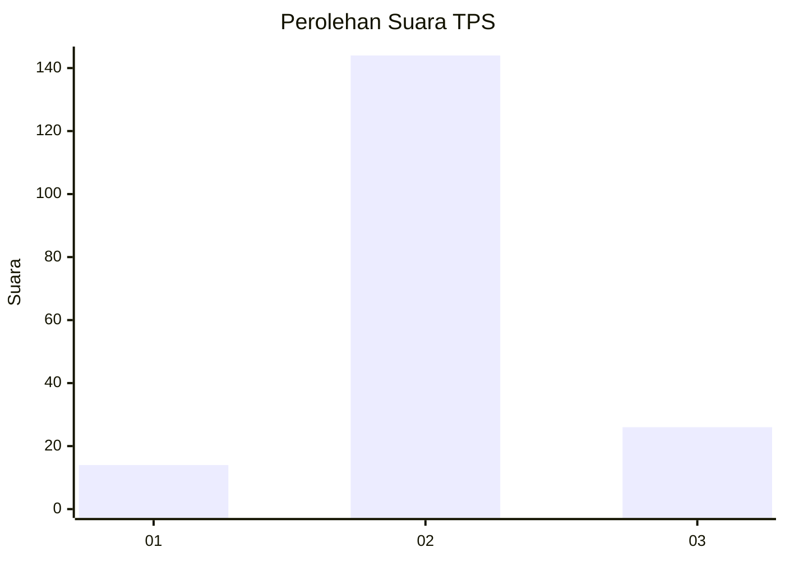
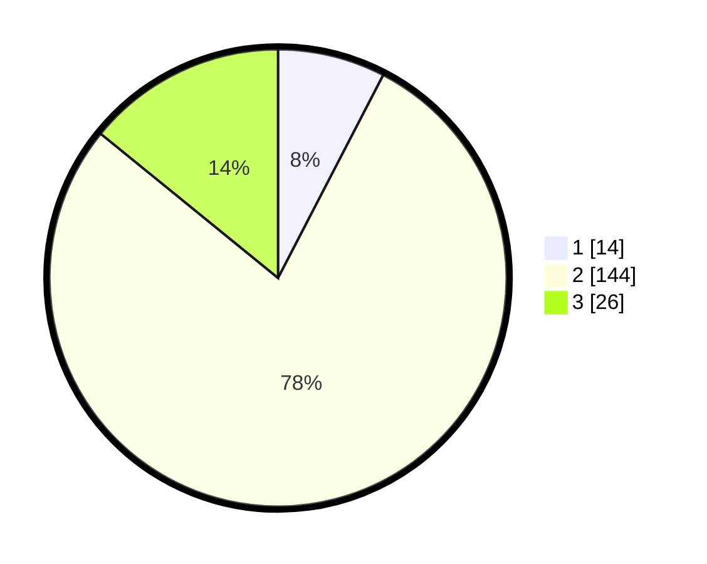

# Hasil

## Grafik

## Tabel

| No. | Nama Paslon    | Suara | Suara (raw) | Persentase |
|:--- |:-------------- | -----:| -----------:| ----------:|
| 1   | ANIES MUHAIMIN | 14    | [14][p-1]   | 7,61       |
| 2   | PRABOWO GIBRAN | 144   | [144][p-2]  | 78,26      |
| 3   | GANJAR MAHFUD  | 26    | [26][p-3]   | 14,13      |

[p-1]: https://github.com/gigit-pemilu/pemilu-2024-35-jawa-timur/blob/main/pilpres/hitung-suara/sub/35-jawa-timur/sub/22-bojonegoro/sub/08-kedungadem/sub/2009-tumbrasanom/sub/001-tps/sub/paslon-1.txt
[p-2]: https://github.com/gigit-pemilu/pemilu-2024-35-jawa-timur/blob/main/pilpres/hitung-suara/sub/35-jawa-timur/sub/22-bojonegoro/sub/08-kedungadem/sub/2009-tumbrasanom/sub/001-tps/sub/paslon-2.txt
[p-3]: https://github.com/gigit-pemilu/pemilu-2024-35-jawa-timur/blob/main/pilpres/hitung-suara/sub/35-jawa-timur/sub/22-bojonegoro/sub/08-kedungadem/sub/2009-tumbrasanom/sub/001-tps/sub/paslon-3.txt

## Foto C Plano

https://sirekap-obj-formc.kpu.go.id/ed80/pemilu/ppwp/35/22/08/20/09/3522082009001-20240220-080641--baf3de4d-dd14-4d08-b1d1-1bb3dd0fcb92.jpg

https://sirekap-obj-formc.kpu.go.id/ed80/pemilu/ppwp/35/22/08/20/09/3522082009001-20240220-080739--c97c6d91-b831-481e-bfb4-5f0e26b3671b.jpg

https://sirekap-obj-formc.kpu.go.id/ed80/pemilu/ppwp/35/22/08/20/09/3522082009001-20240220-080359--82100ac5-14a5-4087-a9a7-43bd1148af39.jpg

## Metadata

| Key        | Value               |
| ---------- | ------------------- |
| Time Stamp | 2024-02-25 01:00:00 |

