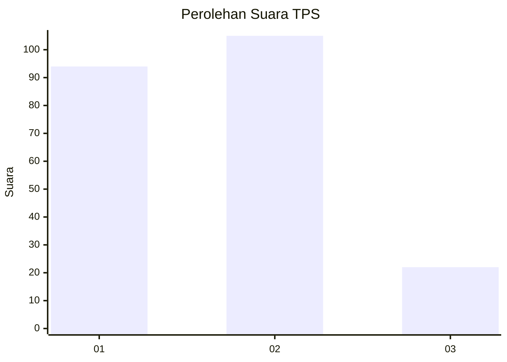
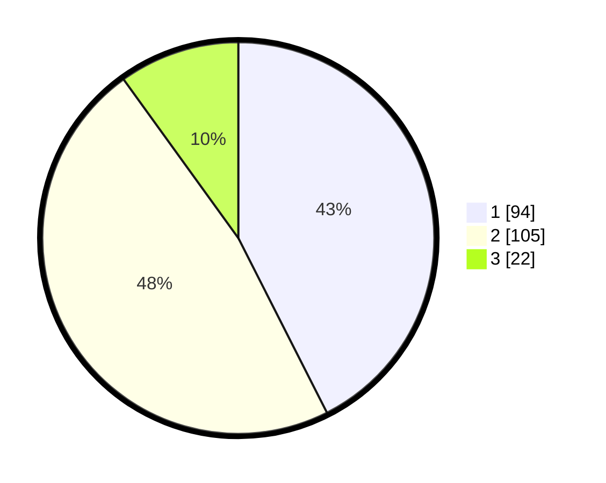

# Hasil

## Grafik

## Tabel

| No. | Nama Paslon    | Suara | Suara (raw) | Persentase |
|:--- |:-------------- | -----:| -----------:| ----------:|
| 1   | ANIES MUHAIMIN | 94    | [94][p-1]   | 42,53      |
| 2   | PRABOWO GIBRAN | 105   | [105][p-2]  | 47,51      |
| 3   | GANJAR MAHFUD  | 22    | [22][p-3]   | 9,95       |

[p-1]: https://github.com/gigit-pemilu/pemilu-2024/blob/main/pilpres/hitung-suara/sub/35-jawa-timur/sub/22-bojonegoro/sub/08-kedungadem/sub/2010-kedungadem/sub/001-tps/sub/paslon-1.txt
[p-2]: https://github.com/gigit-pemilu/pemilu-2024/blob/main/pilpres/hitung-suara/sub/35-jawa-timur/sub/22-bojonegoro/sub/08-kedungadem/sub/2010-kedungadem/sub/001-tps/sub/paslon-2.txt
[p-3]: https://github.com/gigit-pemilu/pemilu-2024/blob/main/pilpres/hitung-suara/sub/35-jawa-timur/sub/22-bojonegoro/sub/08-kedungadem/sub/2010-kedungadem/sub/001-tps/sub/paslon-3.txt

## Foto C Plano

https://sirekap-obj-formc.kpu.go.id/05c4/pemilu/ppwp/35/22/08/20/10/3522082010001-20240214-223139--4325a96a-f9dc-42cb-89be-07a734fb444e.jpg

https://sirekap-obj-formc.kpu.go.id/05c4/pemilu/ppwp/35/22/08/20/10/3522082010001-20240214-141758--b52c7364-d77d-4341-aa2b-195c98db1233.jpg

https://sirekap-obj-formc.kpu.go.id/05c4/pemilu/ppwp/35/22/08/20/10/3522082010001-20240214-141848--68e511b5-aace-4982-83c5-4f1339450eb4.jpg

## Metadata

| Key        | Value               |
| ---------- | ------------------- |
| Time Stamp | 2024-02-24 22:31:28 |

