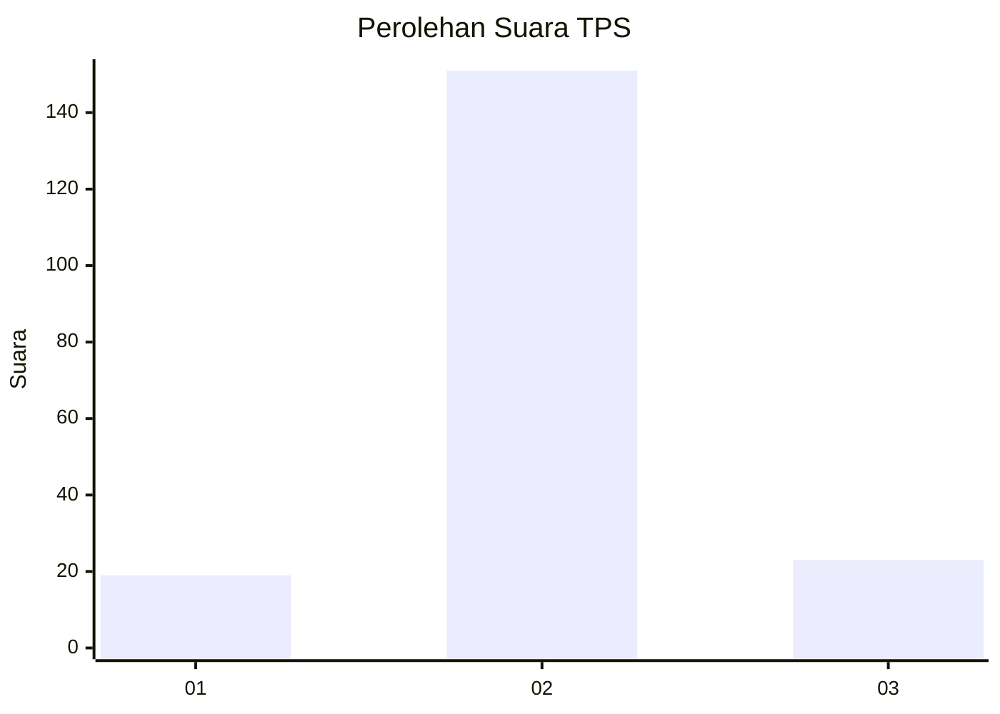
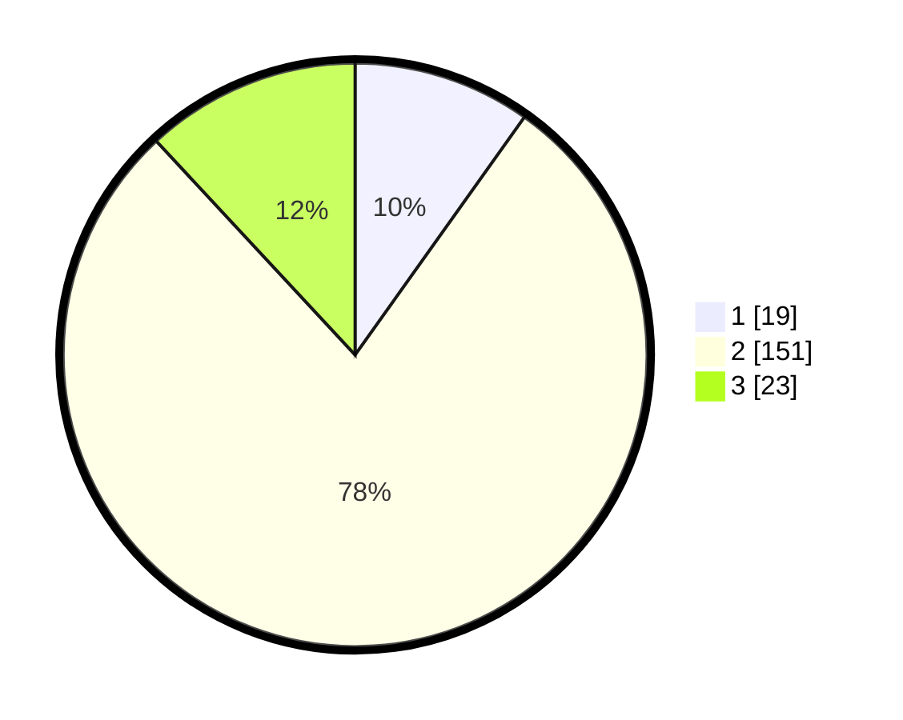

# Hasil

## Grafik

## Tabel

| No. | Nama Paslon    | Suara | Suara (raw) | Persentase |
|:--- |:-------------- | -----:| -----------:| ----------:|
| 1   | ANIES MUHAIMIN | 19    | [19][p-1]   | 9,84       |
| 2   | PRABOWO GIBRAN | 151   | [151][p-2]  | 78,24      |
| 3   | GANJAR MAHFUD  | 23    | [23][p-3]   | 11,92      |

[p-1]: https://github.com/gigit-pemilu/pemilu-2024/blob/main/pilpres/hitung-suara/sub/35-jawa-timur/sub/22-bojonegoro/sub/08-kedungadem/sub/2011-duwel/sub/001-tps/sub/paslon-1.txt
[p-2]: https://github.com/gigit-pemilu/pemilu-2024/blob/main/pilpres/hitung-suara/sub/35-jawa-timur/sub/22-bojonegoro/sub/08-kedungadem/sub/2011-duwel/sub/001-tps/sub/paslon-2.txt
[p-3]: https://github.com/gigit-pemilu/pemilu-2024/blob/main/pilpres/hitung-suara/sub/35-jawa-timur/sub/22-bojonegoro/sub/08-kedungadem/sub/2011-duwel/sub/001-tps/sub/paslon-3.txt

## Foto C Plano

https://sirekap-obj-formc.kpu.go.id/fff2/pemilu/ppwp/35/22/08/20/11/3522082011001-20240214-223643--2407c04c-c9f1-40e4-86f9-f772133eaf80.jpg

https://sirekap-obj-formc.kpu.go.id/fff2/pemilu/ppwp/35/22/08/20/11/3522082011001-20240214-223806--cb958100-8022-4eeb-afd4-b63db5c6f90d.jpg

https://sirekap-obj-formc.kpu.go.id/fff2/pemilu/ppwp/35/22/08/20/11/3522082011001-20240214-223925--cf8ffb2b-9fc4-4a6b-a9b7-cfb576af4ef3.jpg

## Metadata

| Key        | Value               |
| ---------- | ------------------- |
| Time Stamp | 2024-02-24 22:31:28 |

