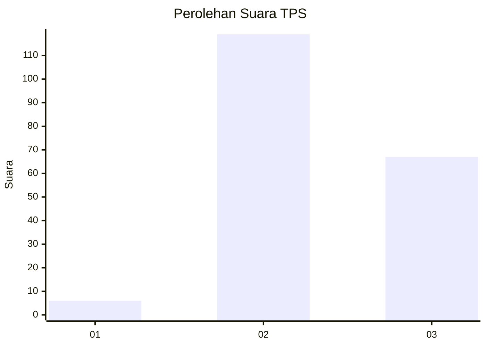
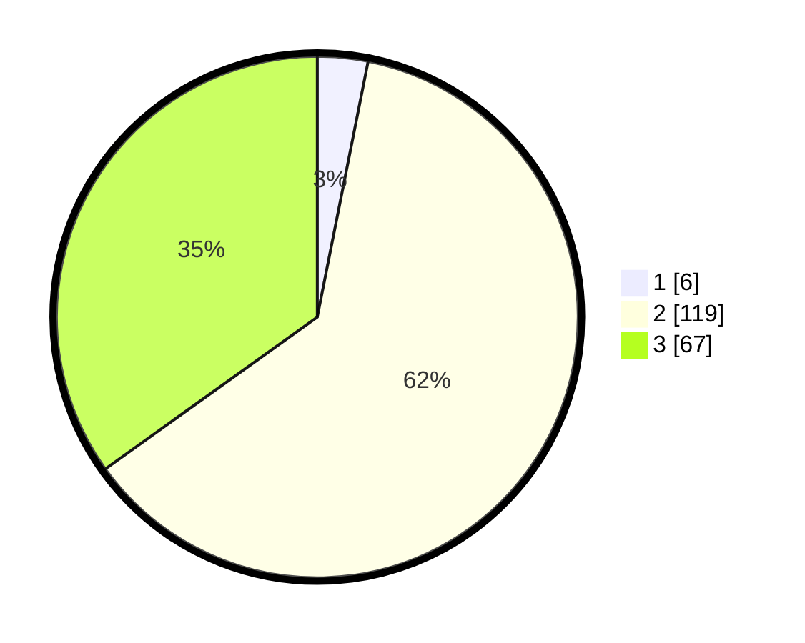

# Hasil

## Grafik

## Tabel

| No. | Nama Paslon    | Suara | Suara (raw) | Persentase |
|:--- |:-------------- | -----:| -----------:| ----------:|
| 1   | ANIES MUHAIMIN | 6     | [6][p-1]    | 3,13       |
| 2   | PRABOWO GIBRAN | 119   | [119][p-2]  | 61,98      |
| 3   | GANJAR MAHFUD  | 67    | [67][p-3]   | 34,90      |

[p-1]: https://github.com/gigit-pemilu/pemilu-2024/blob/main/pilpres/hitung-suara/sub/35-jawa-timur/sub/22-bojonegoro/sub/08-kedungadem/sub/2012-kepohkidul/sub/005-tps/sub/paslon-1.txt
[p-2]: https://github.com/gigit-pemilu/pemilu-2024/blob/main/pilpres/hitung-suara/sub/35-jawa-timur/sub/22-bojonegoro/sub/08-kedungadem/sub/2012-kepohkidul/sub/005-tps/sub/paslon-2.txt
[p-3]: https://github.com/gigit-pemilu/pemilu-2024/blob/main/pilpres/hitung-suara/sub/35-jawa-timur/sub/22-bojonegoro/sub/08-kedungadem/sub/2012-kepohkidul/sub/005-tps/sub/paslon-3.txt

## Foto C Plano

https://sirekap-obj-formc.kpu.go.id/8dd1/pemilu/ppwp/35/22/08/20/12/3522082012005-20240214-180835--34bb1a52-b815-4db6-9834-7ed467c500b2.jpg

https://sirekap-obj-formc.kpu.go.id/8dd1/pemilu/ppwp/35/22/08/20/12/3522082012005-20240214-203319--38e02e43-2210-4a36-8e5f-ee32d2f5efea.jpg

https://sirekap-obj-formc.kpu.go.id/8dd1/pemilu/ppwp/35/22/08/20/12/3522082012005-20240214-213327--203bbc5b-4efd-41de-bd22-fb5cc1decb17.jpg

## Metadata

| Key        | Value               |
| ---------- | ------------------- |
| Time Stamp | 2024-02-15 04:00:24 |

