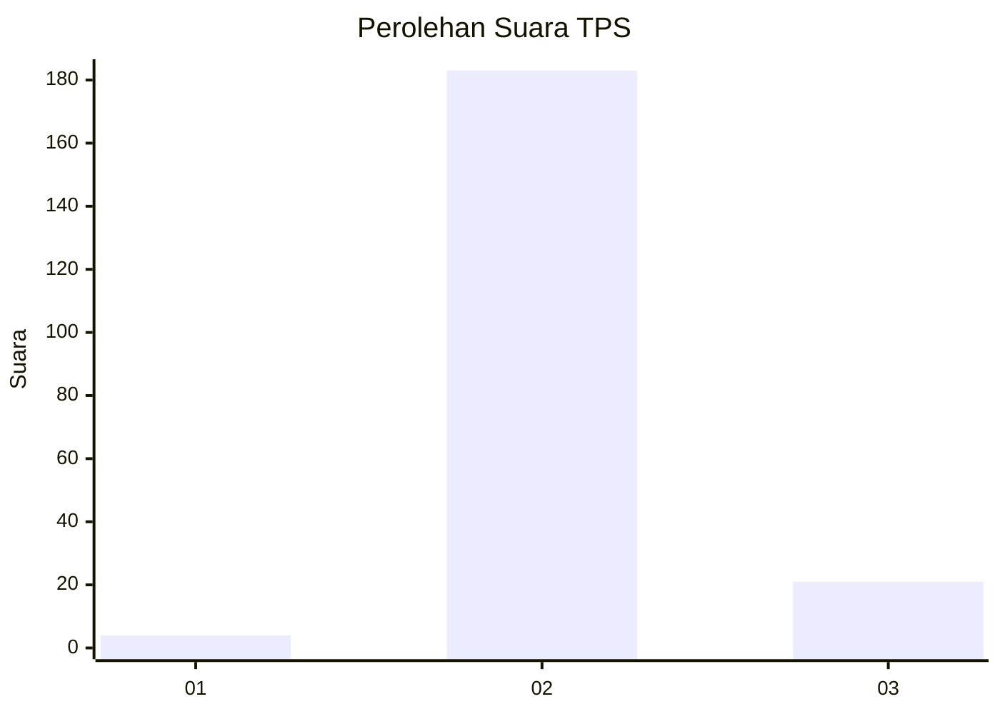
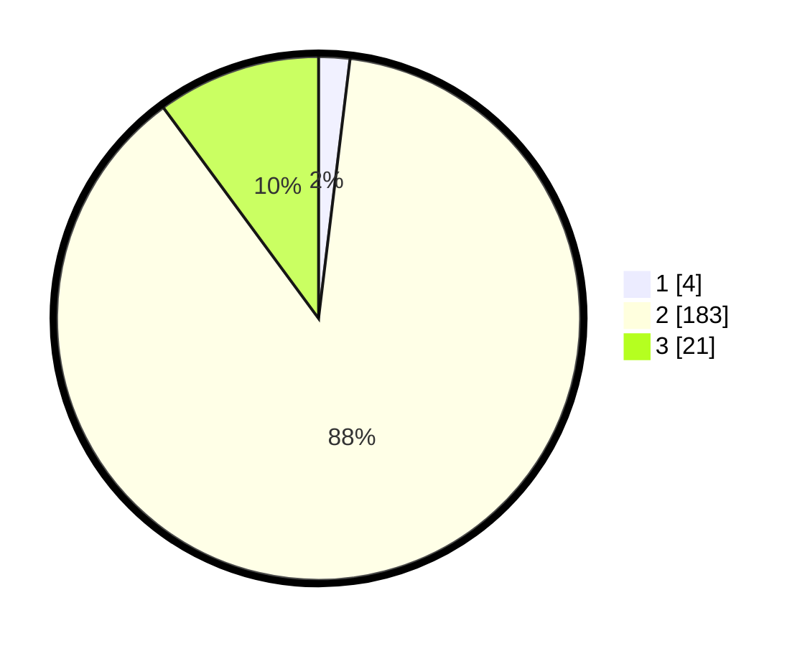

# Hasil

## Grafik

## Tabel

| No. | Nama Paslon    | Suara | Suara (raw) | Persentase |
|:--- |:-------------- | -----:| -----------:| ----------:|
| 1   | ANIES MUHAIMIN | 4     | [4][p-1]    | 1,92       |
| 2   | PRABOWO GIBRAN | 183   | [183][p-2]  | 87,98      |
| 3   | GANJAR MAHFUD  | 21    | [21][p-3]   | 10,10      |

[p-1]: https://github.com/gigit-pemilu/pemilu-2024/blob/main/pilpres/hitung-suara/sub/35-jawa-timur/sub/22-bojonegoro/sub/08-kedungadem/sub/2015-megale/sub/018-tps/sub/paslon-1.txt
[p-2]: https://github.com/gigit-pemilu/pemilu-2024/blob/main/pilpres/hitung-suara/sub/35-jawa-timur/sub/22-bojonegoro/sub/08-kedungadem/sub/2015-megale/sub/018-tps/sub/paslon-2.txt
[p-3]: https://github.com/gigit-pemilu/pemilu-2024/blob/main/pilpres/hitung-suara/sub/35-jawa-timur/sub/22-bojonegoro/sub/08-kedungadem/sub/2015-megale/sub/018-tps/sub/paslon-3.txt

## Foto C Plano

https://sirekap-obj-formc.kpu.go.id/3c26/pemilu/ppwp/35/22/08/20/15/3522082015018-20240214-141710--08d21df1-26a4-4670-a4d1-7c12dfbd9c9f.jpg

https://sirekap-obj-formc.kpu.go.id/3c26/pemilu/ppwp/35/22/08/20/15/3522082015018-20240214-141750--adb5bcd7-4591-4ab4-a041-8c3b681d0035.jpg

https://sirekap-obj-formc.kpu.go.id/3c26/pemilu/ppwp/35/22/08/20/15/3522082015018-20240214-141837--7f9a8b9e-b4cb-44fa-94fc-510c51cf6065.jpg

## Metadata

| Key        | Value               |
| ---------- | ------------------- |
| Time Stamp | 2024-02-24 22:31:28 |

