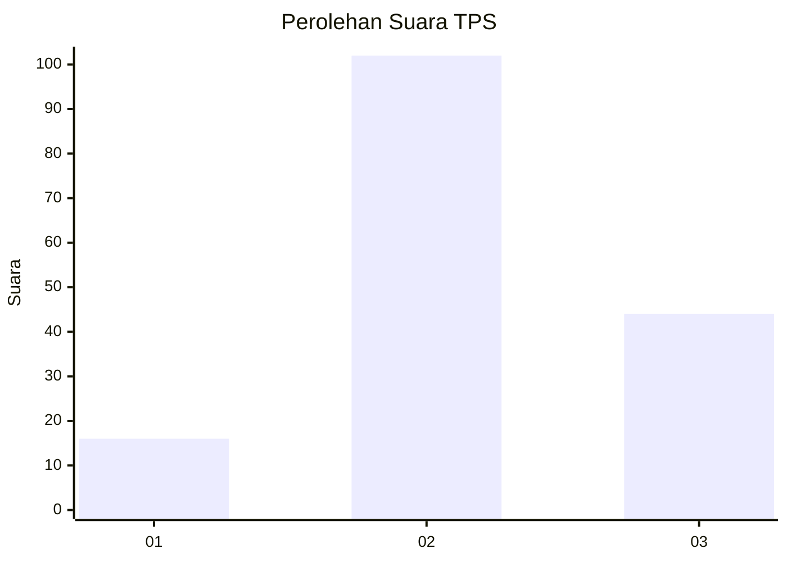
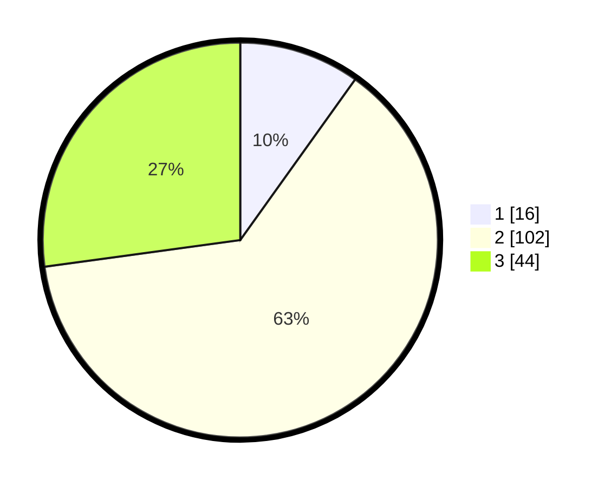

# Hasil

## Grafik

## Tabel

| No. | Nama Paslon    | Suara | Suara (raw) | Persentase |
|:--- |:-------------- | -----:| -----------:| ----------:|
| 1   | ANIES MUHAIMIN | 16    | [16][p-1]   | 9,88       |
| 2   | PRABOWO GIBRAN | 102   | [102][p-2]  | 62,96      |
| 3   | GANJAR MAHFUD  | 44    | [44][p-3]   | 27,16      |

[p-1]: https://github.com/gigit-pemilu/pemilu-2024/blob/main/pilpres/hitung-suara/sub/35-jawa-timur/sub/22-bojonegoro/sub/08-kedungadem/sub/2015-megale/sub/021-tps/sub/paslon-1.txt
[p-2]: https://github.com/gigit-pemilu/pemilu-2024/blob/main/pilpres/hitung-suara/sub/35-jawa-timur/sub/22-bojonegoro/sub/08-kedungadem/sub/2015-megale/sub/021-tps/sub/paslon-2.txt
[p-3]: https://github.com/gigit-pemilu/pemilu-2024/blob/main/pilpres/hitung-suara/sub/35-jawa-timur/sub/22-bojonegoro/sub/08-kedungadem/sub/2015-megale/sub/021-tps/sub/paslon-3.txt

## Foto C Plano

https://sirekap-obj-formc.kpu.go.id/8e87/pemilu/ppwp/35/22/08/20/15/3522082015021-20240214-231634--903936f2-d88a-43f9-9ee6-fe5823a91033.jpg

https://sirekap-obj-formc.kpu.go.id/8e87/pemilu/ppwp/35/22/08/20/15/3522082015021-20240214-232649--e169945a-661b-49ea-bec5-c89061fa1631.jpg

https://sirekap-obj-formc.kpu.go.id/8e87/pemilu/ppwp/35/22/08/20/15/3522082015021-20240214-232828--d55d5ba0-5670-42ec-90f0-d5e7c17e5854.jpg

## Metadata

| Key        | Value               |
| ---------- | ------------------- |
| Time Stamp | 2024-02-15 12:00:28 |

