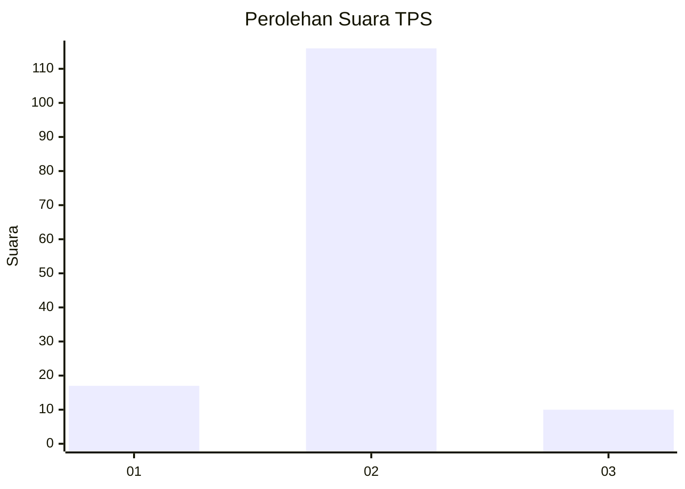
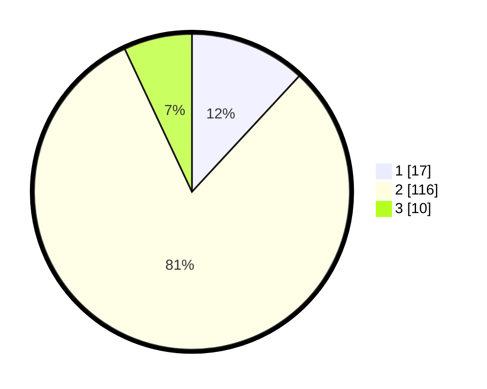

# Hasil

## Grafik

## Tabel

| No. | Nama Paslon    | Suara | Suara (raw) | Persentase |
|:--- |:-------------- | -----:| -----------:| ----------:|
| 1   | ANIES MUHAIMIN | 17    | [17][p-1]   | 11,89      |
| 2   | PRABOWO GIBRAN | 116   | [116][p-2]  | 81,12      |
| 3   | GANJAR MAHFUD  | 10    | [10][p-3]   | 6,99       |

[p-1]: https://github.com/gigit-pemilu/pemilu-2024-35-jawa-timur/blob/main/pilpres/hitung-suara/sub/35-jawa-timur/sub/22-bojonegoro/sub/08-kedungadem/sub/2019-jamberejo/sub/002-tps/sub/paslon-1.txt
[p-2]: https://github.com/gigit-pemilu/pemilu-2024-35-jawa-timur/blob/main/pilpres/hitung-suara/sub/35-jawa-timur/sub/22-bojonegoro/sub/08-kedungadem/sub/2019-jamberejo/sub/002-tps/sub/paslon-2.txt
[p-3]: https://github.com/gigit-pemilu/pemilu-2024-35-jawa-timur/blob/main/pilpres/hitung-suara/sub/35-jawa-timur/sub/22-bojonegoro/sub/08-kedungadem/sub/2019-jamberejo/sub/002-tps/sub/paslon-3.txt

## Foto C Plano

https://sirekap-obj-formc.kpu.go.id/934a/pemilu/ppwp/35/22/08/20/19/3522082019002-20240214-233713--2ac56da3-7650-492b-afa1-e44fd19e30c5.jpg

https://sirekap-obj-formc.kpu.go.id/934a/pemilu/ppwp/35/22/08/20/19/3522082019002-20240214-222817--d453d191-0485-40d5-994c-7a2a4b9c38ea.jpg

https://sirekap-obj-formc.kpu.go.id/934a/pemilu/ppwp/35/22/08/20/19/3522082019002-20240214-234033--29567e29-b1da-417c-9e1c-8a3185222893.jpg

## Metadata

| Key        | Value               |
| ---------- | ------------------- |
| Time Stamp | 2024-02-25 12:00:00 |

