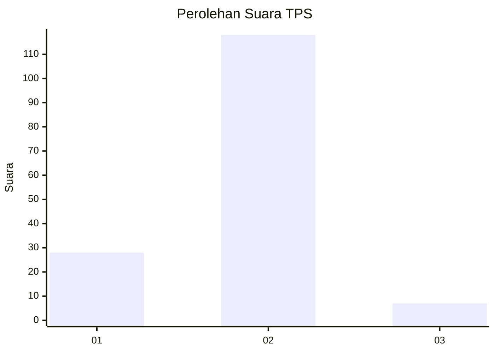
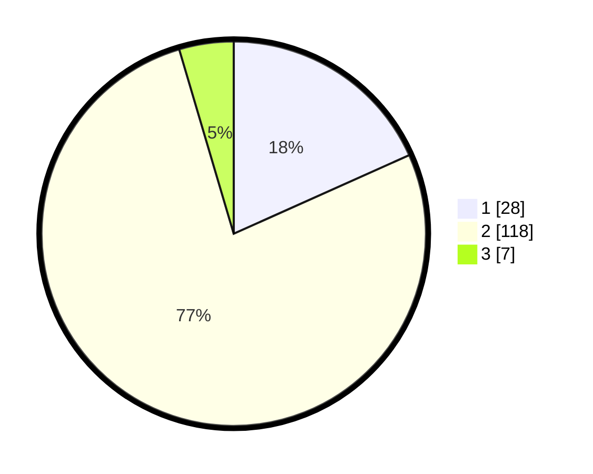

# Hasil

## Grafik

## Tabel

| No. | Nama Paslon    | Suara | Suara (raw) | Persentase |
|:--- |:-------------- | -----:| -----------:| ----------:|
| 1   | ANIES MUHAIMIN | 28    | [28][p-1]   | 18,30      |
| 2   | PRABOWO GIBRAN | 118   | [118][p-2]  | 77,12      |
| 3   | GANJAR MAHFUD  | 7     | [7][p-3]    | 4,58       |

[p-1]: https://github.com/gigit-pemilu/pemilu-2024/blob/main/pilpres/hitung-suara/sub/35-jawa-timur/sub/22-bojonegoro/sub/08-kedungadem/sub/2019-jamberejo/sub/004-tps/sub/paslon-1.txt
[p-2]: https://github.com/gigit-pemilu/pemilu-2024/blob/main/pilpres/hitung-suara/sub/35-jawa-timur/sub/22-bojonegoro/sub/08-kedungadem/sub/2019-jamberejo/sub/004-tps/sub/paslon-2.txt
[p-3]: https://github.com/gigit-pemilu/pemilu-2024/blob/main/pilpres/hitung-suara/sub/35-jawa-timur/sub/22-bojonegoro/sub/08-kedungadem/sub/2019-jamberejo/sub/004-tps/sub/paslon-3.txt

## Foto C Plano

https://sirekap-obj-formc.kpu.go.id/da7a/pemilu/ppwp/35/22/08/20/19/3522082019004-20240214-224055--5f6c5d23-1fc3-43c8-942f-a9525277e95f.jpg

https://sirekap-obj-formc.kpu.go.id/da7a/pemilu/ppwp/35/22/08/20/19/3522082019004-20240214-222853--c773f6b2-b7d0-41ab-8b6b-b28d6e56557e.jpg

https://sirekap-obj-formc.kpu.go.id/da7a/pemilu/ppwp/35/22/08/20/19/3522082019004-20240214-194638--15a6a1b0-878f-419b-9cdd-cd577003d84c.jpg

## Metadata

| Key        | Value               |
| ---------- | ------------------- |
| Time Stamp | 2024-02-24 22:31:28 |

