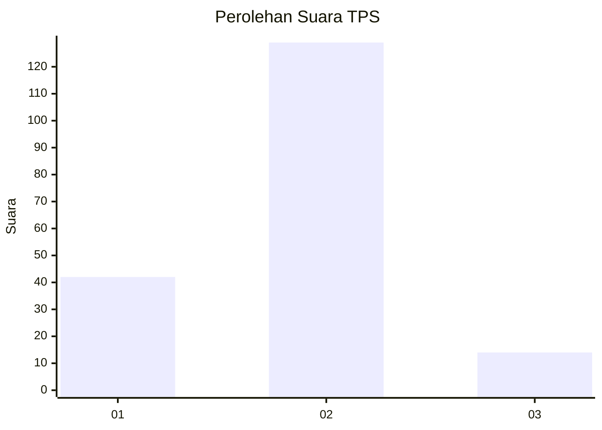
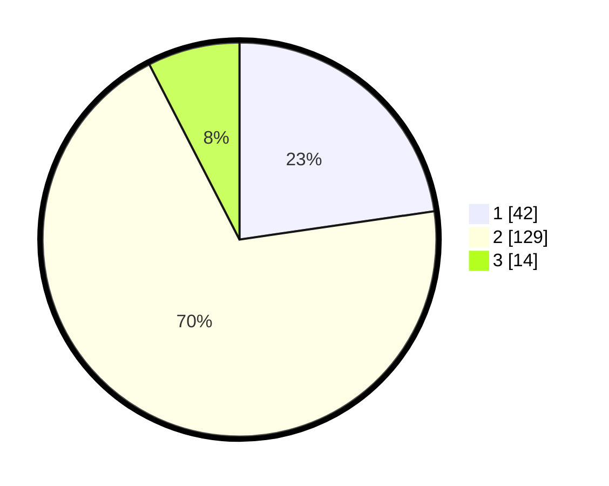

# Hasil

## Grafik

## Tabel

| No. | Nama Paslon    | Suara | Suara (raw) | Persentase |
|:--- |:-------------- | -----:| -----------:| ----------:|
| 1   | ANIES MUHAIMIN | 42    | [42][p-1]   | 22,70      |
| 2   | PRABOWO GIBRAN | 129   | [129][p-2]  | 69,73      |
| 3   | GANJAR MAHFUD  | 14    | [14][p-3]   | 7,57       |

[p-1]: https://github.com/gigit-pemilu/pemilu-2024/blob/main/pilpres/hitung-suara/sub/35-jawa-timur/sub/22-bojonegoro/sub/08-kedungadem/sub/2019-jamberejo/sub/005-tps/sub/paslon-1.txt
[p-2]: https://github.com/gigit-pemilu/pemilu-2024/blob/main/pilpres/hitung-suara/sub/35-jawa-timur/sub/22-bojonegoro/sub/08-kedungadem/sub/2019-jamberejo/sub/005-tps/sub/paslon-2.txt
[p-3]: https://github.com/gigit-pemilu/pemilu-2024/blob/main/pilpres/hitung-suara/sub/35-jawa-timur/sub/22-bojonegoro/sub/08-kedungadem/sub/2019-jamberejo/sub/005-tps/sub/paslon-3.txt

## Foto C Plano

https://sirekap-obj-formc.kpu.go.id/6a1f/pemilu/ppwp/35/22/08/20/19/3522082019005-20240214-215710--517207e3-faf6-4a89-b74d-86cf98f7d133.jpg

https://sirekap-obj-formc.kpu.go.id/6a1f/pemilu/ppwp/35/22/08/20/19/3522082019005-20240214-194731--ccf0dba4-3044-4022-b04e-8a89dff2aebd.jpg

https://sirekap-obj-formc.kpu.go.id/6a1f/pemilu/ppwp/35/22/08/20/19/3522082019005-20240214-194927--cde4d370-15b7-4b19-8646-75cd4f3f6481.jpg

## Metadata

| Key        | Value               |
| ---------- | ------------------- |
| Time Stamp | 2024-02-24 22:31:28 |

