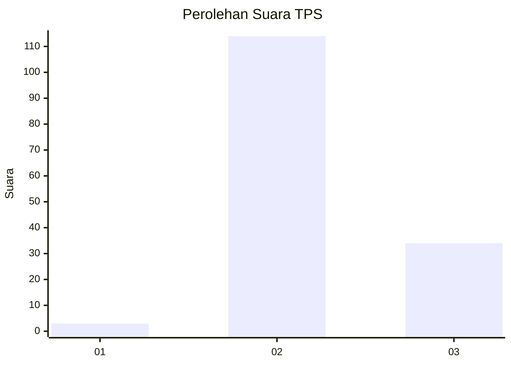
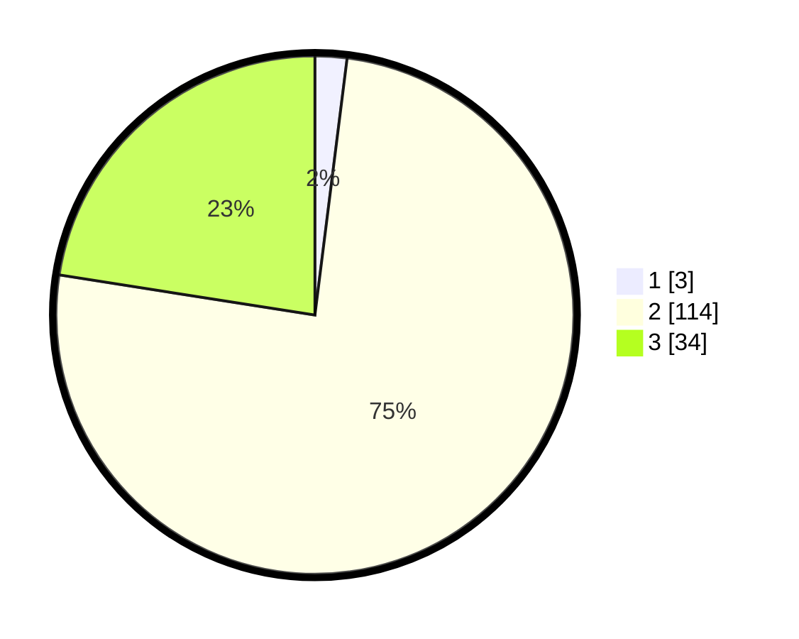

# Hasil

## Grafik

## Tabel

| No. | Nama Paslon    | Suara | Suara (raw) | Persentase |
|:--- |:-------------- | -----:| -----------:| ----------:|
| 1   | ANIES MUHAIMIN | 3     | [3][p-1]    | 1,99       |
| 2   | PRABOWO GIBRAN | 114   | [114][p-2]  | 75,50      |
| 3   | GANJAR MAHFUD  | 34    | [34][p-3]   | 22,52      |

[p-1]: https://github.com/gigit-pemilu/pemilu-2024-35-jawa-timur/blob/main/pilpres/hitung-suara/sub/35-jawa-timur/sub/22-bojonegoro/sub/08-kedungadem/sub/2019-jamberejo/sub/012-tps/sub/paslon-1.txt
[p-2]: https://github.com/gigit-pemilu/pemilu-2024-35-jawa-timur/blob/main/pilpres/hitung-suara/sub/35-jawa-timur/sub/22-bojonegoro/sub/08-kedungadem/sub/2019-jamberejo/sub/012-tps/sub/paslon-2.txt
[p-3]: https://github.com/gigit-pemilu/pemilu-2024-35-jawa-timur/blob/main/pilpres/hitung-suara/sub/35-jawa-timur/sub/22-bojonegoro/sub/08-kedungadem/sub/2019-jamberejo/sub/012-tps/sub/paslon-3.txt

## Foto C Plano

https://sirekap-obj-formc.kpu.go.id/86dc/pemilu/ppwp/35/22/08/20/19/3522082019012-20240214-141115--224389c8-7b7c-492b-8d18-59fb627c59b3.jpg

https://sirekap-obj-formc.kpu.go.id/86dc/pemilu/ppwp/35/22/08/20/19/3522082019012-20240214-140948--f1b220b2-10da-4214-92e3-848f0fe4da79.jpg

https://sirekap-obj-formc.kpu.go.id/86dc/pemilu/ppwp/35/22/08/20/19/3522082019012-20240215-013924--38b2ecaf-3fb7-41a6-b685-2ea37f61387e.jpg

## Metadata

| Key        | Value               |
| ---------- | ------------------- |
| Time Stamp | 2024-02-24 22:31:28 |

