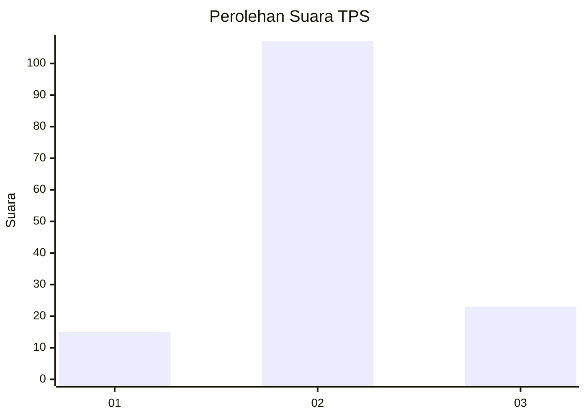
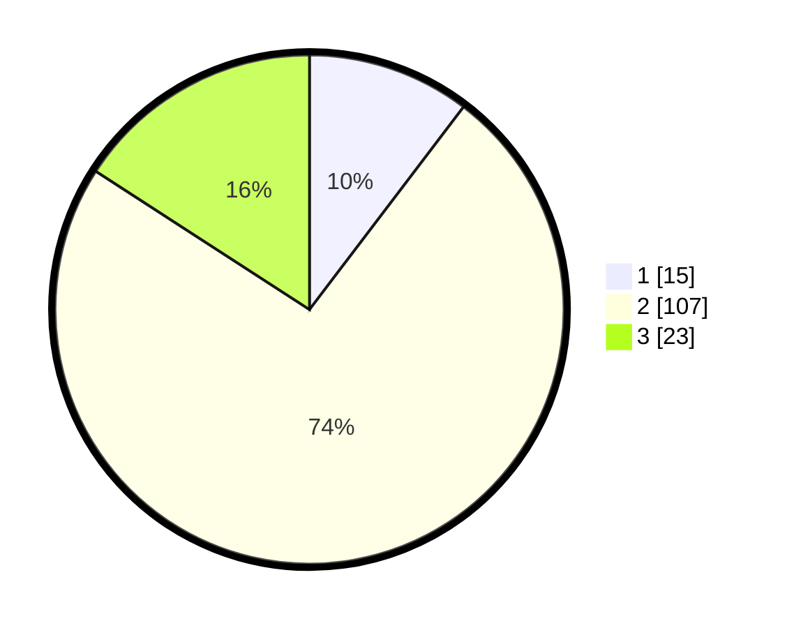

# Hasil

## Grafik

## Tabel

| No. | Nama Paslon    | Suara | Suara (raw) | Persentase |
|:--- |:-------------- | -----:| -----------:| ----------:|
| 1   | ANIES MUHAIMIN | 15    | [15][p-1]   | 10,34      |
| 2   | PRABOWO GIBRAN | 107   | [107][p-2]  | 73,79      |
| 3   | GANJAR MAHFUD  | 23    | [23][p-3]   | 15,86      |

[p-1]: https://github.com/gigit-pemilu/pemilu-2024/blob/main/pilpres/hitung-suara/sub/35-jawa-timur/sub/22-bojonegoro/sub/08-kedungadem/sub/2019-jamberejo/sub/016-tps/sub/paslon-1.txt
[p-2]: https://github.com/gigit-pemilu/pemilu-2024/blob/main/pilpres/hitung-suara/sub/35-jawa-timur/sub/22-bojonegoro/sub/08-kedungadem/sub/2019-jamberejo/sub/016-tps/sub/paslon-2.txt
[p-3]: https://github.com/gigit-pemilu/pemilu-2024/blob/main/pilpres/hitung-suara/sub/35-jawa-timur/sub/22-bojonegoro/sub/08-kedungadem/sub/2019-jamberejo/sub/016-tps/sub/paslon-3.txt

## Foto C Plano

https://sirekap-obj-formc.kpu.go.id/701e/pemilu/ppwp/35/22/08/20/19/3522082019016-20240215-010020--bac6ec6a-fea3-49ba-a973-95b5bd233326.jpg

https://sirekap-obj-formc.kpu.go.id/701e/pemilu/ppwp/35/22/08/20/19/3522082019016-20240215-010045--766de782-7c32-4841-bda8-74ad100eedee.jpg

https://sirekap-obj-formc.kpu.go.id/701e/pemilu/ppwp/35/22/08/20/19/3522082019016-20240215-010115--4f50f18f-f1e0-4f3d-8ca8-cdd71e555cb4.jpg

## Metadata

| Key        | Value               |
| ---------- | ------------------- |
| Time Stamp | 2024-02-24 22:31:28 |

