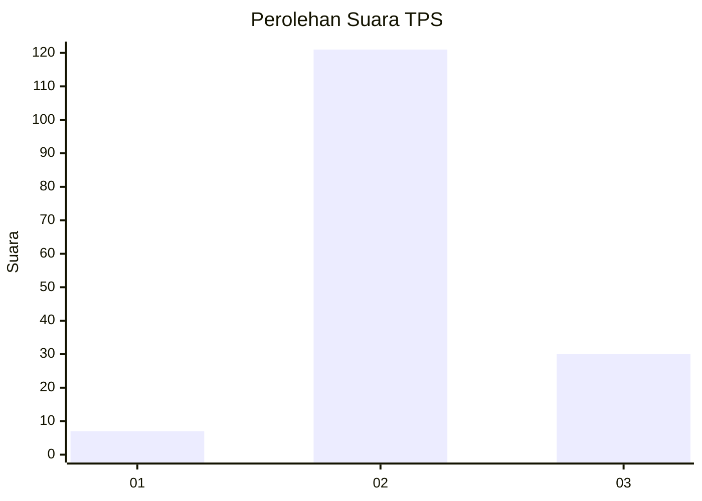
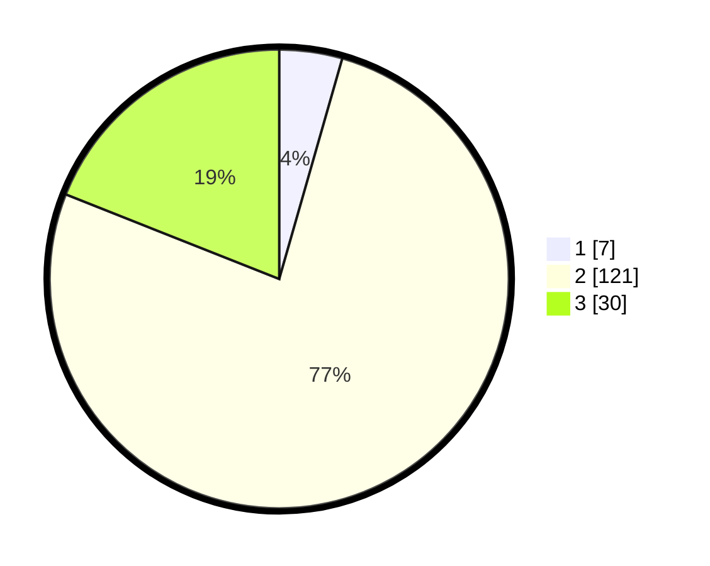

# Hasil

## Grafik

## Tabel

| No. | Nama Paslon    | Suara | Suara (raw) | Persentase |
|:--- |:-------------- | -----:| -----------:| ----------:|
| 1   | ANIES MUHAIMIN | 7     | [7][p-1]    | 4,43       |
| 2   | PRABOWO GIBRAN | 121   | [121][p-2]  | 76,58      |
| 3   | GANJAR MAHFUD  | 30    | [30][p-3]   | 18,99      |

[p-1]: https://github.com/gigit-pemilu/pemilu-2024-35-jawa-timur/blob/main/pilpres/hitung-suara/sub/35-jawa-timur/sub/22-bojonegoro/sub/08-kedungadem/sub/2020-sidomulyo/sub/005-tps/sub/paslon-1.txt
[p-2]: https://github.com/gigit-pemilu/pemilu-2024-35-jawa-timur/blob/main/pilpres/hitung-suara/sub/35-jawa-timur/sub/22-bojonegoro/sub/08-kedungadem/sub/2020-sidomulyo/sub/005-tps/sub/paslon-2.txt
[p-3]: https://github.com/gigit-pemilu/pemilu-2024-35-jawa-timur/blob/main/pilpres/hitung-suara/sub/35-jawa-timur/sub/22-bojonegoro/sub/08-kedungadem/sub/2020-sidomulyo/sub/005-tps/sub/paslon-3.txt

## Foto C Plano

https://sirekap-obj-formc.kpu.go.id/3e88/pemilu/ppwp/35/22/08/20/20/3522082020005-20240218-094735--1133f398-191b-46c3-b228-5a75902a45a9.jpg

https://sirekap-obj-formc.kpu.go.id/3e88/pemilu/ppwp/35/22/08/20/20/3522082020005-20240218-094943--317b423b-a4e9-4826-91e7-8a5ba6f70854.jpg

https://sirekap-obj-formc.kpu.go.id/3e88/pemilu/ppwp/35/22/08/20/20/3522082020005-20240218-095312--67b72357-ed54-4131-b01c-e4d4162aa0b0.jpg

## Metadata

| Key        | Value               |
| ---------- | ------------------- |
| Time Stamp | 2024-02-25 23:00:00 |

