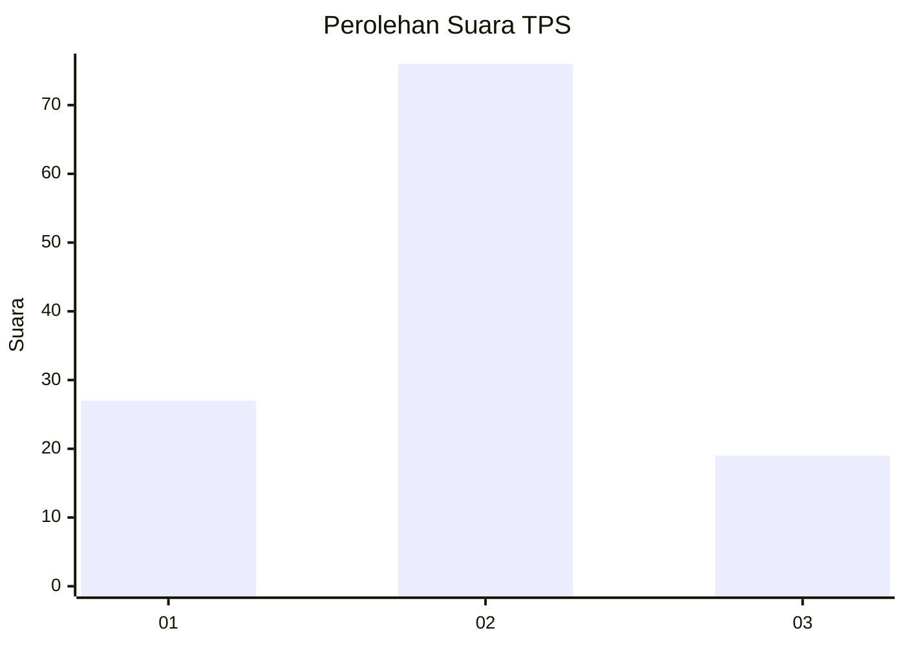
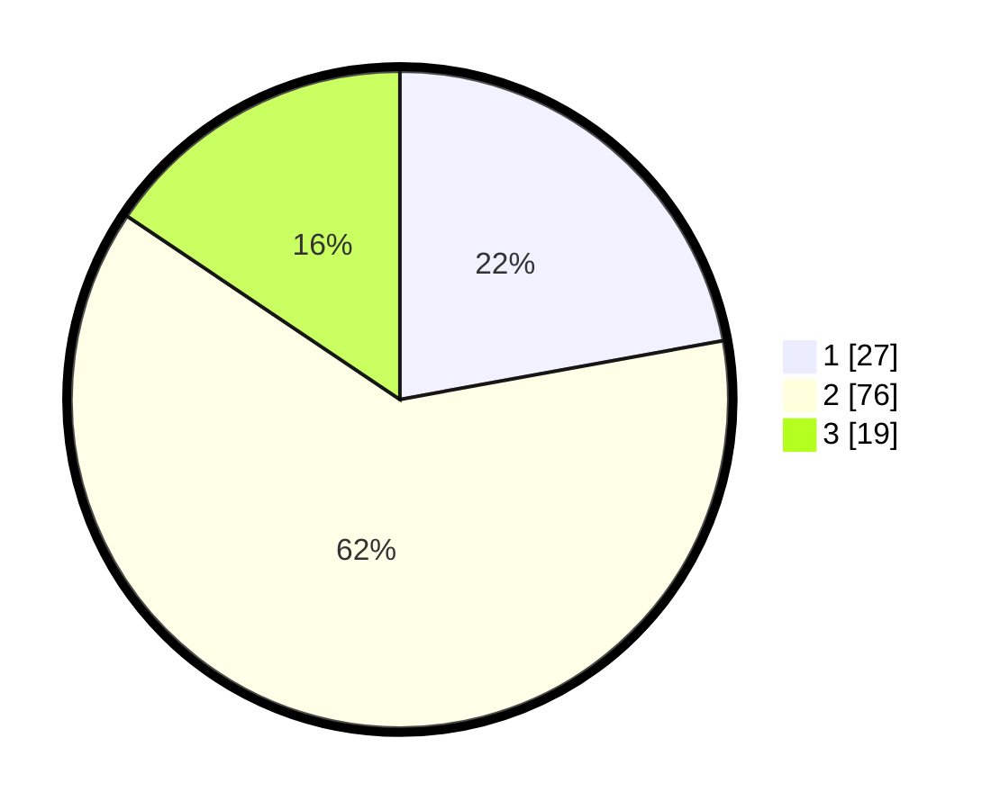

# Hasil

## Grafik

## Tabel

| No. | Nama Paslon    | Suara | Suara (raw) | Persentase |
|:--- |:-------------- | -----:| -----------:| ----------:|
| 1   | ANIES MUHAIMIN | 27    | [27][p-1]   | 22,13      |
| 2   | PRABOWO GIBRAN | 76    | [76][p-2]   | 62,30      |
| 3   | GANJAR MAHFUD  | 19    | [19][p-3]   | 15,57      |

[p-1]: https://github.com/gigit-pemilu/pemilu-2024/blob/main/pilpres/hitung-suara/sub/35-jawa-timur/sub/22-bojonegoro/sub/08-kedungadem/sub/2022-ngrandu/sub/005-tps/sub/paslon-1.txt
[p-2]: https://github.com/gigit-pemilu/pemilu-2024/blob/main/pilpres/hitung-suara/sub/35-jawa-timur/sub/22-bojonegoro/sub/08-kedungadem/sub/2022-ngrandu/sub/005-tps/sub/paslon-2.txt
[p-3]: https://github.com/gigit-pemilu/pemilu-2024/blob/main/pilpres/hitung-suara/sub/35-jawa-timur/sub/22-bojonegoro/sub/08-kedungadem/sub/2022-ngrandu/sub/005-tps/sub/paslon-3.txt

## Foto C Plano

https://sirekap-obj-formc.kpu.go.id/f0cb/pemilu/ppwp/35/22/08/20/22/3522082022005-20240214-215145--9c87cd27-31be-48ec-b588-e8d3d65ff3b9.jpg

https://sirekap-obj-formc.kpu.go.id/f0cb/pemilu/ppwp/35/22/08/20/22/3522082022005-20240214-215330--7f52d023-92cc-4a91-9f72-1e98f8357c33.jpg

https://sirekap-obj-formc.kpu.go.id/f0cb/pemilu/ppwp/35/22/08/20/22/3522082022005-20240214-215514--49731778-d5b0-475b-a4f0-cdd7b13594bb.jpg

## Metadata

| Key        | Value               |
| ---------- | ------------------- |
| Time Stamp | 2024-02-24 22:31:28 |

