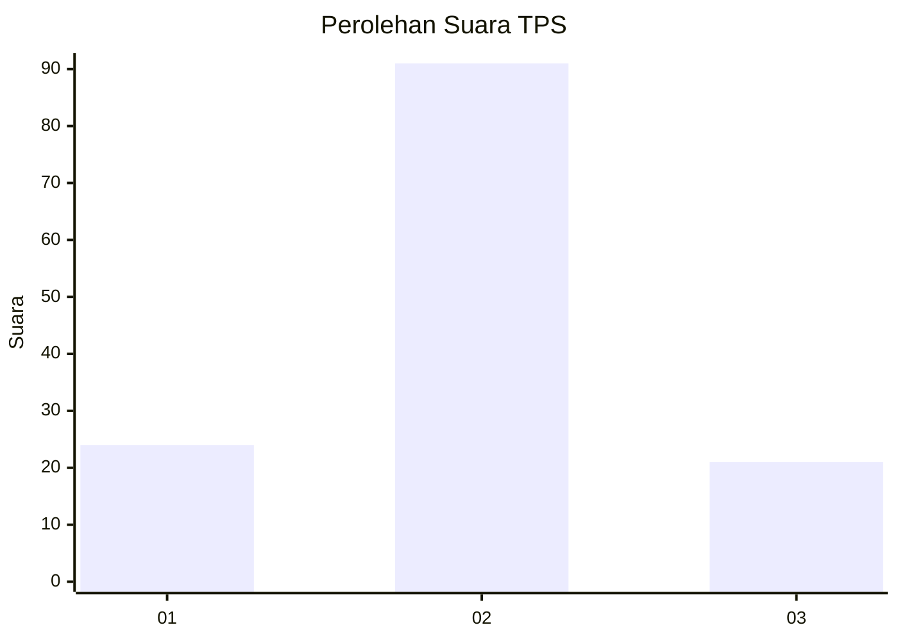
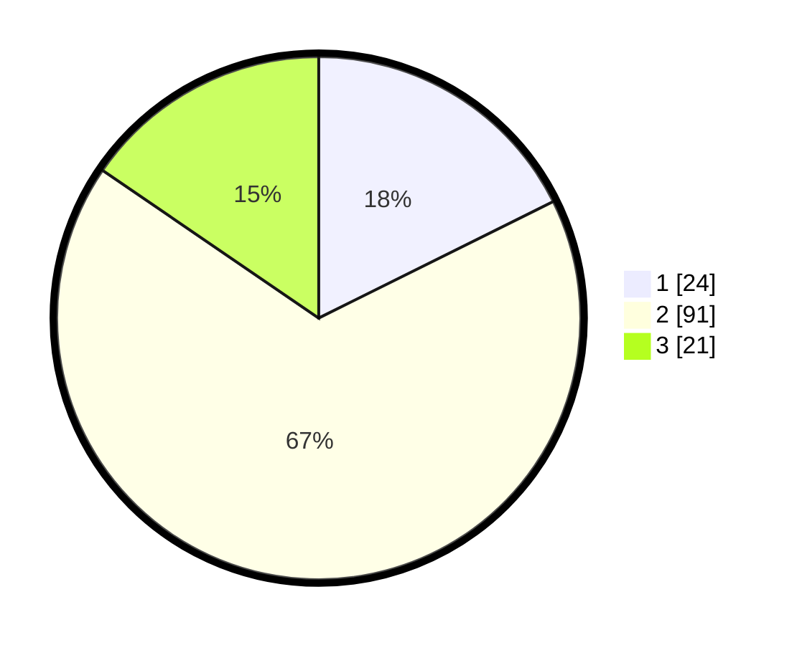

# Hasil

## Grafik

## Tabel

| No. | Nama Paslon    | Suara | Suara (raw) | Persentase |
|:--- |:-------------- | -----:| -----------:| ----------:|
| 1   | ANIES MUHAIMIN | 24    | [24][p-1]   | 17,65      |
| 2   | PRABOWO GIBRAN | 91    | [91][p-2]   | 66,91      |
| 3   | GANJAR MAHFUD  | 21    | [21][p-3]   | 15,44      |

[p-1]: https://github.com/gigit-pemilu/pemilu-2024/blob/main/pilpres/hitung-suara/sub/35-jawa-timur/sub/22-bojonegoro/sub/08-kedungadem/sub/2022-ngrandu/sub/013-tps/sub/paslon-1.txt
[p-2]: https://github.com/gigit-pemilu/pemilu-2024/blob/main/pilpres/hitung-suara/sub/35-jawa-timur/sub/22-bojonegoro/sub/08-kedungadem/sub/2022-ngrandu/sub/013-tps/sub/paslon-2.txt
[p-3]: https://github.com/gigit-pemilu/pemilu-2024/blob/main/pilpres/hitung-suara/sub/35-jawa-timur/sub/22-bojonegoro/sub/08-kedungadem/sub/2022-ngrandu/sub/013-tps/sub/paslon-3.txt

## Foto C Plano

https://sirekap-obj-formc.kpu.go.id/16c6/pemilu/ppwp/35/22/08/20/22/3522082022013-20240215-034520--d2d7c8fb-5943-4c71-b35f-c5925c22d00a.jpg

https://sirekap-obj-formc.kpu.go.id/16c6/pemilu/ppwp/35/22/08/20/22/3522082022013-20240215-034630--bc09db61-c54e-40f9-bc98-5debcec368c4.jpg

https://sirekap-obj-formc.kpu.go.id/16c6/pemilu/ppwp/35/22/08/20/22/3522082022013-20240215-034616--bb6d9b8d-142b-4ed2-a6a7-683ff7161251.jpg

## Metadata

| Key        | Value               |
| ---------- | ------------------- |
| Time Stamp | 2024-02-25 12:00:00 |

