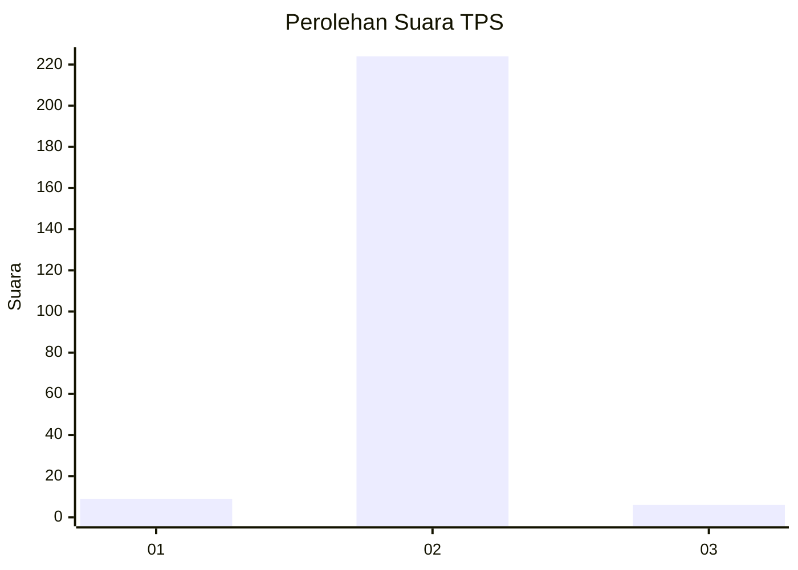
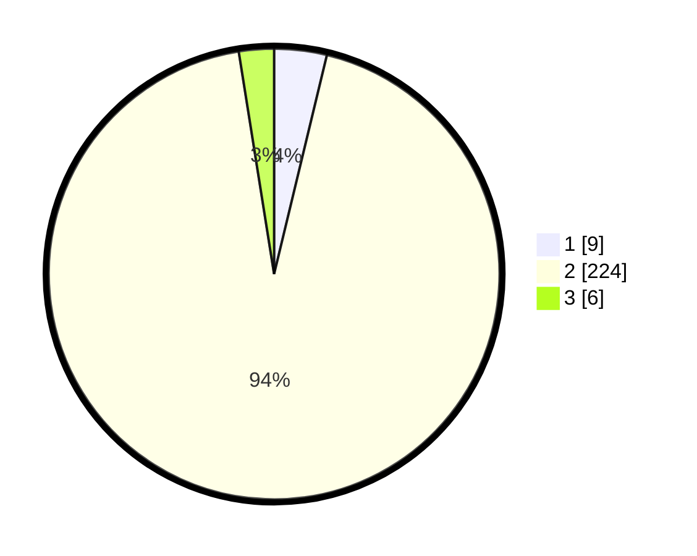

# Hasil

## Grafik

## Tabel

| No. | Nama Paslon    | Suara | Suara (raw) | Persentase |
|:--- |:-------------- | -----:| -----------:| ----------:|
| 1   | ANIES MUHAIMIN | 9     | [9][p-1]    | 3,77       |
| 2   | PRABOWO GIBRAN | 224   | [224][p-2]  | 93,72      |
| 3   | GANJAR MAHFUD  | 6     | [6][p-3]    | 2,51       |

[p-1]: https://github.com/gigit-pemilu/pemilu-2024/blob/main/pilpres/hitung-suara/sub/35-jawa-timur/sub/22-bojonegoro/sub/08-kedungadem/sub/2022-ngrandu/sub/015-tps/sub/paslon-1.txt
[p-2]: https://github.com/gigit-pemilu/pemilu-2024/blob/main/pilpres/hitung-suara/sub/35-jawa-timur/sub/22-bojonegoro/sub/08-kedungadem/sub/2022-ngrandu/sub/015-tps/sub/paslon-2.txt
[p-3]: https://github.com/gigit-pemilu/pemilu-2024/blob/main/pilpres/hitung-suara/sub/35-jawa-timur/sub/22-bojonegoro/sub/08-kedungadem/sub/2022-ngrandu/sub/015-tps/sub/paslon-3.txt

## Foto C Plano

https://sirekap-obj-formc.kpu.go.id/3d5d/pemilu/ppwp/35/22/08/20/22/3522082022015-20240215-020418--eab3f2cf-851c-484b-b122-0609cd8415ac.jpg

https://sirekap-obj-formc.kpu.go.id/3d5d/pemilu/ppwp/35/22/08/20/22/3522082022015-20240215-020752--85e362ca-74c1-4ae1-808a-ba0f07a46cf1.jpg

https://sirekap-obj-formc.kpu.go.id/3d5d/pemilu/ppwp/35/22/08/20/22/3522082022015-20240215-020858--c2b09fb9-bc1f-4b96-a5a0-d9e1a4905eb7.jpg

## Metadata

| Key        | Value               |
| ---------- | ------------------- |
| Time Stamp | 2024-02-15 12:00:28 |

