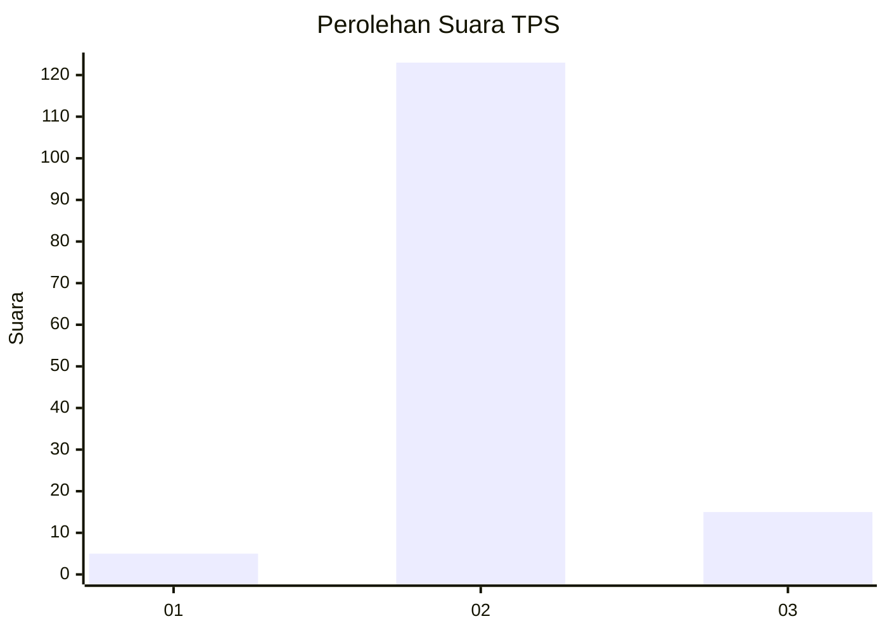
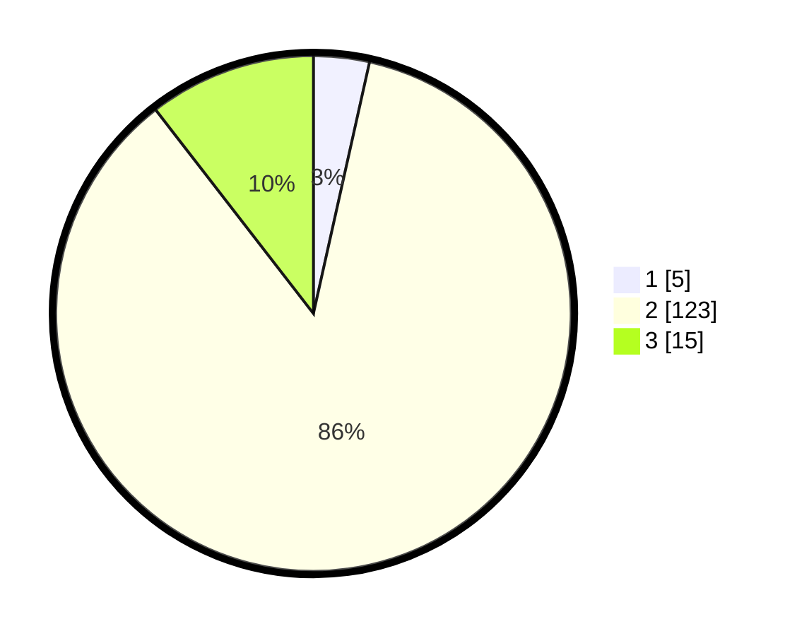

# Hasil

## Grafik

## Tabel

| No. | Nama Paslon    | Suara | Suara (raw) | Persentase |
|:--- |:-------------- | -----:| -----------:| ----------:|
| 1   | ANIES MUHAIMIN | 5     | [5][p-1]    | 3,50       |
| 2   | PRABOWO GIBRAN | 123   | [123][p-2]  | 86,01      |
| 3   | GANJAR MAHFUD  | 15    | [15][p-3]   | 10,49      |

[p-1]: https://github.com/gigit-pemilu/pemilu-2024-35-jawa-timur/blob/main/pilpres/hitung-suara/sub/35-jawa-timur/sub/22-bojonegoro/sub/09-kepohbaru/sub/2001-pejok/sub/010-tps/sub/paslon-1.txt
[p-2]: https://github.com/gigit-pemilu/pemilu-2024-35-jawa-timur/blob/main/pilpres/hitung-suara/sub/35-jawa-timur/sub/22-bojonegoro/sub/09-kepohbaru/sub/2001-pejok/sub/010-tps/sub/paslon-2.txt
[p-3]: https://github.com/gigit-pemilu/pemilu-2024-35-jawa-timur/blob/main/pilpres/hitung-suara/sub/35-jawa-timur/sub/22-bojonegoro/sub/09-kepohbaru/sub/2001-pejok/sub/010-tps/sub/paslon-3.txt

## Foto C Plano

https://sirekap-obj-formc.kpu.go.id/7a8f/pemilu/ppwp/35/22/09/20/01/3522092001010-20240214-193921--87f6ff6a-bb9c-475d-a9aa-e6caf224d788.jpg

https://sirekap-obj-formc.kpu.go.id/7a8f/pemilu/ppwp/35/22/09/20/01/3522092001010-20240214-194543--e96c3330-ba64-4acc-b11c-d3f472f0db76.jpg

https://sirekap-obj-formc.kpu.go.id/7a8f/pemilu/ppwp/35/22/09/20/01/3522092001010-20240214-194801--31f8da11-b7ac-4ca6-88e6-f740ffc4ff4e.jpg

## Metadata

| Key        | Value               |
| ---------- | ------------------- |
| Time Stamp | 2024-02-25 02:00:00 |

