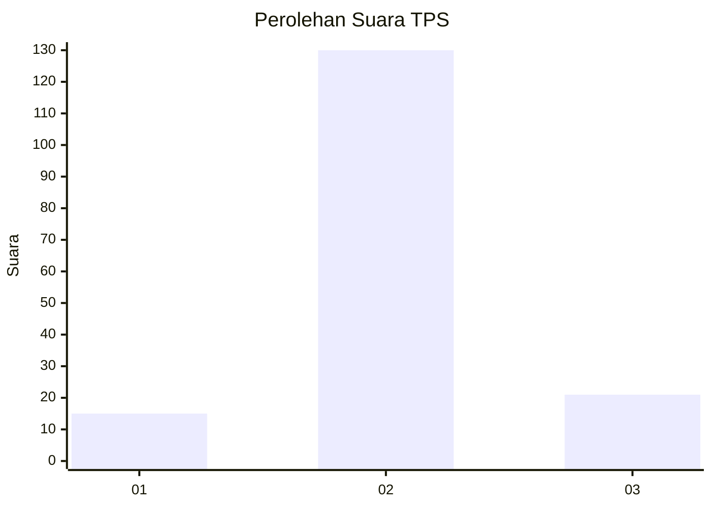
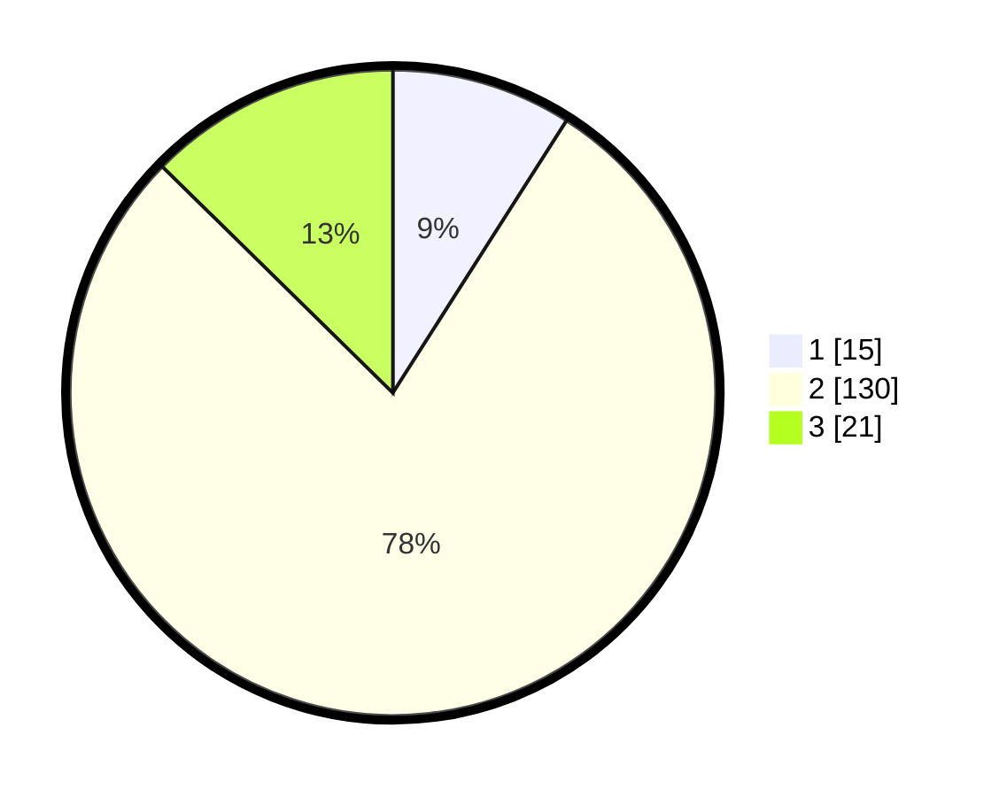

# Hasil

## Grafik

## Tabel

| No. | Nama Paslon    | Suara | Suara (raw) | Persentase |
|:--- |:-------------- | -----:| -----------:| ----------:|
| 1   | ANIES MUHAIMIN | 15    | [15][p-1]   | 9,04       |
| 2   | PRABOWO GIBRAN | 130   | [130][p-2]  | 78,31      |
| 3   | GANJAR MAHFUD  | 21    | [21][p-3]   | 12,65      |

[p-1]: https://github.com/gigit-pemilu/pemilu-2024-35-jawa-timur/blob/main/pilpres/hitung-suara/sub/35-jawa-timur/sub/22-bojonegoro/sub/09-kepohbaru/sub/2001-pejok/sub/017-tps/sub/paslon-1.txt
[p-2]: https://github.com/gigit-pemilu/pemilu-2024-35-jawa-timur/blob/main/pilpres/hitung-suara/sub/35-jawa-timur/sub/22-bojonegoro/sub/09-kepohbaru/sub/2001-pejok/sub/017-tps/sub/paslon-2.txt
[p-3]: https://github.com/gigit-pemilu/pemilu-2024-35-jawa-timur/blob/main/pilpres/hitung-suara/sub/35-jawa-timur/sub/22-bojonegoro/sub/09-kepohbaru/sub/2001-pejok/sub/017-tps/sub/paslon-3.txt

## Foto C Plano

https://sirekap-obj-formc.kpu.go.id/9b76/pemilu/ppwp/35/22/09/20/01/3522092001017-20240214-215135--0ef1468a-3f6f-4eb0-899a-5d1fd72beffa.jpg

https://sirekap-obj-formc.kpu.go.id/9b76/pemilu/ppwp/35/22/09/20/01/3522092001017-20240214-215734--2c2daf80-bd6c-4f17-aab2-380fe87590e2.jpg

https://sirekap-obj-formc.kpu.go.id/9b76/pemilu/ppwp/35/22/09/20/01/3522092001017-20240214-220034--c752bf9b-3f9f-40e2-862e-97c199e3d35a.jpg

## Metadata

| Key        | Value               |
| ---------- | ------------------- |
| Time Stamp | 2024-02-24 22:31:28 |

