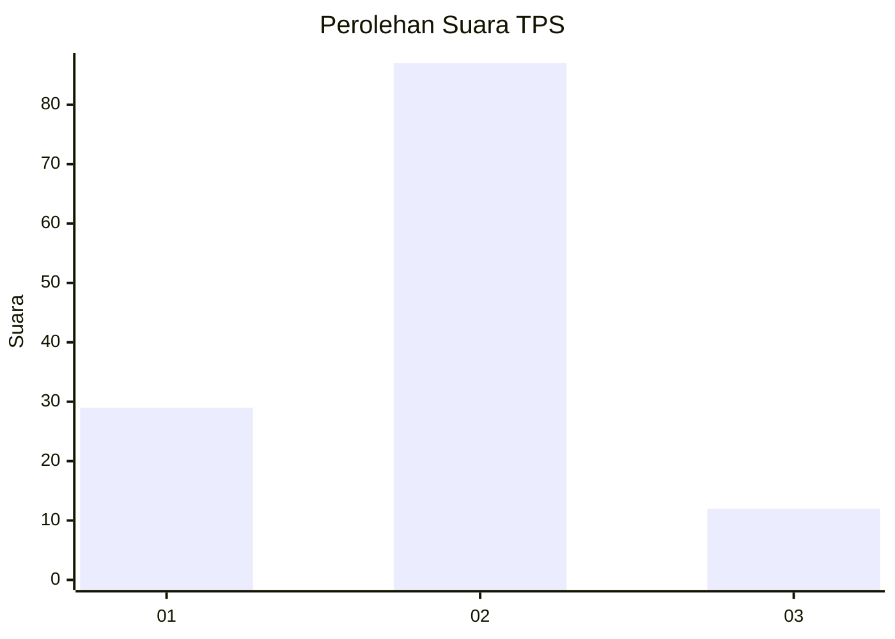

# Hasil

## Grafik

## Tabel

| No. | Nama Paslon    | Suara | Suara (raw) | Persentase |
|:--- |:-------------- | -----:| -----------:| ----------:|
| 1   | ANIES MUHAIMIN | 29    | [29][p-1]   | 22,66      |
| 2   | PRABOWO GIBRAN | 87    | [87][p-2]   | 67,97      |
| 3   | GANJAR MAHFUD  | 12    | [12][p-3]   | 9,38       |

[p-1]: https://github.com/gigit-pemilu/pemilu-2024-35-jawa-timur/blob/main/pilpres/hitung-suara/sub/35-jawa-timur/sub/22-bojonegoro/sub/09-kepohbaru/sub/2001-pejok/sub/018-tps/sub/paslon-1.txt
[p-2]: https://github.com/gigit-pemilu/pemilu-2024-35-jawa-timur/blob/main/pilpres/hitung-suara/sub/35-jawa-timur/sub/22-bojonegoro/sub/09-kepohbaru/sub/2001-pejok/sub/018-tps/sub/paslon-2.txt
[p-3]: https://github.com/gigit-pemilu/pemilu-2024-35-jawa-timur/blob/main/pilpres/hitung-suara/sub/35-jawa-timur/sub/22-bojonegoro/sub/09-kepohbaru/sub/2001-pejok/sub/018-tps/sub/paslon-3.txt

## Foto C Plano

https://sirekap-obj-formc.kpu.go.id/9474/pemilu/ppwp/35/22/09/20/01/3522092001018-20240215-061449--fcd23e65-0211-468f-a797-3fe844d06b10.jpg

https://sirekap-obj-formc.kpu.go.id/9474/pemilu/ppwp/35/22/09/20/01/3522092001018-20240215-062215--7a1b8d91-0c36-4dba-902f-251d9f15b73d.jpg

https://sirekap-obj-formc.kpu.go.id/9474/pemilu/ppwp/35/22/09/20/01/3522092001018-20240215-062235--d726b45e-60de-4f8c-bde4-f995cd72c9c0.jpg

## Metadata

| Key        | Value               |
| ---------- | ------------------- |
| Time Stamp | 2024-02-15 18:00:26 |

