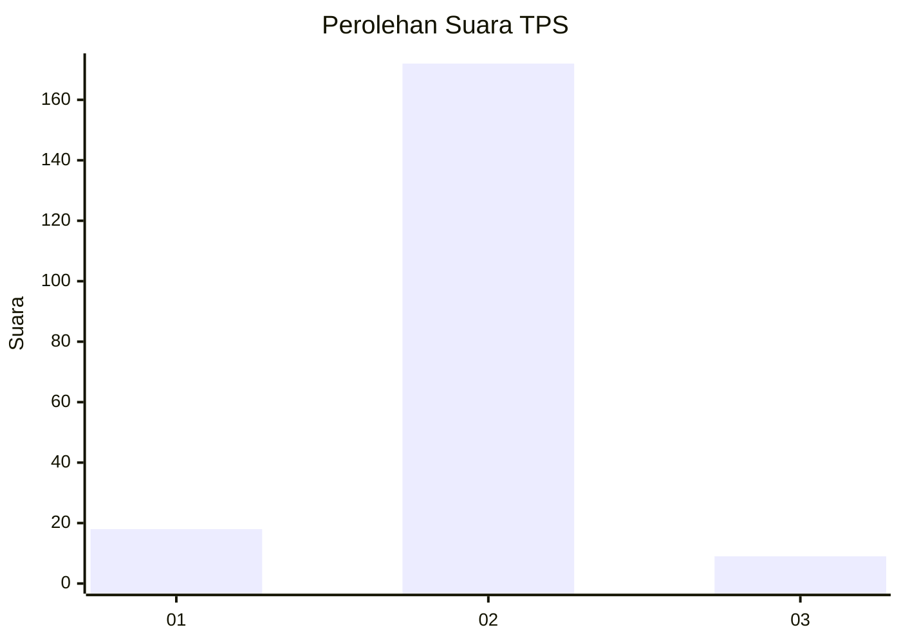
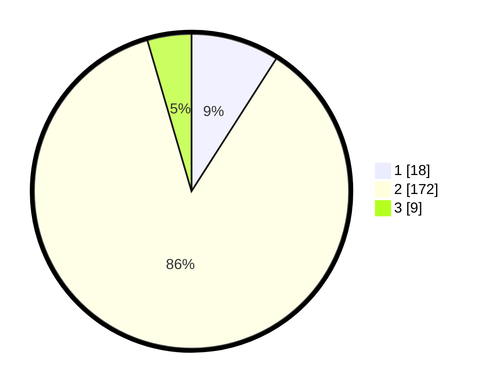

# Hasil

## Grafik

## Tabel

| No. | Nama Paslon    | Suara | Suara (raw) | Persentase |
|:--- |:-------------- | -----:| -----------:| ----------:|
| 1   | ANIES MUHAIMIN | 18    | [18][p-1]   | 9,05       |
| 2   | PRABOWO GIBRAN | 172   | [172][p-2]  | 86,43      |
| 3   | GANJAR MAHFUD  | 9     | [9][p-3]    | 4,52       |

[p-1]: https://github.com/gigit-pemilu/pemilu-2024/blob/main/pilpres/hitung-suara/sub/35-jawa-timur/sub/22-bojonegoro/sub/09-kepohbaru/sub/2002-cengkir/sub/003-tps/sub/paslon-1.txt
[p-2]: https://github.com/gigit-pemilu/pemilu-2024/blob/main/pilpres/hitung-suara/sub/35-jawa-timur/sub/22-bojonegoro/sub/09-kepohbaru/sub/2002-cengkir/sub/003-tps/sub/paslon-2.txt
[p-3]: https://github.com/gigit-pemilu/pemilu-2024/blob/main/pilpres/hitung-suara/sub/35-jawa-timur/sub/22-bojonegoro/sub/09-kepohbaru/sub/2002-cengkir/sub/003-tps/sub/paslon-3.txt

## Foto C Plano

https://sirekap-obj-formc.kpu.go.id/b86e/pemilu/ppwp/35/22/09/20/02/3522092002003-20240214-234501--4eb20137-2692-4b8d-86bd-07480d123bfd.jpg

https://sirekap-obj-formc.kpu.go.id/b86e/pemilu/ppwp/35/22/09/20/02/3522092002003-20240214-234514--0f700a28-921e-473c-b9e6-e362f12265f3.jpg

https://sirekap-obj-formc.kpu.go.id/b86e/pemilu/ppwp/35/22/09/20/02/3522092002003-20240214-234531--fa3cf51f-063a-49ba-bc2c-3087bdc4685a.jpg

## Metadata

| Key        | Value               |
| ---------- | ------------------- |
| Time Stamp | 2024-02-25 12:00:00 |

