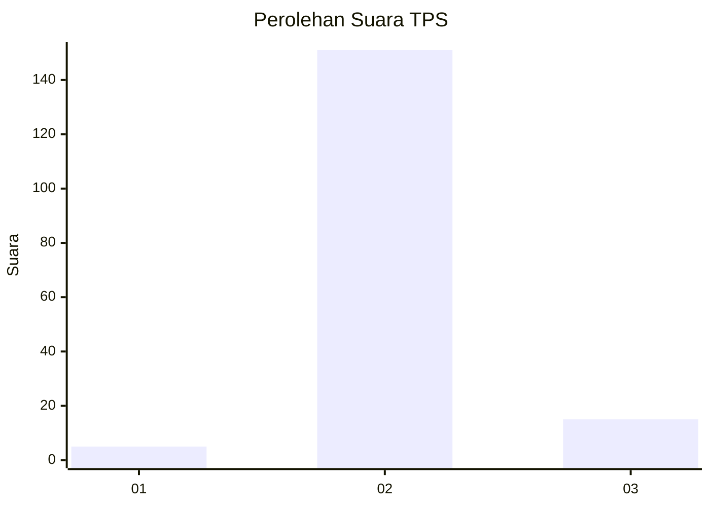
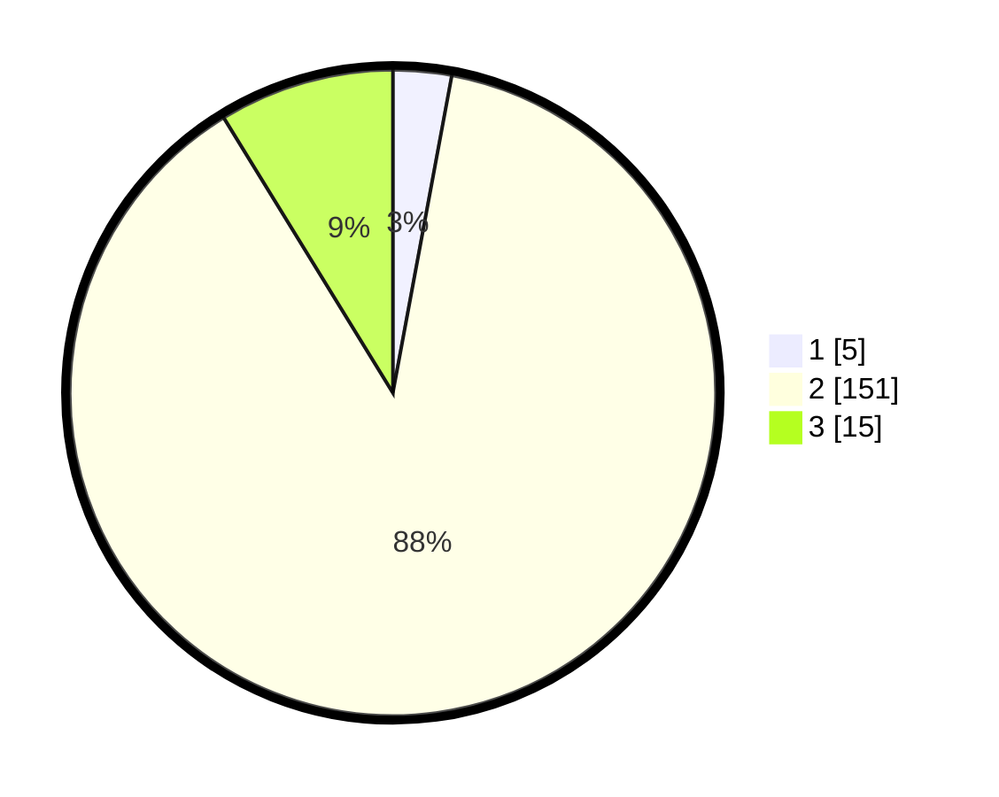

# Hasil

## Grafik

## Tabel

| No. | Nama Paslon    | Suara | Suara (raw) | Persentase |
|:--- |:-------------- | -----:| -----------:| ----------:|
| 1   | ANIES MUHAIMIN | 5     | [5][p-1]    | 2,92       |
| 2   | PRABOWO GIBRAN | 151   | [151][p-2]  | 88,30      |
| 3   | GANJAR MAHFUD  | 15    | [15][p-3]   | 8,77       |

[p-1]: https://github.com/gigit-pemilu/pemilu-2024-35-jawa-timur/blob/main/pilpres/hitung-suara/sub/35-jawa-timur/sub/22-bojonegoro/sub/09-kepohbaru/sub/2002-cengkir/sub/004-tps/sub/paslon-1.txt
[p-2]: https://github.com/gigit-pemilu/pemilu-2024-35-jawa-timur/blob/main/pilpres/hitung-suara/sub/35-jawa-timur/sub/22-bojonegoro/sub/09-kepohbaru/sub/2002-cengkir/sub/004-tps/sub/paslon-2.txt
[p-3]: https://github.com/gigit-pemilu/pemilu-2024-35-jawa-timur/blob/main/pilpres/hitung-suara/sub/35-jawa-timur/sub/22-bojonegoro/sub/09-kepohbaru/sub/2002-cengkir/sub/004-tps/sub/paslon-3.txt

## Foto C Plano

https://sirekap-obj-formc.kpu.go.id/d6e4/pemilu/ppwp/35/22/09/20/02/3522092002004-20240214-141434--44f1540a-db43-4858-881b-ef0f6f233728.jpg

https://sirekap-obj-formc.kpu.go.id/d6e4/pemilu/ppwp/35/22/09/20/02/3522092002004-20240214-141442--fdb9544c-2643-4bdc-9352-774db9fca9ac.jpg

https://sirekap-obj-formc.kpu.go.id/d6e4/pemilu/ppwp/35/22/09/20/02/3522092002004-20240214-141449--acce78e5-59e7-4e0a-ae31-018c7e7f0f47.jpg

## Metadata

| Key        | Value               |
| ---------- | ------------------- |
| Time Stamp | 2024-02-15 06:00:23 |

