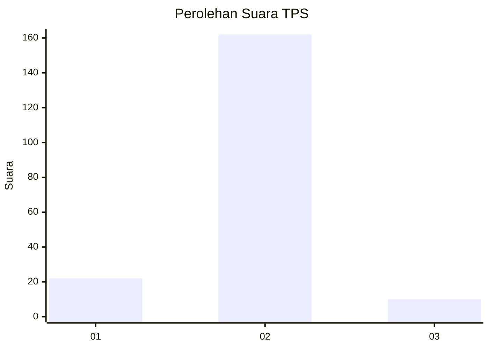
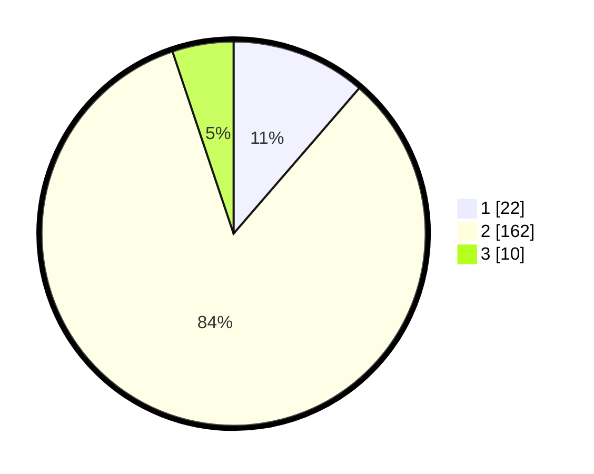

# Hasil

## Grafik

## Tabel

| No. | Nama Paslon    | Suara | Suara (raw) | Persentase |
|:--- |:-------------- | -----:| -----------:| ----------:|
| 1   | ANIES MUHAIMIN | 22    | [22][p-1]   | 11,34      |
| 2   | PRABOWO GIBRAN | 162   | [162][p-2]  | 83,51      |
| 3   | GANJAR MAHFUD  | 10    | [10][p-3]   | 5,15       |

[p-1]: https://github.com/gigit-pemilu/pemilu-2024/blob/main/pilpres/hitung-suara/sub/35-jawa-timur/sub/22-bojonegoro/sub/09-kepohbaru/sub/2003-kepoh/sub/005-tps/sub/paslon-1.txt
[p-2]: https://github.com/gigit-pemilu/pemilu-2024/blob/main/pilpres/hitung-suara/sub/35-jawa-timur/sub/22-bojonegoro/sub/09-kepohbaru/sub/2003-kepoh/sub/005-tps/sub/paslon-2.txt
[p-3]: https://github.com/gigit-pemilu/pemilu-2024/blob/main/pilpres/hitung-suara/sub/35-jawa-timur/sub/22-bojonegoro/sub/09-kepohbaru/sub/2003-kepoh/sub/005-tps/sub/paslon-3.txt

## Foto C Plano

https://sirekap-obj-formc.kpu.go.id/e75c/pemilu/ppwp/35/22/09/20/03/3522092003005-20240214-203634--74b81c1f-aeeb-4a24-a2ce-232907b04c59.jpg

https://sirekap-obj-formc.kpu.go.id/e75c/pemilu/ppwp/35/22/09/20/03/3522092003005-20240214-203754--7defdae6-6323-40ba-a61d-baad457d2247.jpg

https://sirekap-obj-formc.kpu.go.id/e75c/pemilu/ppwp/35/22/09/20/03/3522092003005-20240214-203855--4e43cb62-d6c8-4635-95e1-23ea6ea2dc75.jpg

## Metadata

| Key        | Value               |
| ---------- | ------------------- |
| Time Stamp | 2024-02-25 12:00:00 |

