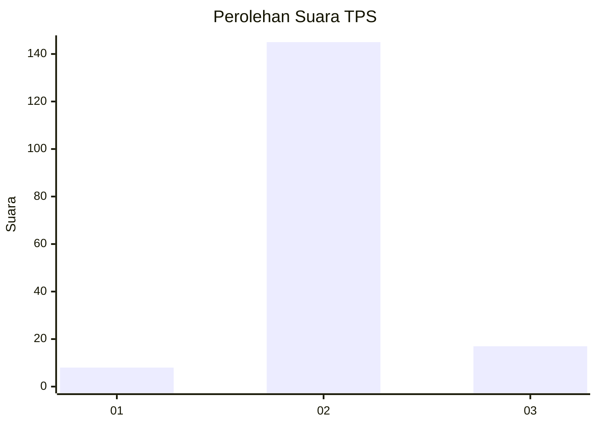
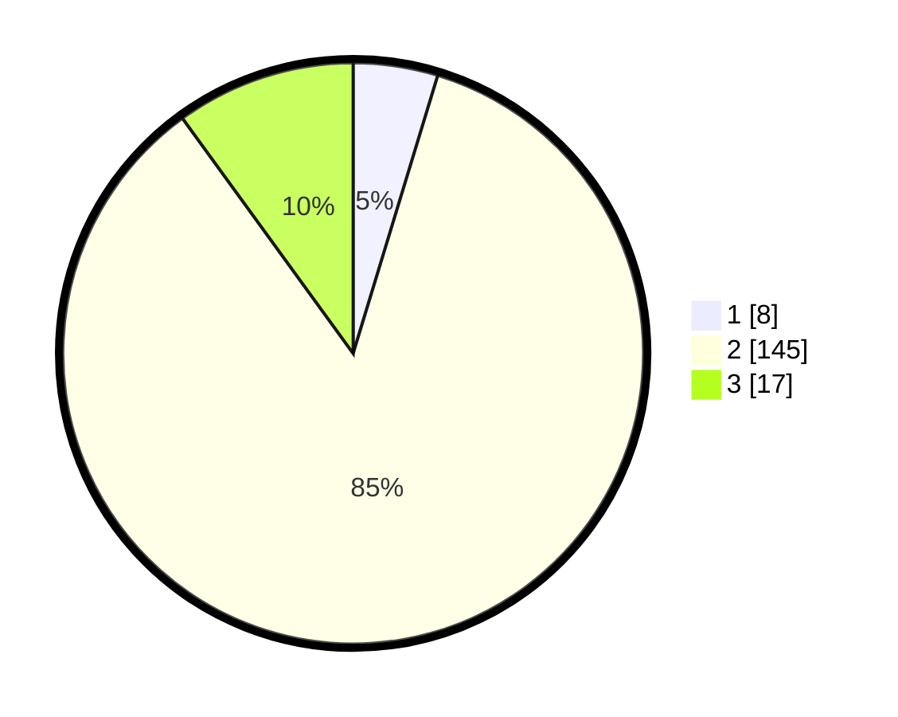

# Hasil

## Grafik

## Tabel

| No. | Nama Paslon    | Suara | Suara (raw) | Persentase |
|:--- |:-------------- | -----:| -----------:| ----------:|
| 1   | ANIES MUHAIMIN | 8     | [8][p-1]    | 4,71       |
| 2   | PRABOWO GIBRAN | 145   | [145][p-2]  | 85,29      |
| 3   | GANJAR MAHFUD  | 17    | [17][p-3]   | 10,00      |

[p-1]: https://github.com/gigit-pemilu/pemilu-2024-35-jawa-timur/blob/main/pilpres/hitung-suara/sub/35-jawa-timur/sub/22-bojonegoro/sub/09-kepohbaru/sub/2003-kepoh/sub/008-tps/sub/paslon-1.txt
[p-2]: https://github.com/gigit-pemilu/pemilu-2024-35-jawa-timur/blob/main/pilpres/hitung-suara/sub/35-jawa-timur/sub/22-bojonegoro/sub/09-kepohbaru/sub/2003-kepoh/sub/008-tps/sub/paslon-2.txt
[p-3]: https://github.com/gigit-pemilu/pemilu-2024-35-jawa-timur/blob/main/pilpres/hitung-suara/sub/35-jawa-timur/sub/22-bojonegoro/sub/09-kepohbaru/sub/2003-kepoh/sub/008-tps/sub/paslon-3.txt

## Foto C Plano

https://sirekap-obj-formc.kpu.go.id/7682/pemilu/ppwp/35/22/09/20/03/3522092003008-20240215-020645--adbac584-2d98-461f-b7e9-31475a88a784.jpg

https://sirekap-obj-formc.kpu.go.id/7682/pemilu/ppwp/35/22/09/20/03/3522092003008-20240215-021228--f11709b8-b4c3-43c3-8e6b-bb315c9b7eb8.jpg

https://sirekap-obj-formc.kpu.go.id/7682/pemilu/ppwp/35/22/09/20/03/3522092003008-20240215-021310--0fe2aa70-8351-41e2-ad8d-1a0024168467.jpg

## Metadata

| Key        | Value               |
| ---------- | ------------------- |
| Time Stamp | 2024-02-25 12:00:00 |

