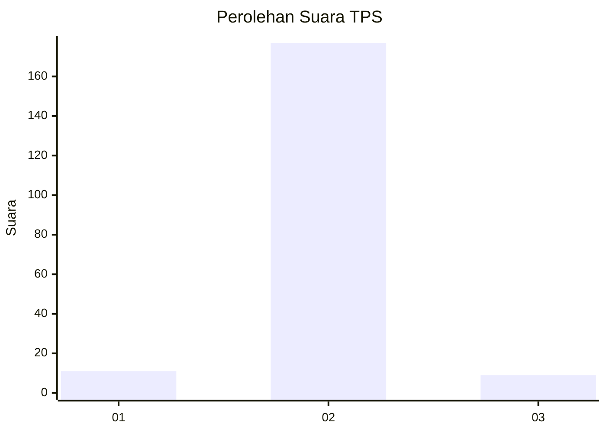
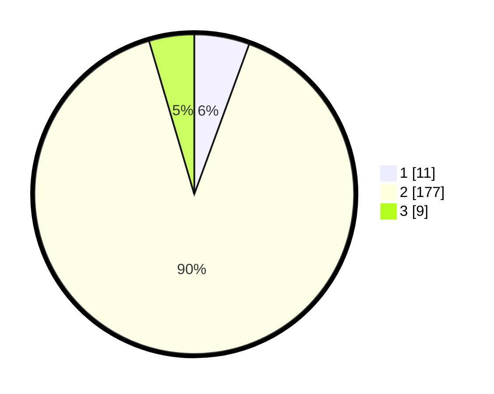

# Hasil

## Grafik

## Tabel

| No. | Nama Paslon    | Suara | Suara (raw) | Persentase |
|:--- |:-------------- | -----:| -----------:| ----------:|
| 1   | ANIES MUHAIMIN | 11    | [11][p-1]   | 5,58       |
| 2   | PRABOWO GIBRAN | 177   | [177][p-2]  | 89,85      |
| 3   | GANJAR MAHFUD  | 9     | [9][p-3]    | 4,57       |

[p-1]: https://github.com/gigit-pemilu/pemilu-2024/blob/main/pilpres/hitung-suara/sub/35-jawa-timur/sub/22-bojonegoro/sub/09-kepohbaru/sub/2003-kepoh/sub/011-tps/sub/paslon-1.txt
[p-2]: https://github.com/gigit-pemilu/pemilu-2024/blob/main/pilpres/hitung-suara/sub/35-jawa-timur/sub/22-bojonegoro/sub/09-kepohbaru/sub/2003-kepoh/sub/011-tps/sub/paslon-2.txt
[p-3]: https://github.com/gigit-pemilu/pemilu-2024/blob/main/pilpres/hitung-suara/sub/35-jawa-timur/sub/22-bojonegoro/sub/09-kepohbaru/sub/2003-kepoh/sub/011-tps/sub/paslon-3.txt

## Foto C Plano

https://sirekap-obj-formc.kpu.go.id/4eaa/pemilu/ppwp/35/22/09/20/03/3522092003011-20240215-010027--2dc30f3b-6124-4a41-90fe-6aa8d8ef0199.jpg

https://sirekap-obj-formc.kpu.go.id/4eaa/pemilu/ppwp/35/22/09/20/03/3522092003011-20240215-010239--f0ae27f5-9888-4d8f-b9a3-b844488ef0d6.jpg

https://sirekap-obj-formc.kpu.go.id/4eaa/pemilu/ppwp/35/22/09/20/03/3522092003011-20240215-010345--2aa209a4-6ba6-4183-a2e5-4454d1a5f971.jpg

## Metadata

| Key        | Value               |
| ---------- | ------------------- |
| Time Stamp | 2024-02-24 22:31:28 |

