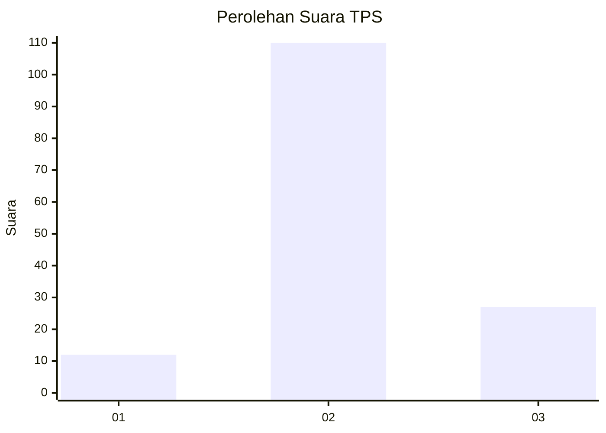

# Hasil

## Grafik

## Tabel

| No. | Nama Paslon    | Suara | Suara (raw) | Persentase |
|:--- |:-------------- | -----:| -----------:| ----------:|
| 1   | ANIES MUHAIMIN | 12    | [12][p-1]   | 8,05       |
| 2   | PRABOWO GIBRAN | 110   | [110][p-2]  | 73,83      |
| 3   | GANJAR MAHFUD  | 27    | [27][p-3]   | 18,12      |

[p-1]: https://github.com/gigit-pemilu/pemilu-2024/blob/main/pilpres/hitung-suara/sub/35-jawa-timur/sub/22-bojonegoro/sub/09-kepohbaru/sub/2005-simorejo/sub/007-tps/sub/paslon-1.txt
[p-2]: https://github.com/gigit-pemilu/pemilu-2024/blob/main/pilpres/hitung-suara/sub/35-jawa-timur/sub/22-bojonegoro/sub/09-kepohbaru/sub/2005-simorejo/sub/007-tps/sub/paslon-2.txt
[p-3]: https://github.com/gigit-pemilu/pemilu-2024/blob/main/pilpres/hitung-suara/sub/35-jawa-timur/sub/22-bojonegoro/sub/09-kepohbaru/sub/2005-simorejo/sub/007-tps/sub/paslon-3.txt

## Foto C Plano

https://sirekap-obj-formc.kpu.go.id/a969/pemilu/ppwp/35/22/09/20/05/3522092005007-20240214-140942--738eb00f-4b37-4ae9-b2bb-50c060dbcf1b.jpg

https://sirekap-obj-formc.kpu.go.id/a969/pemilu/ppwp/35/22/09/20/05/3522092005007-20240214-140933--ba804c2e-f42a-422f-a336-897dda4578f8.jpg

https://sirekap-obj-formc.kpu.go.id/a969/pemilu/ppwp/35/22/09/20/05/3522092005007-20240214-141219--4787ecbc-2364-480b-bf0f-628c92e5525e.jpg

## Metadata

| Key        | Value               |
| ---------- | ------------------- |
| Time Stamp | 2024-02-14 21:46:01 |

