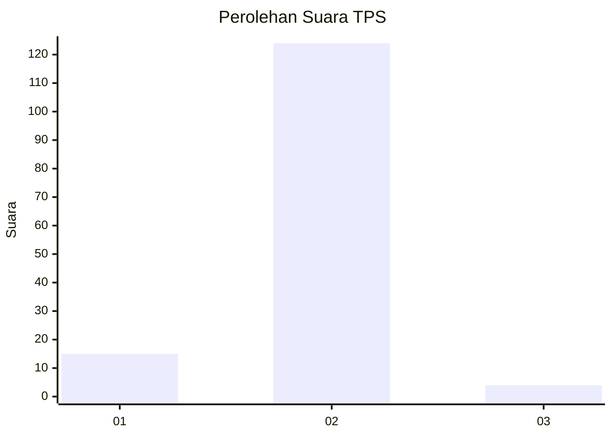
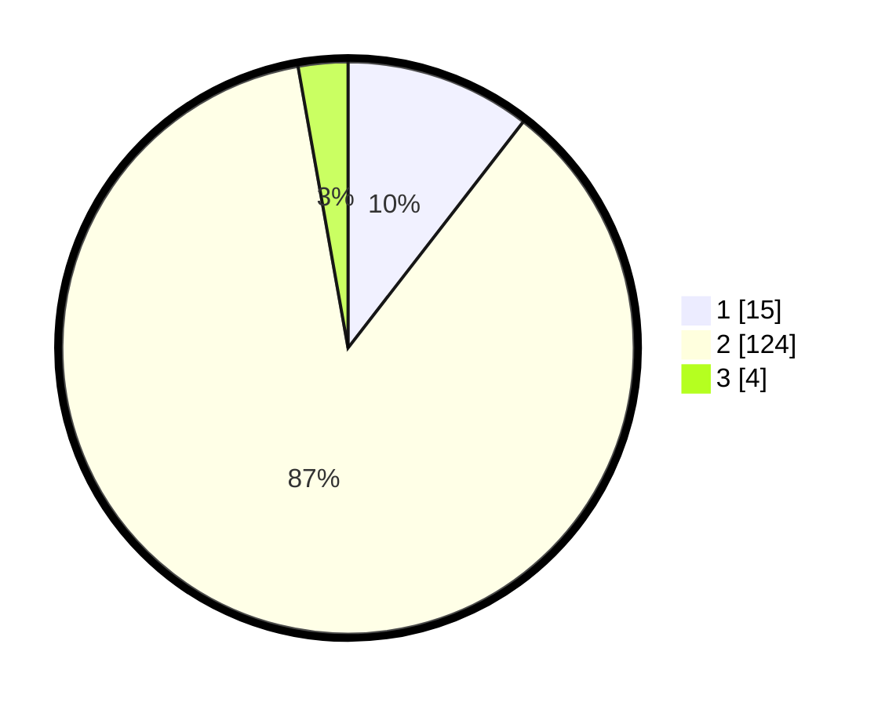

# Hasil

## Grafik

## Tabel

| No. | Nama Paslon    | Suara | Suara (raw) | Persentase |
|:--- |:-------------- | -----:| -----------:| ----------:|
| 1   | ANIES MUHAIMIN | 15    | [15][p-1]   | 10,49      |
| 2   | PRABOWO GIBRAN | 124   | [124][p-2]  | 86,71      |
| 3   | GANJAR MAHFUD  | 4     | [4][p-3]    | 2,80       |

[p-1]: https://github.com/gigit-pemilu/pemilu-2024/blob/main/pilpres/hitung-suara/sub/35-jawa-timur/sub/22-bojonegoro/sub/09-kepohbaru/sub/2007-nglumber/sub/010-tps/sub/paslon-1.txt
[p-2]: https://github.com/gigit-pemilu/pemilu-2024/blob/main/pilpres/hitung-suara/sub/35-jawa-timur/sub/22-bojonegoro/sub/09-kepohbaru/sub/2007-nglumber/sub/010-tps/sub/paslon-2.txt
[p-3]: https://github.com/gigit-pemilu/pemilu-2024/blob/main/pilpres/hitung-suara/sub/35-jawa-timur/sub/22-bojonegoro/sub/09-kepohbaru/sub/2007-nglumber/sub/010-tps/sub/paslon-3.txt

## Foto C Plano

https://sirekap-obj-formc.kpu.go.id/2117/pemilu/ppwp/35/22/09/20/07/3522092007010-20240214-155334--ab831397-e1ab-4cc9-80a7-5870614d8979.jpg

https://sirekap-obj-formc.kpu.go.id/2117/pemilu/ppwp/35/22/09/20/07/3522092007010-20240214-155347--8f77e9a8-cd34-4d66-bf56-f02596e880c8.jpg

https://sirekap-obj-formc.kpu.go.id/2117/pemilu/ppwp/35/22/09/20/07/3522092007010-20240214-155358--192b1c68-a6b7-4bfe-9b0f-268d3e2f43ed.jpg

## Metadata

| Key        | Value               |
| ---------- | ------------------- |
| Time Stamp | 2024-02-14 21:46:01 |

