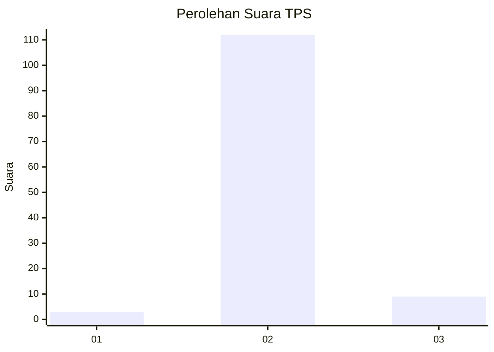
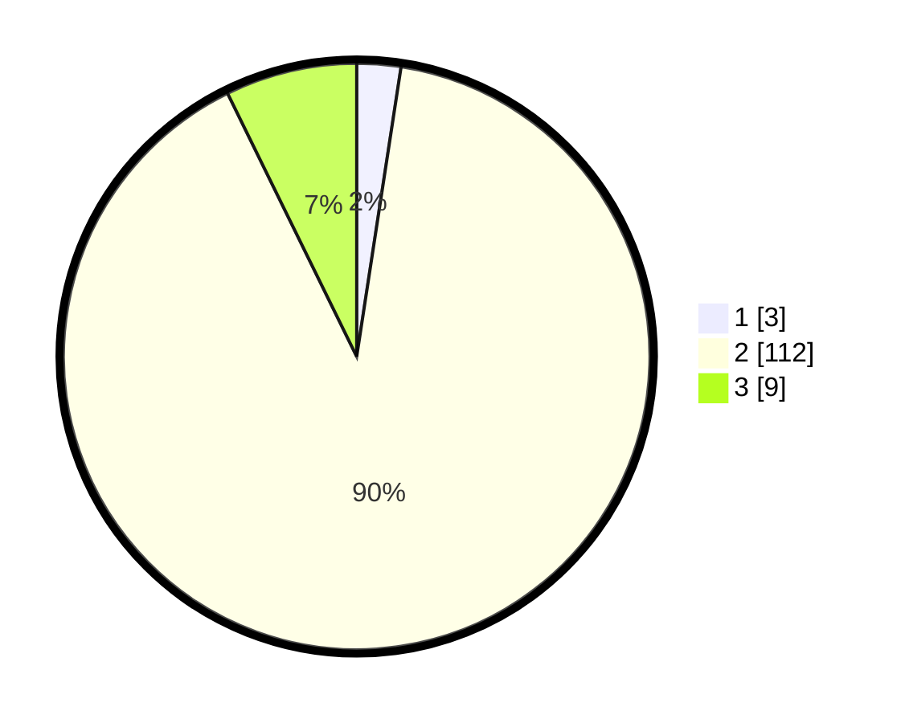

# Hasil

## Grafik

## Tabel

| No. | Nama Paslon    | Suara | Suara (raw) | Persentase |
|:--- |:-------------- | -----:| -----------:| ----------:|
| 1   | ANIES MUHAIMIN | 3     | [3][p-1]    | 2,42       |
| 2   | PRABOWO GIBRAN | 112   | [112][p-2]  | 90,32      |
| 3   | GANJAR MAHFUD  | 9     | [9][p-3]    | 7,26       |

[p-1]: https://github.com/gigit-pemilu/pemilu-2024/blob/main/pilpres/hitung-suara/sub/35-jawa-timur/sub/22-bojonegoro/sub/09-kepohbaru/sub/2007-nglumber/sub/011-tps/sub/paslon-1.txt
[p-2]: https://github.com/gigit-pemilu/pemilu-2024/blob/main/pilpres/hitung-suara/sub/35-jawa-timur/sub/22-bojonegoro/sub/09-kepohbaru/sub/2007-nglumber/sub/011-tps/sub/paslon-2.txt
[p-3]: https://github.com/gigit-pemilu/pemilu-2024/blob/main/pilpres/hitung-suara/sub/35-jawa-timur/sub/22-bojonegoro/sub/09-kepohbaru/sub/2007-nglumber/sub/011-tps/sub/paslon-3.txt

## Foto C Plano

https://sirekap-obj-formc.kpu.go.id/1dd3/pemilu/ppwp/35/22/09/20/07/3522092007011-20240214-141639--20cb2187-1d35-4306-a9ae-a4f9b39e2be6.jpg

https://sirekap-obj-formc.kpu.go.id/1dd3/pemilu/ppwp/35/22/09/20/07/3522092007011-20240214-141936--7cc0ea1d-183d-4aab-8bb7-e7e42caba7ce.jpg

https://sirekap-obj-formc.kpu.go.id/1dd3/pemilu/ppwp/35/22/09/20/07/3522092007011-20240214-191515--c0e0e8a4-7668-42d5-a0b2-d4d55eff22c9.jpg

## Metadata

| Key        | Value               |
| ---------- | ------------------- |
| Time Stamp | 2024-02-24 22:31:28 |

