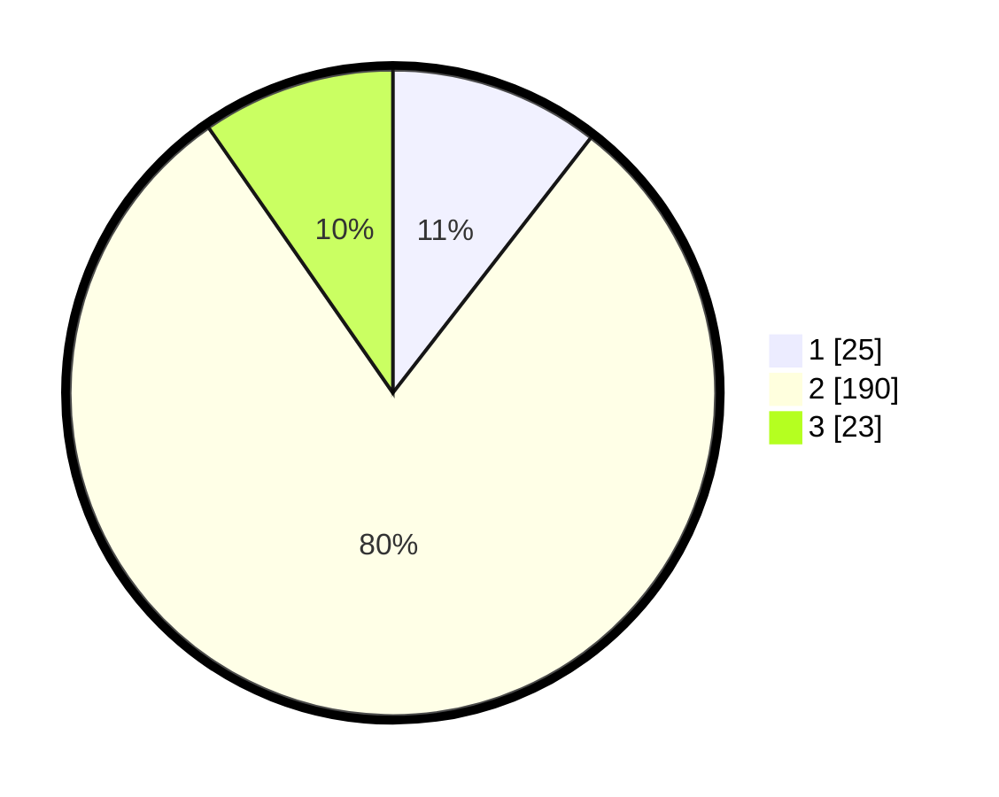

# Hasil

## Grafik

## Tabel

| No. | Nama Paslon    | Suara | Suara (raw) | Persentase |
|:--- |:-------------- | -----:| -----------:| ----------:|
| 1   | ANIES MUHAIMIN | 25    | [25][p-1]   | 10,50      |
| 2   | PRABOWO GIBRAN | 190   | [190][p-2]  | 79,83      |
| 3   | GANJAR MAHFUD  | 23    | [23][p-3]   | 9,66       |

[p-1]: https://github.com/gigit-pemilu/pemilu-2024/blob/main/pilpres/hitung-suara/sub/35-jawa-timur/sub/22-bojonegoro/sub/09-kepohbaru/sub/2014-bayemgede/sub/001-tps/sub/paslon-1.txt
[p-2]: https://github.com/gigit-pemilu/pemilu-2024/blob/main/pilpres/hitung-suara/sub/35-jawa-timur/sub/22-bojonegoro/sub/09-kepohbaru/sub/2014-bayemgede/sub/001-tps/sub/paslon-2.txt
[p-3]: https://github.com/gigit-pemilu/pemilu-2024/blob/main/pilpres/hitung-suara/sub/35-jawa-timur/sub/22-bojonegoro/sub/09-kepohbaru/sub/2014-bayemgede/sub/001-tps/sub/paslon-3.txt

## Foto C Plano

https://sirekap-obj-formc.kpu.go.id/f2ca/pemilu/ppwp/35/22/09/20/14/3522092014001-20240215-014419--ff60595f-3c6c-4c5b-9072-7f5fc4587e86.jpg

https://sirekap-obj-formc.kpu.go.id/f2ca/pemilu/ppwp/35/22/09/20/14/3522092014001-20240215-014532--a2aa245f-63cd-4b19-a9c6-354b4cd6ae6e.jpg

https://sirekap-obj-formc.kpu.go.id/f2ca/pemilu/ppwp/35/22/09/20/14/3522092014001-20240215-014656--72e3b30e-a7a7-48f5-8124-28720e8ad527.jpg

## Metadata

| Key        | Value               |
| ---------- | ------------------- |
| Time Stamp | 2024-02-24 22:31:28 |

