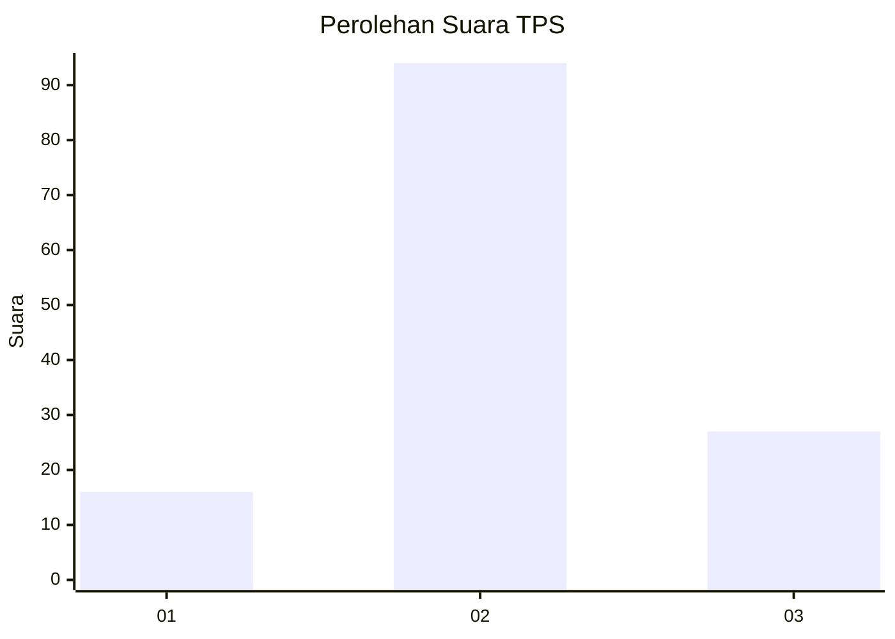
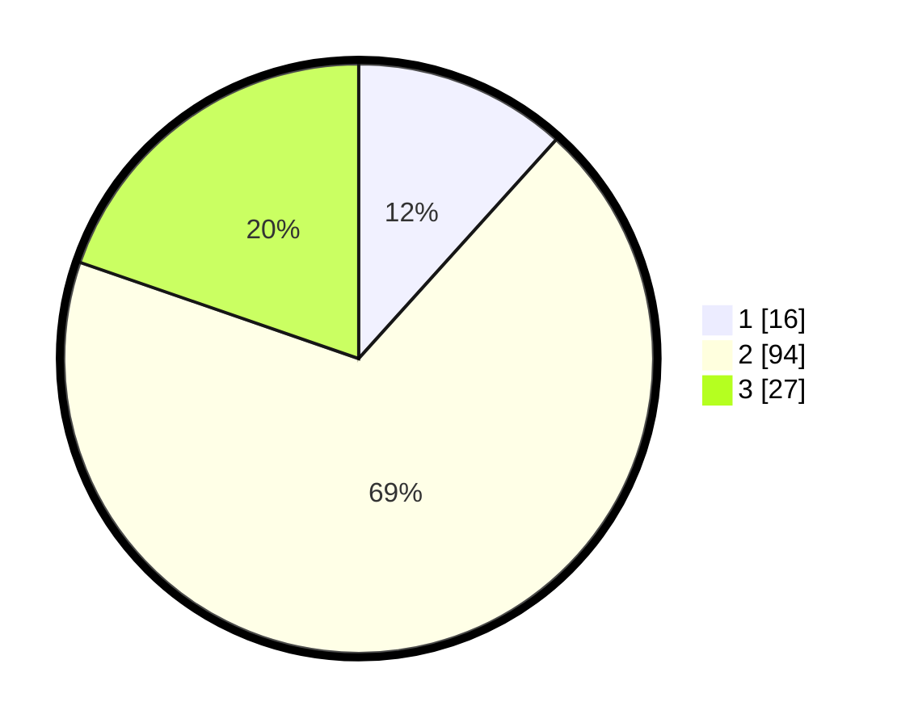

# Hasil

## Grafik

## Tabel

| No. | Nama Paslon    | Suara | Suara (raw) | Persentase |
|:--- |:-------------- | -----:| -----------:| ----------:|
| 1   | ANIES MUHAIMIN | 16    | [16][p-1]   | 11,68      |
| 2   | PRABOWO GIBRAN | 94    | [94][p-2]   | 68,61      |
| 3   | GANJAR MAHFUD  | 27    | [27][p-3]   | 19,71      |

[p-1]: https://github.com/gigit-pemilu/pemilu-2024/blob/main/pilpres/hitung-suara/sub/35-jawa-timur/sub/22-bojonegoro/sub/09-kepohbaru/sub/2020-jipo/sub/001-tps/sub/paslon-1.txt
[p-2]: https://github.com/gigit-pemilu/pemilu-2024/blob/main/pilpres/hitung-suara/sub/35-jawa-timur/sub/22-bojonegoro/sub/09-kepohbaru/sub/2020-jipo/sub/001-tps/sub/paslon-2.txt
[p-3]: https://github.com/gigit-pemilu/pemilu-2024/blob/main/pilpres/hitung-suara/sub/35-jawa-timur/sub/22-bojonegoro/sub/09-kepohbaru/sub/2020-jipo/sub/001-tps/sub/paslon-3.txt

## Foto C Plano

https://sirekap-obj-formc.kpu.go.id/50af/pemilu/ppwp/35/22/09/20/20/3522092020001-20240214-155527--090ac727-7b74-41db-abae-80a8bef3a8ae.jpg

https://sirekap-obj-formc.kpu.go.id/50af/pemilu/ppwp/35/22/09/20/20/3522092020001-20240214-213833--0a57e40b-5805-4c03-b994-c7ec47ca4120.jpg

https://sirekap-obj-formc.kpu.go.id/50af/pemilu/ppwp/35/22/09/20/20/3522092020001-20240214-214001--69e95e10-e4eb-46d4-a730-96ee1eab3026.jpg

## Metadata

| Key        | Value               |
| ---------- | ------------------- |
| Time Stamp | 2024-02-25 15:00:00 |

