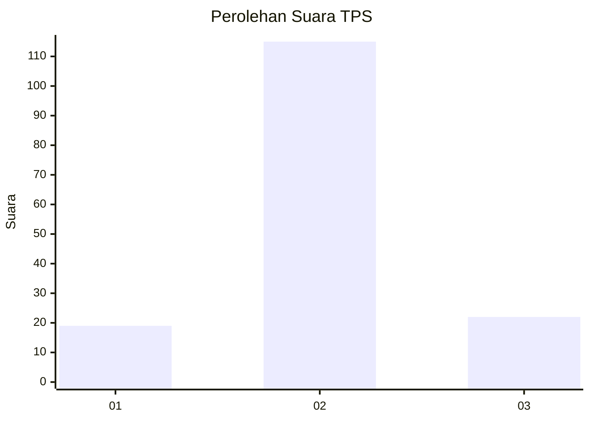
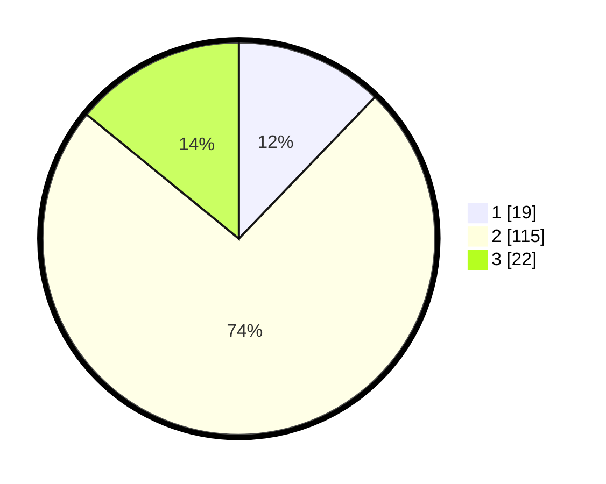

# Hasil

## Grafik

## Tabel

| No. | Nama Paslon    | Suara | Suara (raw) | Persentase |
|:--- |:-------------- | -----:| -----------:| ----------:|
| 1   | ANIES MUHAIMIN | 19    | [19][p-1]   | 12,18      |
| 2   | PRABOWO GIBRAN | 115   | [115][p-2]  | 73,72      |
| 3   | GANJAR MAHFUD  | 22    | [22][p-3]   | 14,10      |

[p-1]: https://github.com/gigit-pemilu/pemilu-2024-35-jawa-timur/blob/main/pilpres/hitung-suara/sub/35-jawa-timur/sub/22-bojonegoro/sub/09-kepohbaru/sub/2022-mudung/sub/006-tps/sub/paslon-1.txt
[p-2]: https://github.com/gigit-pemilu/pemilu-2024-35-jawa-timur/blob/main/pilpres/hitung-suara/sub/35-jawa-timur/sub/22-bojonegoro/sub/09-kepohbaru/sub/2022-mudung/sub/006-tps/sub/paslon-2.txt
[p-3]: https://github.com/gigit-pemilu/pemilu-2024-35-jawa-timur/blob/main/pilpres/hitung-suara/sub/35-jawa-timur/sub/22-bojonegoro/sub/09-kepohbaru/sub/2022-mudung/sub/006-tps/sub/paslon-3.txt

## Foto C Plano

https://sirekap-obj-formc.kpu.go.id/489b/pemilu/ppwp/35/22/09/20/22/3522092022006-20240214-224602--10cffe7c-d3bc-4d49-b80c-2575a9d5fd2b.jpg

https://sirekap-obj-formc.kpu.go.id/489b/pemilu/ppwp/35/22/09/20/22/3522092022006-20240214-224830--52729f4e-af89-4a56-90b8-b6bec298236e.jpg

https://sirekap-obj-formc.kpu.go.id/489b/pemilu/ppwp/35/22/09/20/22/3522092022006-20240214-215749--a5f6c1dc-5981-48d8-bf9e-c4936fc757d1.jpg

## Metadata

| Key        | Value               |
| ---------- | ------------------- |
| Time Stamp | 2024-02-25 17:00:00 |

